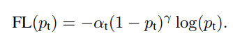

- ### [CheXpert Project](#chexpert-project)
>* [CheXpert competition](#chexpert-competition)
    + [My take](#my-take)
  * [Exploratory Data Analysis](#exploratory-data-analysis)
    + [Number of diseases (confirmed positive)](#number-of-diseases--confirmed-positive-)
      - [*Note on Support Devices*](#-note-on-support-devices-)
    + [Disease Occurrences](#disease-occurrences)
    + [**Handling of missing labels**](#--handling-of-missing-labels--)
    + [Feature distributions](#feature-distributions)
      - [**Note on AP and PA positions**](#--note-on-ap-and-pa-positions--)
  * [Model Training and Optimization Parameters](#model-training-and-optimization-parameters)
    + [Pretrained Densenet](#pretrained-densenet)
    + [Weighted Focal loss](#weighted-focal-loss)
    + [Optimizer - Adam](#optimizer---adam)
    + [Image Transforms](#image-transforms)
    + [Multi Label and Multi Class Classification](#multi-label-and-multi-class-classification)
      - [Class Labels](#class-labels)
      - [Formatting labels/class for modeling](#formatting-labels-class-for-modeling)
      - [Using SKLearn for Multilabel/Multiclass Validation](#using-sklearn-for-multilabel-multiclass-validation)
    + [Hyperparameters](#hyperparameters)
    + [PyTorch LRFinder](#pytorch-lrfinder)
  * [Incorporating Metadata](#incorporating-metadata)
      - [Note on Heat Maps](#note-on-heat-maps)
  * [Inference function](#inference-function)

# CheXpert Project 

[CheXpert](https://stanfordmlgroup.github.io/competitions/chexpert/) is a large public dataset for chest radiograph interpretation, consisting of 224,316 chest radiographs of 65,240 patients. 14 observations can be made by radiologists as positive, negative, or uncertain. This dataset is also released with MIMIC-CXR, a large dataset of 371,920 chest x-rays associated with 227,943 imaging studies sourced.  

A study usually consists of two images where one is a front and other is a lateral view. The 14 labels for each image were extracted from free text radiologly reports using an NLP tool, CheXpert labeler. 

## CheXpert competition

- The competition uses 5 out of the 14 observations  (a) Atelectasis, (b) Cardiomegaly, (c) Consolidation, (d) Edema, and (e) Pleural Effusion. 

### My take

You can either download the dataset at high-resolution CheXpert-v1.0 Original (~439G), or downsampled resolution CheXpert-v1.0 Downsampled (~11G). The work in this repo uses the downsampled version that consists of:

- Train: 223414 images/labels
- Validation: 234 images/labels

I opted to go for multilabel and multi class classification where I trained on a subset of the images, the full image set, and finally, incorporated metadata.  The rest of this document describes this in more detail, as well as the results.

## Exploratory Data Analysis

My goals were to understand the data, and use that information to format it for modeling.

### Number of diseases (confirmed positive)
To get number of diseases in an Xray, I first replace the -1.0 with 0, so that when I sum across columns, I am only summing the 1.0 values. Then this column result is number of diseases.

#### *Note on Support Devices*

It is not considered a finding according to the labels. See the EDA notebook for more detail. Below is a sample of rows to show the case where Support Devices was labeled positive, the other diseases were labeled negative, and No Finding is marked as positive. Because of this, I decided to use the 13 disease labels and disregard Support Devices.

|        |                                                         Path |  Sex |  Age | Frontal/Lateral | AP/PA | No Finding | Enlarged Cardiomediastinum | Cardiomegaly | Lung Opacity | Lung Lesion | Edema | Consolidation | Pneumonia | Atelectasis | Pneumothorax | Pleural Effusion | Pleural Other | Fracture | Support Devices | Number of Diseases |
| -----: | -----------------------------------------------------------: | ---: | ---: | --------------: | ----: | ---------: | -------------------------: | -----------: | -----------: | ----------: | ----: | ------------: | --------: | ----------: | -----------: | ---------------: | ------------: | -------: | --------------: | -----------------: |
| 106874 | CheXpert-v1.0-small/train/patient25675/study1/view1_frontal.jpg | Male |   82 |         Frontal |    AP |        1.0 |                        0.0 |          0.0 |          0.0 |         0.0 |   0.0 |           0.0 |       0.0 |         0.0 |          0.0 |              0.0 |           0.0 |      0.0 |             1.0 |                  0 |
| 205052 | CheXpert-v1.0-small/train/patient52021/study1/view1_frontal.jpg | Male |   43 |         Frontal |    AP |        1.0 |                        0.0 |          0.0 |          0.0 |         0.0 |   0.0 |           0.0 |       0.0 |         0.0 |          0.0 |              0.0 |           0.0 |      0.0 |             1.0 |                  0 |
|  54825 | CheXpert-v1.0-small/train/patient13296/study6/view1_frontal.jpg | Male |   75 |         Frontal |    PA |        1.0 |                        0.0 |          0.0 |          0.0 |         0.0 |   0.0 |           0.0 |       0.0 |         0.0 |          0.0 |              0.0 |           0.0 |      0.0 |             1.0 |                  0 |
| 135999 | CheXpert-v1.0-small/train/patient32632/study2/view2_lateral.jpg | Male |   56 |         Lateral |   NaN |        1.0 |                        0.0 |          0.0 |          0.0 |         0.0 |   0.0 |           0.0 |       0.0 |         0.0 |          0.0 |              0.0 |           0.0 |      0.0 |             1.0 |                  0 |
| 158690 | CheXpert-v1.0-small/train/patient37144/study3/view1_frontal.jpg | Male |   64 |         Frontal |    AP |        1.0 |                        0.0 |          0.0 |          0.0 |         0.0 |   0.0 |           0.0 |       0.0 |         0.0 |          0.0 |              0.0 |           0.0 |      0.0 |             1.0 |                  0 |

### Disease Occurrences
Here I first sum the positive labels of a disease using the temp dataframe I created (where -1.0 is replaced with 0, so it does not get in the sum calcuation)
This goes into a dictionary that I use to store the number of positive occurances for each disease.  Then I replace the NANs in the train and valid dataframes with -1.0, the negative class.

### **Handling of missing labels**

The reason could be systematic, that is, radioligists don't fill in every disease label, and they mainly focus on what is positive or uncertain. First modeling assumption will be that missing is negative. 

Therefore I used the following - 

- -1.0 - Uncertain 
- 1.0 - Positive
- 0.0 - Negative 
- Blank/NAN - assuming negative (0.0) 

### Feature distributions

Below are bar charts of cateogorical features and histograms for numerical features in the train and validation data.
Between train and validation, they appear similiarly distributed enough to assume it is fine. I also base this on the literature explaining that they did stratified train/test splits.

#### **Note on AP and PA positions**
According to an explanation [here](https://www.med-ed.virginia.edu/courses/rad/cxr/technique3chest.html): 
*The PA (posterioranterior) film is obtained with the patient facing the cassette and the x-ray tube 6 feet away. This distance diminishp_studies effect of beam divergence and magnification of structures closer to the x-ray tube. On the film below the exam was obtained in an AP or anteroposterior position. The chest has a different appearance. The heart shadow is magnified because it is an anterior structure. The pulmonary vasculature is also altered when patients are examined in the supine position.  On the AP supine film there is more equalization of the pulmonary vasculature when the size of the lower lobe vessels are compared to the upper.
The AP shows magnification of the heart and widening of the mediastinum.  Whenever possible the patient should be imaged in an upright PA position.  AP views are less useful and should be reserved for very ill patients who cannot stand erect.*

My interpretation of these facts and results show that AP is the more preferred Xray to get as its easier to read than in the PA view. But if the patient can not stand up, then PA is the only option. 

Frontal and AP XRay types are the high majority. I tried training on these only and with all images to compare model evaluation results. The metrics went up slightly when I also included the PA and Lateral. Assumption (guess?) is that though model learns on less variation of XRay views and was also evalauted on the same views, it learned diseases a little better on the extra view images even when evaluating on all test images.

## Model Training and Optimization Parameters

### Pretrained Densenet

Using Pretrained Densenet weights, and changing the last layer to output 13 classes. Because there isnt that much data to train on and as there are successful results using pertained image classification weights with medicail image, specifically even chexpert, I went that route to save time. 

This requires the weights to be passed through a `Relu`, then `adaptive_avg_pool2d`, then flattened out before this last classifier layer. When metadata is used, it is concatenated with the output of this flattened vector and then passed through the last classifier layer.

### Weighted Focal loss

Adjusting the loss function is an option to handling imbalanced classes vs a weighted upclass. A pro is there doesnt need to be extra computation or storage space. Weighted Focal loss was specifically made for object detection to find objects in highly imbalanced videos.  It has creeped into other applications, like in the medical space as well. 

I used the PyTorch implementation on this blog [post](https://amaarora.github.io/2020/06/29/FocalLoss.html) as Weighted Focal loss is currently not supported in PyTorch.  It is in Tensorflow, known as [SigmoidFocalCrossEntropy](https://www.tensorflow.org/addons/api_docs/python/tfa/losses/SigmoidFocalCrossEntropy).

When $\gamma=0$ then the equation is Cross Entropy Loss. For $\gamma>0$, the loss lowers for the well classified examples, helping the hard to classify examples more weight in the loss. It does this by adding the a multiplicative factor to the Cross Entropy loss $(1 − p_t)^\gamma$ where $p_t$ is the probability of the ground truth label, or the actual probabilities of the predictions.

In implementation of the code, the target vector is flattened which will be a long vector of $\alpha$ or *$1 -\alpha$* . It is an array of either float numbers $\alpha$ and so we only have two values depending on if the target vector given is 1 or 0. The output of *binary_cross_entropy_with_logits* is that it will internally take the sigmoid of the raw logits, then apply the log.  Doing *exp* reverses the *log* operation and gives you the actual probabilities.

### Optimizer - Adam

I use the authors default proposed values of $\beta_1=0.9$ and  $\beta_2=0.999$. I used a weight decay for some of the training runs when implementing some regularization. 

### Image Transforms

For input into Densenet, I center crop the images to a size of 320, and normalize with the mean and standard deviation.

### Multi Label and Multi Class Classification 

#### Class Labels

Three classes are implemented, where blanks are assumed to be the negative class.

- 2.0: Uncertain 
- 1.0:  Positive
- 0.0: Negative 
- Blank/NAN - assuming negative (0.0) 

#### Formatting labels/class for modeling

I have a vector 13*3 = 39 length, therefore 39 different probability distributions and modelling the individual probabilities of each class within each label. (see below for the vector structure) Binary Cross Entropy (BCE) is used instead of Softmax or Cross Entropy because more than one label and class can be ground truth in this dataset.  BCE treats each output independently and is modelling the individual probabilities of each class within each label. [This](https://gombru.github.io/2018/05/23/cross_entropy_loss/) article gives a great explanation of different loss functions, and handling multi class and multi label.

As I am doing both multi class and multi label, I use the following:

Class 0 (Negative) becomes 100

Class 1 (Positive) becomes 010

Class 2 (Uncertain) becomes 001

The data loader class does the label formatting work.  Below is an illustration for one xray.

#### Using SKLearn for Multilabel/Multiclass Validation
To get validation metrics, the label vector (ground truth) and model prediction vectors are used.  They are traversed in slices of 3 digits, that is, for each disease. 

Dictionary of dictionaries are used for each metrics ( confusion matrix, false positive rate, true positive rate, ROC AUC, Precision, Recall, F1, and accuracy).  As I ran experiments and wanted to keep track, I saved each run of metrics into pickle files so that I could create tables and plots of the results offline.

I plot three graphs for each epoch, where each ROC graph shows all of the ROCs for each label - positive, negative and uncertain.  Each graph had the 13 performance curves for each disease label. 

For accuracy, all disease labels are plotted in the same accuracy over epoch plot.

I also create tables for each run which includes precision, recall, ROC AUC for each disease and epoch.  All of this was to determine how the model was doing and not rely on train and validation loss alone.  This helped me to confirm a decision on which parameters to change for a next run.

### Hyperparameters

I setup and ran the experiements using a [paperspace](https://www.paperspace.com) account.  The reason for this choice, as opposed to using a Google colab notebook, is that paperspace provides persistent storage space as well as GPU usage and the [middle paid option](https://gradient.paperspace.com/pricing) provides 200GB, enough for me to store the low resolution Chexpert Xrays.

Batch size of 16 and 4 number of workers were the most optimal. 

### PyTorch LRFinder

In addition to intuition, I used the tweaked fast.ai version of [LRFinder](https://github.com/davidtvs/pytorch-lr-finder) to help me determine what learning rate to use for each of the runs.

## Incorporating Metadata

Can we get better model performance using Metadata along with the images? 

- Age and Gender are the metadata

As illustrated in the model architecture diagram above, I modified the dataloader to not only output the image and the labels, but also the age + gender columns. In this case both disease label and class + age and gender are put together into one feature space and the model is trying to jointly optimize both.

In medical diagnostics, which consists of images, metadata on the patient, and EHR (electronic health records), all the information combined can be helpful. Ideally, the focus is on the pathology though information such as age and gender can play a factor as there are some medical situations unique to these groups. 

There are multiple ways to incorporate metadata, such as using age + gender as loss terms, for Multi-task loss, where a branch is created in parallel after the convolutional layer to directly regress the age and classify gender.  This way, the information that is being learned is to jointly optimize for both the class and the age + gender.  I decided to go with the faster/'easier' option of feeding the features into linear layers outside of Denesenet CNN, and then concatenate this with the outputs of the CNN into the dense classification layer. This way, the outputs of the metadata are in a new feature space.

By adding this metadata information, bias is incorporated onto the learned feature space, so in this latent space, these biases should help disambiguate between features and hypothetically one should get better performance. 

Gender is one hot encoded, and age is normalized by the mean and standard deviation of the training data.  For inference, it is assumed that age will still be in the same as it is in the training data.  

#### Note on Heat Maps

I ended up not implementing heat maps due to using multi class and multlabel modeling.  I am pointing them out as Heat Maps such as [GradCAM](https://medium.com/@stepanulyanin/implementing-grad-cam-in-pytorch-ea0937c31e82) (Class Activation Maps) are useful in healthcare. It helps to ensure the network is learning eactly what a doctor would focus on to make a decision/classification.

## Inference function

At the end of the modeling notebook, there is an inference cell that loads model weights, creates the model class object, and has the code the take an image, label, age and gender, and output the prediction. Then this is reshaped by `out.reshape((13, 3))` and each row has the probability of negative, positive and no finding for each class.

