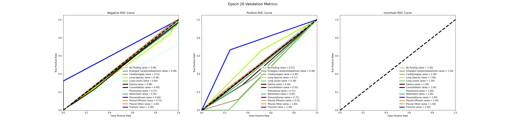
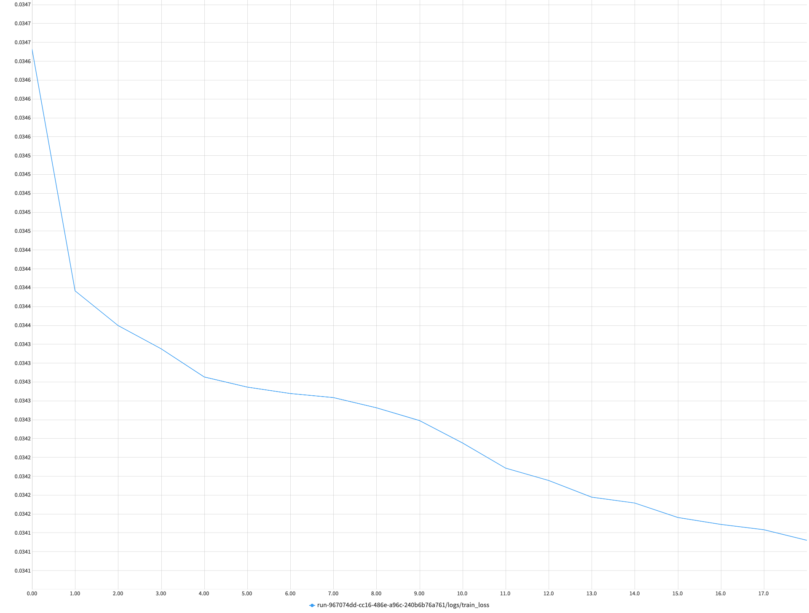
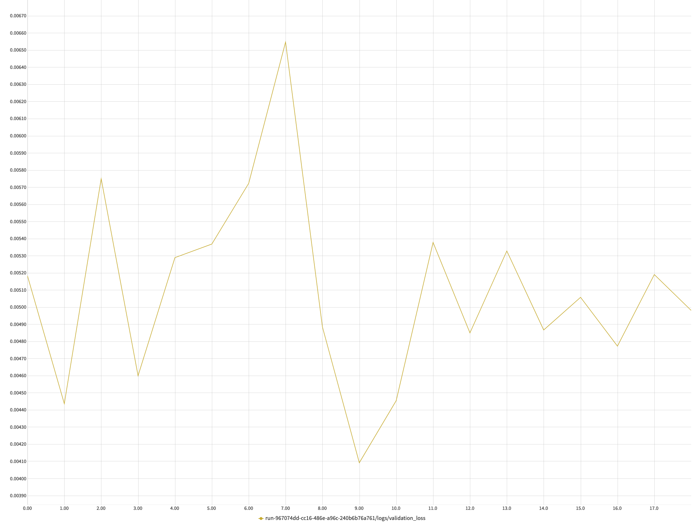
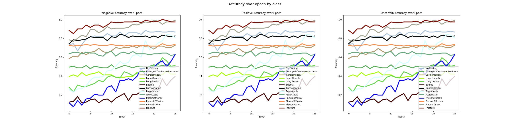

- [Swin Transformer model on CheXpert](#swin-transformer-model-on-chexpert)
  * [Training Run #1](#training-run--1)
    + [ROC AUC Graphs for Epoch 26](#roc-auc-graphs-for-epoch-26)
    + [Accuracy Graph of the labels over Epochs](#accuracy-graph-of-the-labels-over-epochs)
      - [Table of results](#table-of-results)
  * [Training Run #2](#training-run--2)
  * [Training Run #3](#training-run--3)
      - [ROC AUC Graphs for Epoch 10](#roc-auc-graphs-for-epoch-10)
      - [Accuracy Graph of the labels over Epochs](#accuracy-graph-of-the-labels-over-epochs-1)
      - [Table of Results](#table-of-results)
- [Summary of results](#summary-of-results)
  * [ROC AUC, Precision, Recall, F1](#roc-auc--precision--recall--f1)
      - [Positive Class:](#positive-class-)
      - [Negative Class](#negative-class)
  * [Accuracy](#accuracy)

<small><i><a href='http://ecotrust-canada.github.io/markdown-toc/'>Table of contents generated with markdown-toc</a></i></small>

# Swin Transformer model on CheXpert
This work is similiar to the code I have in the [modeling notebook](https://github.com/kulsoom-abdullah/chexpert_multiclass_multilabel/blob/main/rendered_notebooks/modeling-metadata.html) that uses a CNN architecture with the main difference being that I am using a Transformer architecture.

The goal was for me to use the popular ViT Swin Transformer model on the CheXpert dataset and see if I could beat the results I got with CNN.

I used the [timm](https://rwightman.github.io/pytorch-image-models/) Python library for the Swin Transformer model trained on ImageNet-1k at resolution 224x224. I then unfreeze all of the trainable parameters and trained on the CheXpert multi classification and multi label task.

You can learn more about Swin in the paper [Swin Transformer: Hierarchical Vision Transformer using Shifted Windows by Liu et al.](https://arxiv.org/abs/2103.14030).

TL DR I got almost the same results as I did with CNN. More details on the training and results are below.

## Training Run #1
For the 1st run, I set the train loop to 30 epochs total and the following hyperparameters:
- Batch size: 16
- Num workers = 4
- Betas: (0.9, 0.999) 
- and a low learning_rate = 1.0E-09, since I was fine tuning.
-
Using neptune.ai to track the experiement, I saw that the validation loss was still trending downwards, with a slight bump up at epoch 27.  For training run #2, I continued from the model weights with lowest validation error, epoch 26.

Plots from the experiement tracked at [neptune](https://app.neptune.ai/kulsoom/CheXpert/e/CHEX-54/charts)

### ROC AUC Graphs for Epoch 26

### Accuracy Graph of the labels over Epochs

#### Table of results

Table of Validation metrics for each disease by class, every epoch, for train #1

|Epoch|         Disease          |Positive:F1|Recall|Precision|RoC Auc Score|Negative: F1|Recall|Precision|RoC Auc Score|Uncertain: F1|Recall|Precision|RoC Auc Score|
|----:|--------------------------|----------:|-----:|--------:|------------:|-----------:|-----:|--------:|------------:|------------:|-----:|--------:|------------:|
|    0|No Finding                |       0.11|  0.14|     0.09|         0.50|        0.84|  0.81|     0.88|         0.48|         1.00|  1.00|        1|            1|
|    1|No Finding                |       0.16|  0.21|     0.13|         0.50|        0.85|  0.81|     0.89|         0.51|         1.00|  1.00|        1|            1|
|    2|No Finding                |       0.09|  0.14|     0.07|         0.50|        0.80|  0.75|     0.87|         0.44|         1.00|  0.99|        1|            1|
|    3|No Finding                |       0.11|  0.14|     0.09|         0.50|        0.84|  0.81|     0.88|         0.47|         1.00|  1.00|        1|            1|
|    4|No Finding                |       0.00|  0.00|     0.00|         0.50|        0.88|  0.90|     0.87|         0.45|         1.00|  1.00|        1|            1|
|    5|No Finding                |       0.21|  0.21|     0.21|         0.50|        0.90|  0.90|     0.90|         0.56|         1.00|  1.00|        1|            1|
|    6|No Finding                |       0.16|  0.14|     0.18|         0.50|        0.90|  0.92|     0.89|         0.53|         1.00|  1.00|        1|            1|
|    7|No Finding                |       0.08|  0.07|     0.10|         0.51|        0.90|  0.93|     0.88|         0.49|         1.00|  0.99|        1|            1|
|    8|No Finding                |       0.08|  0.07|     0.10|         0.50|        0.90|  0.92|     0.88|         0.49|         1.00|  1.00|        1|            1|
|    9|No Finding                |       0.00|  0.00|     0.00|         0.47|        0.92|  0.96|     0.88|         0.48|         1.00|  1.00|        1|            1|
|   10|No Finding                |       0.16|  0.14|     0.18|         0.50|        0.90|  0.92|     0.89|         0.52|         1.00|  1.00|        1|            1|
|   11|No Finding                |       0.00|  0.00|     0.00|         0.51|        0.91|  0.94|     0.88|         0.47|         1.00|  0.99|        1|            1|
|   12|No Finding                |       0.27|  0.21|     0.37|         0.52|        0.93|  0.95|     0.90|         0.58|         1.00|  1.00|        1|            1|
|   13|No Finding                |       0.09|  0.07|     0.11|         0.52|        0.90|  0.93|     0.88|         0.50|         1.00|  1.00|        1|            1|
|   14|No Finding                |       0.00|  0.00|     0.00|         0.50|        0.93|  0.98|     0.88|         0.49|         1.00|  0.99|        1|            1|
|   15|No Finding                |       0.00|  0.00|     0.00|         0.51|        0.92|  0.97|     0.88|         0.48|         1.00|  1.00|        1|            1|
|   16|No Finding                |       0.00|  0.00|     0.00|         0.53|        0.92|  0.97|     0.88|         0.49|         1.00|  1.00|        1|            1|
|   17|No Finding                |       0.00|  0.00|     0.00|         0.52|        0.91|  0.95|     0.88|         0.47|         1.00|  1.00|        1|            1|
|   18|No Finding                |       0.00|  0.00|     0.00|         0.54|        0.94|  1.00|     0.88|         0.50|         1.00|  1.00|        1|            1|
|   19|No Finding                |       0.00|  0.00|     0.00|         0.53|        0.93|  0.98|     0.88|         0.49|         1.00|  1.00|        1|            1|
|   20|No Finding                |       0.00|  0.00|     0.00|         0.51|        0.93|  0.98|     0.88|         0.49|         1.00|  1.00|        1|            1|
|   21|No Finding                |       0.00|  0.00|     0.00|         0.49|        0.93|  0.99|     0.88|         0.50|         1.00|  1.00|        1|            1|
|   22|No Finding                |       0.00|  0.00|     0.00|         0.54|        0.93|  0.98|     0.88|         0.49|         1.00|  1.00|        1|            1|
|   23|No Finding                |       0.00|  0.00|     0.00|         0.49|        0.93|  0.98|     0.88|         0.49|         1.00|  1.00|        1|            1|
|   24|No Finding                |       0.00|  0.00|     0.00|         0.55|        0.93|  0.99|     0.88|         0.49|         1.00|  1.00|        1|            1|
|   25|No Finding                |       0.00|  0.00|     0.00|         0.51|        0.93|  0.98|     0.88|         0.49|         1.00|  1.00|        1|            1|
|    0|Enlarged Cardiomediastinum|       0.15|  0.09|     0.56|         0.44|        0.67|  0.95|     0.52|         0.51|         0.97|  0.95|        1|            1|
|    1|Enlarged Cardiomediastinum|       0.06|  0.04|     0.40|         0.48|        0.69|  1.00|     0.53|         0.49|         0.98|  0.96|        1|            1|
|    2|Enlarged Cardiomediastinum|       0.17|  0.11|     0.50|         0.43|        0.68|  0.97|     0.53|         0.51|         0.96|  0.93|        1|            1|
|    3|Enlarged Cardiomediastinum|       0.12|  0.07|     0.44|         0.49|        0.69|  1.00|     0.53|         0.50|         0.96|  0.93|        1|            1|
|    4|Enlarged Cardiomediastinum|       0.07|  0.04|     0.50|         0.47|        0.69|  1.00|     0.53|         0.50|         0.98|  0.97|        1|            1|
|    5|Enlarged Cardiomediastinum|       0.06|  0.04|     0.22|         0.44|        0.70|  1.00|     0.53|         0.47|         0.97|  0.93|        1|            1|
|    6|Enlarged Cardiomediastinum|       0.03|  0.02|     0.25|         0.46|        0.69|  1.00|     0.53|         0.49|         0.98|  0.97|        1|            1|
|    7|Enlarged Cardiomediastinum|       0.06|  0.04|     0.33|         0.46|        0.69|  1.00|     0.53|         0.49|         0.97|  0.95|        1|            1|
|    8|Enlarged Cardiomediastinum|       0.06|  0.04|     0.29|         0.43|        0.67|  0.95|     0.52|         0.48|         0.98|  0.97|        1|            1|
|    9|Enlarged Cardiomediastinum|       0.03|  0.02|     0.17|         0.44|        0.68|  0.97|     0.52|         0.47|         0.98|  0.97|        1|            1|
|   10|Enlarged Cardiomediastinum|       0.13|  0.07|     0.80|         0.45|        0.69|  1.00|     0.53|         0.52|         0.98|  0.96|        1|            1|
|   11|Enlarged Cardiomediastinum|       0.06|  0.04|     0.25|         0.46|        0.68|  0.97|     0.52|         0.47|         0.97|  0.95|        1|            1|
|   12|Enlarged Cardiomediastinum|       0.03|  0.02|     0.20|         0.43|        0.69|  1.00|     0.53|         0.48|         0.98|  0.96|        1|            1|
|   13|Enlarged Cardiomediastinum|       0.03|  0.02|     0.25|         0.46|        0.70|  1.00|     0.53|         0.49|         0.99|  0.98|        1|            1|
|   14|Enlarged Cardiomediastinum|       0.03|  0.02|     0.20|         0.44|        0.68|  0.97|     0.53|         0.48|         0.99|  0.98|        1|            1|
|   15|Enlarged Cardiomediastinum|       0.03|  0.02|     0.17|         0.41|        0.66|  0.94|     0.51|         0.47|         0.99|  0.98|        1|            1|
|   16|Enlarged Cardiomediastinum|       0.06|  0.04|     0.40|         0.45|        0.68|  0.98|     0.52|         0.49|         0.98|  0.97|        1|            1|
|   17|Enlarged Cardiomediastinum|       0.10|  0.05|     0.50|         0.41|        0.68|  0.97|     0.52|         0.50|         0.98|  0.97|        1|            1|
|   18|Enlarged Cardiomediastinum|       0.06|  0.04|     0.29|         0.44|        0.68|  0.98|     0.52|         0.48|         0.97|  0.95|        1|            1|
|   19|Enlarged Cardiomediastinum|       0.03|  0.02|     0.25|         0.45|        0.69|  1.00|     0.53|         0.49|         0.98|  0.97|        1|            1|
|   20|Enlarged Cardiomediastinum|       0.10|  0.05|     0.75|         0.49|        0.69|  1.00|     0.53|         0.52|         0.98|  0.97|        1|            1|
|   21|Enlarged Cardiomediastinum|       0.03|  0.02|     0.25|         0.48|        0.68|  0.98|     0.52|         0.49|         0.99|  0.98|        1|            1|
|   22|Enlarged Cardiomediastinum|       0.10|  0.05|     0.50|         0.43|        0.68|  0.97|     0.53|         0.50|         0.99|  0.98|        1|            1|
|   23|Enlarged Cardiomediastinum|       0.03|  0.02|     0.50|         0.46|        0.69|  1.00|     0.53|         0.50|         0.99|  0.98|        1|            1|
|   24|Enlarged Cardiomediastinum|       0.00|  0.00|     0.00|         0.43|        0.68|  0.97|     0.52|         0.47|         0.99|  0.98|        1|            1|
|   25|Enlarged Cardiomediastinum|       0.03|  0.02|     0.20|         0.48|        0.68|  0.97|     0.52|         0.48|         0.99|  0.98|        1|            1|
|    0|Cardiomegaly              |       0.25|  0.21|     0.29|         0.42|        0.81|  0.93|     0.71|         0.50|         0.92|  0.85|        1|            1|
|    1|Cardiomegaly              |       0.12|  0.09|     0.17|         0.46|        0.82|  0.94|     0.72|         0.44|         0.95|  0.90|        1|            1|
|    2|Cardiomegaly              |       0.15|  0.12|     0.21|         0.44|        0.83|  0.97|     0.72|         0.48|         0.93|  0.87|        1|            1|
|    3|Cardiomegaly              |       0.17|  0.12|     0.31|         0.38|        0.84|  0.99|     0.72|         0.51|         0.95|  0.90|        1|            1|
|    4|Cardiomegaly              |       0.09|  0.06|     0.14|         0.44|        0.82|  0.95|     0.72|         0.45|         0.96|  0.92|        1|            1|
|    5|Cardiomegaly              |       0.00|  0.00|     0.00|         0.44|        0.83|  0.98|     0.72|         0.44|         0.97|  0.94|        1|            1|
|    6|Cardiomegaly              |       0.09|  0.06|     0.20|         0.44|        0.83|  0.98|     0.72|         0.49|         0.97|  0.93|        1|            1|
|    7|Cardiomegaly              |       0.20|  0.12|     0.50|         0.43|        0.84|  1.00|     0.73|         0.51|         0.97|  0.93|        1|            1|
|    8|Cardiomegaly              |       0.18|  0.12|     0.33|         0.48|        0.83|  0.98|     0.72|         0.51|         0.96|  0.92|        1|            1|
|    9|Cardiomegaly              |       0.09|  0.06|     0.17|         0.47|        0.81|  0.93|     0.71|         0.48|         0.97|  0.95|        1|            1|
|   10|Cardiomegaly              |       0.05|  0.03|     0.12|         0.47|        0.84|  0.99|     0.72|         0.45|         0.97|  0.94|        1|            1|
|   11|Cardiomegaly              |       0.05|  0.03|     0.25|         0.46|        0.84|  0.99|     0.72|         0.52|         0.99|  0.98|        1|            1|
|   12|Cardiomegaly              |       0.00|  0.00|     0.00|         0.48|        0.84|  0.99|     0.72|         0.47|         0.99|  0.98|        1|            1|
|   13|Cardiomegaly              |       0.10|  0.06|     0.33|         0.45|        0.83|  0.98|     0.73|         0.50|         0.99|  0.98|        1|            1|
|   14|Cardiomegaly              |       0.11|  0.06|     0.40|         0.46|        0.84|  0.99|     0.72|         0.51|         0.98|  0.97|        1|            1|
|   15|Cardiomegaly              |       0.00|  0.00|     0.00|         0.47|        0.84|  1.00|     0.73|         0.49|         1.00|  0.99|        1|            1|
|   16|Cardiomegaly              |       0.05|  0.03|     0.25|         0.50|        0.84|  1.00|     0.73|         0.49|         0.98|  0.97|        1|            1|
|   17|Cardiomegaly              |       0.11|  0.06|     0.67|         0.44|        0.85|  1.00|     0.73|         0.52|         0.99|  0.98|        1|            1|
|   18|Cardiomegaly              |       0.06|  0.03|     0.33|         0.51|        0.84|  1.00|     0.73|         0.50|         0.99|  0.98|        1|            1|
|   19|Cardiomegaly              |       0.06|  0.03|     0.33|         0.46|        0.84|  0.99|     0.72|         0.50|         0.99|  0.98|        1|            1|
|   20|Cardiomegaly              |       0.00|  0.00|     0.00|         0.46|        0.84|  0.99|     0.72|         0.47|         0.98|  0.97|        1|            1|
|   21|Cardiomegaly              |       0.00|  0.00|     0.00|         0.43|        0.84|  1.00|     0.73|         0.49|         1.00|  0.99|        1|            1|
|   22|Cardiomegaly              |       0.00|  0.00|     0.00|         0.45|        0.84|  0.99|     0.72|         0.48|         1.00|  1.00|        1|            1|
|   23|Cardiomegaly              |       0.00|  0.00|     0.00|         0.35|        0.84|  0.99|     0.72|         0.48|         0.99|  0.98|        1|            1|
|   24|Cardiomegaly              |       0.00|  0.00|     0.00|         0.44|        0.84|  0.99|     0.72|         0.48|         0.99|  0.98|        1|            1|
|   25|Cardiomegaly              |       0.06|  0.03|     1.00|         0.40|        0.84|  1.00|     0.73|         0.51|         1.00|  0.99|        1|            1|
|    0|Lung Opacity              |       0.12|  0.08|     0.33|         0.57|        0.61|  0.93|     0.45|         0.44|         0.96|  0.93|        1|            1|
|    1|Lung Opacity              |       0.10|  0.06|     0.31|         0.58|        0.60|  0.91|     0.45|         0.45|         0.98|  0.96|        1|            1|
|    2|Lung Opacity              |       0.12|  0.08|     0.31|         0.55|        0.60|  0.91|     0.45|         0.46|         0.97|  0.93|        1|            1|
|    3|Lung Opacity              |       0.20|  0.12|     0.50|         0.58|        0.64|  0.96|     0.47|         0.49|         0.96|  0.93|        1|            1|
|    4|Lung Opacity              |       0.15|  0.09|     0.37|         0.59|        0.61|  0.93|     0.46|         0.46|         0.96|  0.93|        1|            1|
|    5|Lung Opacity              |       0.17|  0.11|     0.47|         0.58|        0.64|  0.98|     0.47|         0.48|         0.95|  0.91|        1|            1|
|    6|Lung Opacity              |       0.17|  0.11|     0.44|         0.56|        0.64|  0.96|     0.47|         0.47|         0.96|  0.93|        1|            1|
|    7|Lung Opacity              |       0.16|  0.09|     0.50|         0.54|        0.64|  0.98|     0.47|         0.49|         0.97|  0.94|        1|            1|
|    8|Lung Opacity              |       0.15|  0.09|     0.35|         0.61|        0.61|  0.91|     0.46|         0.46|         0.97|  0.94|        1|            1|
|    9|Lung Opacity              |       0.17|  0.11|     0.41|         0.58|        0.61|  0.91|     0.46|         0.46|         0.97|  0.93|        1|            1|
|   10|Lung Opacity              |       0.10|  0.06|     0.29|         0.56|        0.63|  0.96|     0.47|         0.45|         0.97|  0.93|        1|            1|
|   11|Lung Opacity              |       0.03|  0.02|     0.10|         0.54|        0.62|  0.96|     0.45|         0.43|         0.97|  0.93|        1|            1|
|   12|Lung Opacity              |       0.10|  0.06|     0.25|         0.56|        0.61|  0.93|     0.46|         0.41|         0.96|  0.93|        1|            1|
|   13|Lung Opacity              |       0.12|  0.08|     0.28|         0.56|        0.60|  0.89|     0.45|         0.41|         0.97|  0.93|        1|            1|
|   14|Lung Opacity              |       0.08|  0.05|     0.23|         0.63|        0.62|  0.96|     0.46|         0.42|         0.96|  0.93|        1|            1|
|   15|Lung Opacity              |       0.05|  0.03|     0.18|         0.56|        0.61|  0.95|     0.45|         0.42|         0.97|  0.94|        1|            1|
|   16|Lung Opacity              |       0.11|  0.06|     0.40|         0.53|        0.62|  0.95|     0.46|         0.48|         0.98|  0.97|        1|            1|
|   17|Lung Opacity              |       0.10|  0.06|     0.31|         0.66|        0.64|  0.98|     0.47|         0.44|         0.96|  0.93|        1|            1|
|   18|Lung Opacity              |       0.15|  0.09|     0.40|         0.60|        0.62|  0.93|     0.46|         0.45|         0.97|  0.94|        1|            1|
|   19|Lung Opacity              |       0.17|  0.11|     0.41|         0.61|        0.61|  0.91|     0.46|         0.46|         0.97|  0.93|        1|            1|
|   20|Lung Opacity              |       0.10|  0.06|     0.29|         0.56|        0.61|  0.93|     0.46|         0.45|         0.97|  0.94|        1|            1|
|   21|Lung Opacity              |       0.03|  0.02|     0.14|         0.57|        0.60|  0.93|     0.44|         0.46|         0.99|  0.98|        1|            1|
|   22|Lung Opacity              |       0.05|  0.03|     0.20|         0.54|        0.59|  0.89|     0.44|         0.43|         0.99|  0.98|        1|            1|
|   23|Lung Opacity              |       0.13|  0.08|     0.50|         0.65|        0.63|  0.96|     0.47|         0.46|         0.98|  0.97|        1|            1|
|   24|Lung Opacity              |       0.10|  0.06|     0.33|         0.59|        0.62|  0.95|     0.46|         0.45|         0.97|  0.95|        1|            1|
|   25|Lung Opacity              |       0.10|  0.06|     0.33|         0.57|        0.61|  0.93|     0.46|         0.46|         0.98|  0.96|        1|            1|
|    0|Lung Lesion               |       0.02|  1.00|     0.01|         0.66|        0.55|  0.38|     1.00|         0.54|         0.94|  0.89|        1|            1|
|    1|Lung Lesion               |       0.00|  0.00|     0.00|         0.66|        0.55|  0.38|     0.98|         0.04|         0.92|  0.85|        1|            1|
|    2|Lung Lesion               |       0.02|  1.00|     0.01|         0.68|        0.60|  0.43|     1.00|         0.54|         0.93|  0.87|        1|            1|
|    3|Lung Lesion               |       0.02|  1.00|     0.01|         0.67|        0.58|  0.41|     1.00|         0.54|         0.93|  0.88|        1|            1|
|    4|Lung Lesion               |       0.02|  1.00|     0.01|         0.69|        0.62|  0.45|     1.00|         0.54|         0.91|  0.83|        1|            1|
|    5|Lung Lesion               |       0.02|  1.00|     0.01|         0.70|        0.65|  0.48|     1.00|         0.55|         0.90|  0.82|        1|            1|
|    6|Lung Lesion               |       0.02|  1.00|     0.01|         0.71|        0.68|  0.52|     1.00|         0.55|         0.89|  0.80|        1|            1|
|    7|Lung Lesion               |       0.00|  0.00|     0.00|         0.21|        0.69|  0.53|     0.98|         0.56|         0.90|  0.83|        1|            1|
|    8|Lung Lesion               |       0.00|  0.00|     0.00|         0.24|        0.73|  0.57|     0.99|         0.55|         0.87|  0.77|        1|            1|
|    9|Lung Lesion               |       0.03|  1.00|     0.01|         0.78|        0.81|  0.67|     1.00|         0.56|         0.83|  0.71|        1|            1|
|   10|Lung Lesion               |       0.03|  1.00|     0.01|         0.76|        0.79|  0.65|     1.00|         0.59|         0.86|  0.75|        1|            1|
|   11|Lung Lesion               |       0.03|  1.00|     0.01|         0.77|        0.79|  0.65|     1.00|         0.56|         0.85|  0.74|        1|            1|
|   12|Lung Lesion               |       0.00|  0.00|     0.00|         0.29|        0.79|  0.66|     0.99|         0.56|         0.84|  0.73|        1|            1|
|   13|Lung Lesion               |       0.03|  1.00|     0.01|         0.81|        0.85|  0.73|     1.00|         0.60|         0.83|  0.71|        1|            1|
|   14|Lung Lesion               |       0.03|  1.00|     0.01|         0.80|        0.85|  0.73|     1.00|         0.58|         0.82|  0.69|        1|            1|
|   15|Lung Lesion               |       0.03|  1.00|     0.01|         0.82|        0.85|  0.73|     1.00|         0.59|         0.80|  0.67|        1|            1|
|   16|Lung Lesion               |       0.00|  0.00|     0.00|         0.35|        0.87|  0.78|     0.99|         0.60|         0.79|  0.65|        1|            1|
|   17|Lung Lesion               |       0.00|  0.00|     0.00|         0.35|        0.89|  0.82|     0.99|         0.60|         0.78|  0.64|        1|            1|
|   18|Lung Lesion               |       0.03|  1.00|     0.01|         0.85|        0.89|  0.80|     1.00|         0.60|         0.78|  0.64|        1|            1|
|   19|Lung Lesion               |       0.00|  0.00|     0.00|         0.34|        0.88|  0.80|     0.99|         0.60|         0.81|  0.69|        1|            1|
|   20|Lung Lesion               |       0.03|  1.00|     0.02|         0.86|        0.92|  0.86|     1.00|         0.65|         0.79|  0.65|        1|            1|
|   21|Lung Lesion               |       0.00|  0.00|     0.00|         0.39|        0.92|  0.87|     0.99|         0.13|         0.80|  0.66|        1|            1|
|   22|Lung Lesion               |       0.00|  0.00|     0.00|         0.38|        0.94|  0.89|     0.99|         0.67|         0.83|  0.71|        1|            1|
|   23|Lung Lesion               |       0.00|  0.00|     0.00|         0.39|        0.95|  0.92|     0.99|         0.16|         0.79|  0.65|        1|            1|
|   24|Lung Lesion               |       0.00|  0.00|     0.00|         0.90|        0.94|  0.90|     0.99|         0.17|         0.76|  0.61|        1|            1|
|   25|Lung Lesion               |       0.03|  1.00|     0.02|         0.38|        0.92|  0.86|     0.99|         0.66|         0.79|  0.65|        1|            1|
|    0|Edema                     |       0.30|  0.80|     0.18|         0.46|        0.64|  0.55|     0.76|         0.49|         0.68|  0.52|        1|            1|
|    1|Edema                     |       0.32|  0.84|     0.20|         0.38|        0.63|  0.55|     0.73|         0.52|         0.68|  0.52|        1|            1|
|    2|Edema                     |       0.29|  0.72|     0.18|         0.37|        0.60|  0.51|     0.72|         0.49|         0.77|  0.63|        1|            1|
|    3|Edema                     |       0.31|  0.84|     0.19|         0.43|        0.64|  0.55|     0.76|         0.51|         0.67|  0.50|        1|            1|
|    4|Edema                     |       0.24|  0.60|     0.15|         0.36|        0.60|  0.52|     0.71|         0.52|         0.74|  0.59|        1|            1|
|    5|Edema                     |       0.32|  0.84|     0.19|         0.42|        0.60|  0.50|     0.75|         0.51|         0.73|  0.58|        1|            1|
|    6|Edema                     |       0.29|  0.76|     0.18|         0.42|        0.62|  0.53|     0.75|         0.50|         0.73|  0.58|        1|            1|
|    7|Edema                     |       0.27|  0.68|     0.17|         0.36|        0.61|  0.53|     0.71|         0.47|         0.71|  0.55|        1|            1|
|    8|Edema                     |       0.32|  0.84|     0.20|         0.40|        0.61|  0.53|     0.73|         0.48|         0.71|  0.55|        1|            1|
|    9|Edema                     |       0.26|  0.64|     0.16|         0.42|        0.68|  0.62|     0.75|         0.49|         0.69|  0.53|        1|            1|
|   10|Edema                     |       0.22|  0.56|     0.14|         0.38|        0.60|  0.52|     0.71|         0.47|         0.75|  0.60|        1|            1|
|   11|Edema                     |       0.27|  0.64|     0.17|         0.35|        0.62|  0.55|     0.71|         0.48|         0.75|  0.60|        1|            1|
|   12|Edema                     |       0.30|  0.72|     0.19|         0.41|        0.66|  0.60|     0.73|         0.46|         0.72|  0.56|        1|            1|
|   13|Edema                     |       0.29|  0.68|     0.19|         0.40|        0.69|  0.64|     0.74|         0.51|         0.73|  0.57|        1|            1|
|   14|Edema                     |       0.27|  0.68|     0.17|         0.38|        0.65|  0.58|     0.73|         0.51|         0.70|  0.54|        1|            1|
|   15|Edema                     |       0.27|  0.64|     0.17|         0.46|        0.66|  0.58|     0.77|         0.46|         0.76|  0.61|        1|            1|
|   16|Edema                     |       0.21|  0.48|     0.14|         0.37|        0.64|  0.57|     0.72|         0.49|         0.79|  0.65|        1|            1|
|   17|Edema                     |       0.27|  0.60|     0.18|         0.38|        0.65|  0.59|     0.72|         0.52|         0.78|  0.64|        1|            1|
|   18|Edema                     |       0.21|  0.44|     0.14|         0.43|        0.70|  0.65|     0.76|         0.43|         0.79|  0.65|        1|            1|
|   19|Edema                     |       0.30|  0.68|     0.19|         0.39|        0.65|  0.59|     0.72|         0.48|         0.76|  0.61|        1|            1|
|   20|Edema                     |       0.22|  0.48|     0.15|         0.39|        0.70|  0.66|     0.76|         0.54|         0.78|  0.64|        1|            1|
|   21|Edema                     |       0.24|  0.52|     0.16|         0.43|        0.69|  0.65|     0.75|         0.43|         0.78|  0.64|        1|            1|
|   22|Edema                     |       0.31|  0.60|     0.21|         0.42|        0.75|  0.73|     0.78|         0.61|         0.80|  0.67|        1|            1|
|   23|Edema                     |       0.25|  0.52|     0.16|         0.51|        0.73|  0.69|     0.79|         0.51|         0.78|  0.64|        1|            1|
|   24|Edema                     |       0.22|  0.40|     0.15|         0.44|        0.73|  0.70|     0.76|         0.52|         0.84|  0.72|        1|            1|
|   25|Edema                     |       0.23|  0.40|     0.16|         0.46|        0.73|  0.71|     0.76|         0.48|         0.86|  0.75|        1|            1|
|    0|Consolidation             |       0.06|  0.05|     0.08|         0.55|        0.91|  1.00|     0.84|         0.43|         0.94|  0.89|        1|            1|
|    1|Consolidation             |       0.07|  0.05|     0.12|         0.49|        0.91|  0.99|     0.84|         0.42|         0.97|  0.94|        1|            1|
|    2|Consolidation             |       0.00|  0.00|     0.00|         0.48|        0.89|  0.96|     0.84|         0.43|         0.98|  0.97|        1|            1|
|    3|Consolidation             |       0.14|  0.11|     0.22|         0.49|        0.91|  0.99|     0.84|         0.46|         0.97|  0.93|        1|            1|
|    4|Consolidation             |       0.08|  0.05|     0.14|         0.47|        0.91|  0.99|     0.84|         0.49|         0.97|  0.95|        1|            1|
|    5|Consolidation             |       0.09|  0.05|     0.25|         0.49|        0.91|  0.99|     0.84|         0.49|         0.99|  0.98|        1|            1|
|    6|Consolidation             |       0.00|  0.00|     0.00|         0.49|        0.91|  1.00|     0.84|         0.47|         0.98|  0.97|        1|            1|
|    7|Consolidation             |       0.00|  0.00|     0.00|         0.50|        0.91|  1.00|     0.84|         0.48|         0.98|  0.97|        1|            1|
|    8|Consolidation             |       0.00|  0.00|     0.00|         0.49|        0.91|  0.99|     0.84|         0.49|         0.99|  0.98|        1|            1|
|    9|Consolidation             |       0.14|  0.11|     0.20|         0.48|        0.90|  0.98|     0.84|         0.48|         0.97|  0.93|        1|            1|
|   10|Consolidation             |       0.09|  0.05|     0.25|         0.51|        0.91|  0.99|     0.84|         0.48|         0.99|  0.98|        1|            1|
|   11|Consolidation             |       0.00|  0.00|     0.00|         0.51|        0.91|  0.99|     0.84|         0.47|         0.99|  0.98|        1|            1|
|   12|Consolidation             |       0.10|  0.05|     1.00|         0.51|        0.91|  1.00|     0.84|         0.47|         1.00|  0.99|        1|            1|
|   13|Consolidation             |       0.10|  0.05|     0.50|         0.50|        0.91|  1.00|     0.84|         0.49|         0.99|  0.98|        1|            1|
|   14|Consolidation             |       0.16|  0.11|     0.33|         0.52|        0.91|  0.99|     0.84|         0.51|         0.98|  0.96|        1|            1|
|   15|Consolidation             |       0.00|  0.00|     0.00|         0.49|        0.91|  1.00|     0.84|         0.47|         0.99|  0.98|        1|            1|
|   16|Consolidation             |       0.00|  0.00|     0.00|         0.52|        0.91|  1.00|     0.84|         0.48|         0.99|  0.98|        1|            1|
|   17|Consolidation             |       0.09|  0.05|     0.25|         0.52|        0.91|  0.99|     0.84|         0.52|         0.99|  0.98|        1|            1|
|   18|Consolidation             |       0.00|  0.00|     0.00|         0.51|        0.91|  1.00|     0.84|         0.46|         0.99|  0.98|        1|            1|
|   19|Consolidation             |       0.00|  0.00|     0.00|         0.49|        0.90|  0.98|     0.84|         0.47|         0.99|  0.98|        1|            1|
|   20|Consolidation             |       0.00|  0.00|     0.00|         0.50|        0.91|  1.00|     0.84|         0.49|         0.99|  0.98|        1|            1|
|   21|Consolidation             |       0.00|  0.00|     0.00|         0.50|        0.91|  1.00|     0.84|         0.50|         0.98|  0.97|        1|            1|
|   22|Consolidation             |       0.00|  0.00|     0.00|         0.49|        0.91|  0.99|     0.84|         0.49|         1.00|  1.00|        1|            1|
|   23|Consolidation             |       0.00|  0.00|     0.00|         0.53|        0.91|  1.00|     0.84|         0.51|         0.99|  0.98|        1|            1|
|   24|Consolidation             |       0.00|  0.00|     0.00|         0.49|        0.91|  0.99|     0.84|         0.49|         0.99|  0.98|        1|            1|
|   25|Consolidation             |       0.00|  0.00|     0.00|         0.50|        0.91|  0.99|     0.84|         0.49|         1.00|  0.99|        1|            1|
|    0|Pneumonia                 |       0.06|  1.00|     0.03|         0.69|        0.60|  0.43|     1.00|         0.54|         0.89|  0.81|        1|            1|
|    1|Pneumonia                 |       0.06|  1.00|     0.03|         0.69|        0.60|  0.43|     1.00|         0.53|         0.88|  0.79|        1|            1|
|    2|Pneumonia                 |       0.06|  1.00|     0.03|         0.67|        0.58|  0.41|     1.00|         0.55|         0.91|  0.84|        1|            1|
|    3|Pneumonia                 |       0.06|  1.00|     0.03|         0.56|        0.66|  0.50|     0.98|         0.55|         0.86|  0.75|        1|            1|
|    4|Pneumonia                 |       0.02|  0.33|     0.01|         0.56|        0.65|  0.49|     0.97|         0.38|         0.89|  0.81|        1|            1|
|    5|Pneumonia                 |       0.05|  0.67|     0.03|         0.55|        0.69|  0.53|     0.98|         0.57|         0.90|  0.83|        1|            1|
|    6|Pneumonia                 |       0.03|  0.33|     0.01|         0.42|        0.74|  0.60|     0.97|         0.59|         0.88|  0.79|        1|            1|
|    7|Pneumonia                 |       0.05|  0.67|     0.03|         0.60|        0.75|  0.60|     0.99|         0.59|         0.88|  0.79|        1|            1|
|    8|Pneumonia                 |       0.05|  0.67|     0.03|         0.60|        0.75|  0.60|     0.99|         0.58|         0.88|  0.79|        1|            1|
|    9|Pneumonia                 |       0.03|  0.33|     0.02|         0.48|        0.81|  0.69|     0.98|         0.45|         0.87|  0.78|        1|            1|
|   10|Pneumonia                 |       0.06|  0.67|     0.03|         0.76|        0.78|  0.64|     0.99|         0.46|         0.90|  0.82|        1|            1|
|   11|Pneumonia                 |       0.03|  0.33|     0.02|         0.63|        0.83|  0.72|     0.98|         0.31|         0.88|  0.79|        1|            1|
|   12|Pneumonia                 |       0.07|  0.67|     0.04|         0.64|        0.84|  0.73|     0.99|         0.66|         0.90|  0.83|        1|            1|
|   13|Pneumonia                 |       0.03|  0.33|     0.02|         0.64|        0.84|  0.74|     0.98|         0.34|         0.89|  0.80|        1|            1|
|   14|Pneumonia                 |       0.00|  0.00|     0.00|         0.48|        0.84|  0.74|     0.97|         0.35|         0.90|  0.83|        1|            1|
|   15|Pneumonia                 |       0.00|  0.00|     0.00|         0.51|        0.89|  0.83|     0.97|         0.39|         0.89|  0.81|        1|            1|
|   16|Pneumonia                 |       0.04|  0.33|     0.02|         0.82|        0.87|  0.79|     0.98|         0.40|         0.92|  0.85|        1|            1|
|   17|Pneumonia                 |       0.00|  0.00|     0.00|         0.65|        0.85|  0.76|     0.97|         0.37|         0.92|  0.86|        1|            1|
|   18|Pneumonia                 |       0.13|  0.67|     0.07|         0.86|        0.92|  0.86|     0.99|         0.61|         0.96|  0.93|        1|            1|
|   19|Pneumonia                 |       0.00|  0.00|     0.00|         0.68|        0.90|  0.84|     0.97|         0.25|         0.92|  0.86|        1|            1|
|   20|Pneumonia                 |       0.00|  0.00|     0.00|         0.51|        0.91|  0.86|     0.97|         0.29|         0.93|  0.88|        1|            1|
|   21|Pneumonia                 |       0.00|  0.00|     0.00|         0.52|        0.93|  0.89|     0.97|         0.30|         0.94|  0.88|        1|            1|
|   22|Pneumonia                 |       0.00|  0.00|     0.00|         0.70|        0.94|  0.92|     0.97|         0.31|         0.94|  0.88|        1|            1|
|   23|Pneumonia                 |       0.00|  0.00|     0.00|         0.54|        0.95|  0.93|     0.97|         0.53|         0.97|  0.93|        1|            1|
|   24|Pneumonia                 |       0.00|  0.00|     0.00|         0.54|        0.94|  0.91|     0.97|         0.34|         0.97|  0.95|        1|            1|
|   25|Pneumonia                 |       0.00|  0.00|     0.00|         0.71|        0.92|  0.88|     0.97|         0.37|         0.97|  0.95|        1|            1|
|    0|Atelectasis               |       0.04|  0.02|     0.50|         0.50|        0.78|  0.99|     0.64|         0.52|         1.00|  1.00|        1|            1|
|    1|Atelectasis               |       0.20|  0.11|     0.71|         0.45|        0.78|  0.97|     0.65|         0.57|         1.00|  0.99|        1|            1|
|    2|Atelectasis               |       0.16|  0.09|     0.67|         0.44|        0.78|  0.97|     0.65|         0.54|         1.00|  1.00|        1|            1|
|    3|Atelectasis               |       0.12|  0.07|     0.60|         0.49|        0.77|  0.97|     0.64|         0.54|         1.00|  0.99|        1|            1|
|    4|Atelectasis               |       0.20|  0.11|     0.71|         0.45|        0.78|  0.97|     0.65|         0.54|         1.00|  0.99|        1|            1|
|    5|Atelectasis               |       0.16|  0.09|     0.67|         0.46|        0.78|  0.97|     0.65|         0.54|         1.00|  0.99|        1|            1|
|    6|Atelectasis               |       0.16|  0.09|     0.67|         0.50|        0.78|  0.97|     0.65|         0.53|         1.00|  0.99|        1|            1|
|    7|Atelectasis               |       0.04|  0.02|     0.25|         0.47|        0.76|  0.96|     0.63|         0.54|         1.00|  1.00|        1|            1|
|    8|Atelectasis               |       0.12|  0.07|     0.43|         0.47|        0.76|  0.95|     0.63|         0.51|         0.99|  0.98|        1|            1|
|    9|Atelectasis               |       0.16|  0.09|     0.67|         0.52|        0.79|  0.99|     0.66|         0.52|         1.00|  0.99|        1|            1|
|   10|Atelectasis               |       0.20|  0.11|     0.83|         0.44|        0.79|  0.99|     0.66|         0.54|         1.00|  0.99|        1|            1|
|   11|Atelectasis               |       0.15|  0.09|     0.40|         0.48|        0.75|  0.92|     0.63|         0.49|         1.00|  0.99|        1|            1|
|   12|Atelectasis               |       0.13|  0.07|     1.00|         0.45|        0.78|  1.00|     0.64|         0.53|         0.99|  0.98|        1|            1|
|   13|Atelectasis               |       0.12|  0.07|     0.75|         0.53|        0.79|  1.00|     0.65|         0.53|         1.00|  0.99|        1|            1|
|   14|Atelectasis               |       0.08|  0.05|     0.50|         0.47|        0.77|  0.97|     0.64|         0.50|         1.00|  1.00|        1|            1|
|   15|Atelectasis               |       0.17|  0.09|     1.00|         0.44|        0.79|  1.00|     0.65|         0.55|         1.00|  0.99|        1|            1|
|   16|Atelectasis               |       0.12|  0.07|     0.50|         0.48|        0.77|  0.96|     0.64|         0.54|         1.00|  1.00|        1|            1|
|   17|Atelectasis               |       0.08|  0.05|     0.50|         0.45|        0.77|  0.97|     0.64|         0.53|         1.00|  1.00|        1|            1|
|   18|Atelectasis               |       0.04|  0.02|     0.50|         0.48|        0.78|  0.99|     0.64|         0.52|         1.00|  1.00|        1|            1|
|   19|Atelectasis               |       0.12|  0.07|     0.60|         0.44|        0.77|  0.97|     0.64|         0.53|         0.99|  0.98|        1|            1|
|   20|Atelectasis               |       0.09|  0.05|     0.67|         0.45|        0.78|  0.99|     0.64|         0.52|         1.00|  0.99|        1|            1|
|   21|Atelectasis               |       0.09|  0.05|     0.67|         0.44|        0.78|  0.99|     0.64|         0.52|         1.00|  0.99|        1|            1|
|   22|Atelectasis               |       0.16|  0.09|     0.80|         0.40|        0.78|  0.99|     0.64|         0.55|         0.99|  0.98|        1|            1|
|   23|Atelectasis               |       0.09|  0.05|     1.00|         0.46|        0.78|  1.00|     0.64|         0.55|         1.00|  0.99|        1|            1|
|   24|Atelectasis               |       0.00|  0.00|     0.00|         0.43|        0.77|  0.99|     0.63|         0.49|         1.00|  0.99|        1|            1|
|   25|Atelectasis               |       0.08|  0.05|     0.50|         0.45|        0.77|  0.97|     0.64|         0.50|         1.00|  0.99|        1|            1|
|    0|Pneumothorax              |       0.05|  1.00|     0.03|         0.63|        0.75|  0.61|     0.99|         0.51|         0.66|  0.50|        1|            1|
|    1|Pneumothorax              |       0.05|  1.00|     0.03|         0.64|        0.75|  0.61|     0.99|         0.50|         0.62|  0.45|        1|            1|
|    2|Pneumothorax              |       0.06|  1.00|     0.03|         0.65|        0.77|  0.63|     0.99|         0.50|         0.67|  0.50|        1|            1|
|    3|Pneumothorax              |       0.05|  1.00|     0.03|         0.45|        0.72|  0.58|     0.97|         0.50|         0.67|  0.50|        1|            1|
|    4|Pneumothorax              |       0.06|  1.00|     0.03|         0.48|        0.76|  0.63|     0.97|         0.50|         0.68|  0.52|        1|            1|
|    5|Pneumothorax              |       0.06|  1.00|     0.03|         0.45|        0.72|  0.58|     0.97|         0.51|         0.73|  0.58|        1|            1|
|    6|Pneumothorax              |       0.06|  1.00|     0.03|         0.62|        0.73|  0.58|     0.99|         0.52|         0.76|  0.61|        1|            1|
|    7|Pneumothorax              |       0.06|  1.00|     0.03|         0.31|        0.77|  0.64|     0.96|         0.52|         0.71|  0.55|        1|            1|
|    8|Pneumothorax              |       0.06|  1.00|     0.03|         0.64|        0.77|  0.63|     0.99|         0.51|         0.72|  0.56|        1|            1|
|    9|Pneumothorax              |       0.07|  1.00|     0.03|         0.48|        0.78|  0.64|     0.97|         0.53|         0.77|  0.63|        1|            1|
|   10|Pneumothorax              |       0.07|  1.00|     0.03|         0.62|        0.75|  0.60|     0.99|         0.54|         0.81|  0.69|        1|            1|
|   11|Pneumothorax              |       0.06|  1.00|     0.03|         0.48|        0.76|  0.62|     0.97|         0.52|         0.75|  0.60|        1|            1|
|   12|Pneumothorax              |       0.07|  1.00|     0.04|         0.67|        0.81|  0.69|     0.99|         0.54|         0.80|  0.66|        1|            1|
|   13|Pneumothorax              |       0.05|  0.67|     0.03|         0.49|        0.78|  0.65|     0.97|         0.53|         0.83|  0.70|        1|            1|
|   14|Pneumothorax              |       0.05|  0.67|     0.03|         0.66|        0.81|  0.69|     0.98|         0.38|         0.81|  0.69|        1|            1|
|   15|Pneumothorax              |       0.07|  1.00|     0.04|         0.29|        0.75|  0.61|     0.96|         0.55|         0.85|  0.74|        1|            1|
|   16|Pneumothorax              |       0.08|  1.00|     0.04|         0.65|        0.79|  0.65|     0.99|         0.55|         0.85|  0.74|        1|            1|
|   17|Pneumothorax              |       0.09|  1.00|     0.05|         0.65|        0.82|  0.69|     0.99|         0.57|         0.87|  0.78|        1|            1|
|   18|Pneumothorax              |       0.08|  1.00|     0.04|         0.49|        0.79|  0.67|     0.98|         0.56|         0.85|  0.74|        1|            1|
|   19|Pneumothorax              |       0.03|  0.33|     0.02|         0.48|        0.81|  0.69|     0.98|         0.58|         0.89|  0.80|        1|            1|
|   20|Pneumothorax              |       0.06|  0.67|     0.03|         0.36|        0.85|  0.75|     0.97|         0.59|         0.85|  0.74|        1|            1|
|   21|Pneumothorax              |       0.10|  1.00|     0.05|         0.49|        0.83|  0.72|     0.98|         0.60|         0.89|  0.81|        1|            1|
|   22|Pneumothorax              |       0.10|  1.00|     0.05|         0.70|        0.86|  0.76|     0.99|         0.61|         0.88|  0.79|        1|            1|
|   23|Pneumothorax              |       0.06|  0.67|     0.03|         0.36|        0.84|  0.74|     0.97|         0.61|         0.87|  0.77|        1|            1|
|   24|Pneumothorax              |       0.07|  0.67|     0.04|         0.49|        0.85|  0.75|     0.98|         0.64|         0.89|  0.81|        1|            1|
|   25|Pneumothorax              |       0.12|  1.00|     0.06|         0.71|        0.88|  0.80|     0.99|         0.66|         0.90|  0.83|        1|            1|
|    0|Pleural Effusion          |       0.00|  0.00|     0.00|         0.52|        0.84|  1.00|     0.73|         0.45|         1.00|  1.00|        1|            1|
|    1|Pleural Effusion          |       0.00|  0.00|     0.00|         0.50|        0.84|  0.99|     0.72|         0.48|         1.00|  1.00|        1|            1|
|    2|Pleural Effusion          |       0.00|  0.00|     0.00|         0.49|        0.84|  1.00|     0.73|         0.48|         1.00|  1.00|        1|            1|
|    3|Pleural Effusion          |       0.00|  0.00|     0.00|         0.54|        0.84|  1.00|     0.73|         0.50|         1.00|  1.00|        1|            1|
|    4|Pleural Effusion          |       0.06|  0.03|     1.00|         0.50|        0.85|  1.00|     0.73|         0.50|         1.00|  1.00|        1|            1|
|    5|Pleural Effusion          |       0.00|  0.00|     0.00|         0.51|        0.84|  1.00|     0.73|         0.46|         1.00|  1.00|        1|            1|
|    6|Pleural Effusion          |       0.06|  0.03|     1.00|         0.55|        0.85|  1.00|     0.73|         0.53|         1.00|  1.00|        1|            1|
|    7|Pleural Effusion          |       0.00|  0.00|     0.00|         0.54|        0.84|  1.00|     0.73|         0.48|         1.00|  1.00|        1|            1|
|    8|Pleural Effusion          |       0.00|  0.00|     0.00|         0.53|        0.84|  1.00|     0.73|         0.48|         1.00|  1.00|        1|            1|
|    9|Pleural Effusion          |       0.00|  0.00|     0.00|         0.57|        0.84|  1.00|     0.73|         0.49|         1.00|  1.00|        1|            1|
|   10|Pleural Effusion          |       0.06|  0.03|     1.00|         0.54|        0.85|  1.00|     0.73|         0.50|         1.00|  1.00|        1|            1|
|   11|Pleural Effusion          |       0.06|  0.03|     1.00|         0.57|        0.84|  1.00|     0.73|         0.49|         1.00|  0.99|        1|            1|
|   12|Pleural Effusion          |       0.00|  0.00|     0.00|         0.51|        0.84|  1.00|     0.73|         0.51|         1.00|  1.00|        1|            1|
|   13|Pleural Effusion          |       0.00|  0.00|     0.00|         0.57|        0.84|  0.99|     0.72|         0.47|         1.00|  1.00|        1|            1|
|   14|Pleural Effusion          |       0.06|  0.03|     0.50|         0.54|        0.84|  0.99|     0.73|         0.51|         1.00|  1.00|        1|            1|
|   15|Pleural Effusion          |       0.00|  0.00|     0.00|         0.57|        0.84|  0.99|     0.72|         0.49|         1.00|  1.00|        1|            1|
|   16|Pleural Effusion          |       0.00|  0.00|     0.00|         0.58|        0.84|  1.00|     0.73|         0.49|         1.00|  1.00|        1|            1|
|   17|Pleural Effusion          |       0.00|  0.00|     0.00|         0.49|        0.84|  0.99|     0.72|         0.48|         1.00|  1.00|        1|            1|
|   18|Pleural Effusion          |       0.00|  0.00|     0.00|         0.56|        0.84|  1.00|     0.73|         0.50|         1.00|  1.00|        1|            1|
|   19|Pleural Effusion          |       0.00|  0.00|     0.00|         0.53|        0.84|  0.99|     0.72|         0.50|         1.00|  1.00|        1|            1|
|   20|Pleural Effusion          |       0.00|  0.00|     0.00|         0.55|        0.84|  0.99|     0.72|         0.49|         1.00|  1.00|        1|            1|
|   21|Pleural Effusion          |       0.00|  0.00|     0.00|         0.55|        0.84|  0.99|     0.72|         0.49|         1.00|  1.00|        1|            1|
|   22|Pleural Effusion          |       0.11|  0.06|     1.00|         0.57|        0.85|  1.00|     0.74|         0.54|         1.00|  1.00|        1|            1|
|   23|Pleural Effusion          |       0.06|  0.03|     0.50|         0.58|        0.84|  0.99|     0.73|         0.52|         1.00|  1.00|        1|            1|
|   24|Pleural Effusion          |       0.00|  0.00|     0.00|         0.53|        0.84|  1.00|     0.73|         0.48|         1.00|  1.00|        1|            1|
|   25|Pleural Effusion          |       0.06|  0.03|     1.00|         0.51|        0.85|  1.00|     0.73|         0.51|         1.00|  1.00|        1|            1|
|    0|Pleural Other             |       0.00|  0.00|     0.00|         1.00|        0.90|  0.83|     1.00|         1.00|         0.98|  0.96|        1|            1|
|    1|Pleural Other             |       0.00|  0.00|     0.00|         1.00|        0.89|  0.80|     1.00|         1.00|         0.98|  0.97|        1|            1|
|    2|Pleural Other             |       0.00|  0.00|     0.00|         1.00|        0.91|  0.84|     1.00|         1.00|         0.98|  0.96|        1|            1|
|    3|Pleural Other             |       0.00|  0.00|     0.00|         1.00|        0.93|  0.87|     1.00|         1.00|         0.98|  0.97|        1|            1|
|    4|Pleural Other             |       0.00|  0.00|     0.00|         1.00|        0.93|  0.87|     1.00|         1.00|         0.97|  0.95|        1|            1|
|    5|Pleural Other             |       0.00|  0.00|     0.00|         1.00|        0.95|  0.91|     1.00|         1.00|         0.99|  0.98|        1|            1|
|    6|Pleural Other             |       0.00|  0.00|     0.00|         1.00|        0.97|  0.94|     1.00|         1.00|         0.97|  0.95|        1|            1|
|    7|Pleural Other             |       0.00|  0.00|     0.00|         1.00|        0.93|  0.88|     1.00|         1.00|         0.99|  0.98|        1|            1|
|    8|Pleural Other             |       0.00|  0.00|     0.00|         1.00|        0.94|  0.89|     1.00|         1.00|         1.00|  0.99|        1|            1|
|    9|Pleural Other             |       0.00|  0.00|     0.00|         1.00|        0.97|  0.93|     1.00|         1.00|         1.00|  0.99|        1|            1|
|   10|Pleural Other             |       0.00|  0.00|     0.00|         1.00|        0.96|  0.92|     1.00|         1.00|         0.99|  0.98|        1|            1|
|   11|Pleural Other             |       0.00|  0.00|     0.00|         1.00|        0.96|  0.92|     1.00|         1.00|         1.00|  0.99|        1|            1|
|   12|Pleural Other             |       0.00|  0.00|     0.00|         1.00|        0.96|  0.92|     1.00|         1.00|         1.00|  0.99|        1|            1|
|   13|Pleural Other             |       0.00|  0.00|     0.00|         1.00|        0.96|  0.92|     1.00|         1.00|         1.00|  0.99|        1|            1|
|   14|Pleural Other             |       0.00|  0.00|     0.00|         1.00|        0.96|  0.93|     1.00|         1.00|         1.00|  0.99|        1|            1|
|   15|Pleural Other             |       0.00|  0.00|     0.00|         1.00|        0.98|  0.96|     1.00|         1.00|         1.00|  0.99|        1|            1|
|   16|Pleural Other             |       0.00|  0.00|     0.00|         1.00|        0.97|  0.95|     1.00|         1.00|         1.00|  0.99|        1|            1|
|   17|Pleural Other             |       0.00|  0.00|     0.00|         1.00|        0.98|  0.96|     1.00|         1.00|         1.00|  1.00|        1|            1|
|   18|Pleural Other             |       0.00|  0.00|     0.00|         1.00|        0.99|  0.98|     1.00|         1.00|         1.00|  1.00|        1|            1|
|   19|Pleural Other             |       0.00|  0.00|     0.00|         1.00|        0.99|  0.98|     1.00|         1.00|         1.00|  0.99|        1|            1|
|   20|Pleural Other             |       0.00|  0.00|     0.00|         1.00|        1.00|  0.99|     1.00|         1.00|         1.00|  1.00|        1|            1|
|   21|Pleural Other             |       0.00|  0.00|     0.00|         1.00|        0.99|  0.98|     1.00|         1.00|         1.00|  1.00|        1|            1|
|   22|Pleural Other             |       0.00|  0.00|     0.00|         1.00|        0.98|  0.96|     1.00|         1.00|         1.00|  0.99|        1|            1|
|   23|Pleural Other             |       0.00|  0.00|     0.00|         1.00|        0.99|  0.98|     1.00|         1.00|         1.00|  1.00|        1|            1|
|   24|Pleural Other             |       0.00|  0.00|     0.00|         1.00|        0.99|  0.98|     1.00|         1.00|         1.00|  0.99|        1|            1|
|   25|Pleural Other             |       0.00|  0.00|     0.00|         1.00|        1.00|  0.99|     1.00|         1.00|         1.00|  1.00|        1|            1|
|    0|Fracture                  |       0.00|  0.00|     0.00|         1.00|        0.94|  0.88|     1.00|         1.00|         1.00|  1.00|        1|            1|
|    1|Fracture                  |       0.00|  0.00|     0.00|         1.00|        0.92|  0.86|     1.00|         1.00|         1.00|  0.99|        1|            1|
|    2|Fracture                  |       0.00|  0.00|     0.00|         1.00|        0.95|  0.91|     1.00|         1.00|         1.00|  0.99|        1|            1|
|    3|Fracture                  |       0.00|  0.00|     0.00|         1.00|        0.95|  0.91|     1.00|         1.00|         1.00|  0.99|        1|            1|
|    4|Fracture                  |       0.00|  0.00|     0.00|         1.00|        0.97|  0.95|     1.00|         1.00|         1.00|  0.99|        1|            1|
|    5|Fracture                  |       0.00|  0.00|     0.00|         1.00|        0.96|  0.93|     1.00|         1.00|         1.00|  0.99|        1|            1|
|    6|Fracture                  |       0.00|  0.00|     0.00|         1.00|        0.97|  0.95|     1.00|         1.00|         1.00|  0.99|        1|            1|
|    7|Fracture                  |       0.00|  0.00|     0.00|         1.00|        0.97|  0.94|     1.00|         1.00|         1.00|  1.00|        1|            1|
|    8|Fracture                  |       0.00|  0.00|     0.00|         1.00|        0.97|  0.94|     1.00|         1.00|         0.99|  0.98|        1|            1|
|    9|Fracture                  |       0.00|  0.00|     0.00|         1.00|        0.97|  0.95|     1.00|         1.00|         1.00|  0.99|        1|            1|
|   10|Fracture                  |       0.00|  0.00|     0.00|         1.00|        0.99|  0.98|     1.00|         1.00|         1.00|  1.00|        1|            1|
|   11|Fracture                  |       0.00|  0.00|     0.00|         1.00|        0.98|  0.97|     1.00|         1.00|         1.00|  1.00|        1|            1|
|   12|Fracture                  |       0.00|  0.00|     0.00|         1.00|        0.98|  0.97|     1.00|         1.00|         1.00|  1.00|        1|            1|
|   13|Fracture                  |       0.00|  0.00|     0.00|         1.00|        0.99|  0.98|     1.00|         1.00|         1.00|  1.00|        1|            1|
|   14|Fracture                  |       0.00|  0.00|     0.00|         1.00|        0.99|  0.98|     1.00|         1.00|         1.00|  1.00|        1|            1|
|   15|Fracture                  |       0.00|  0.00|     0.00|         1.00|        0.99|  0.98|     1.00|         1.00|         1.00|  1.00|        1|            1|
|   16|Fracture                  |       0.00|  0.00|     0.00|         1.00|        1.00|  0.99|     1.00|         1.00|         1.00|  0.99|        1|            1|
|   17|Fracture                  |       0.00|  0.00|     0.00|         1.00|        0.98|  0.97|     1.00|         1.00|         1.00|  1.00|        1|            1|
|   18|Fracture                  |       0.00|  0.00|     0.00|         1.00|        1.00|  0.99|     1.00|         1.00|         1.00|  1.00|        1|            1|
|   19|Fracture                  |       0.00|  0.00|     0.00|         1.00|        0.99|  0.98|     1.00|         1.00|         1.00|  1.00|        1|            1|
|   20|Fracture                  |       0.00|  0.00|     0.00|         1.00|        0.99|  0.98|     1.00|         1.00|         1.00|  1.00|        1|            1|
|   21|Fracture                  |       0.00|  0.00|     0.00|         1.00|        0.99|  0.98|     1.00|         1.00|         1.00|  1.00|        1|            1|
|   22|Fracture                  |       0.00|  0.00|     0.00|         1.00|        1.00|  1.00|     1.00|         1.00|         1.00|  1.00|        1|            1|
|   23|Fracture                  |       0.00|  0.00|     0.00|         1.00|        1.00|  0.99|     1.00|         1.00|         1.00|  1.00|        1|            1|
|   24|Fracture                  |       0.00|  0.00|     0.00|         1.00|        0.99|  0.98|     1.00|         1.00|         1.00|  1.00|        1|            1|
|   25|Fracture                  |       0.00|  0.00|     0.00|         1.00|        0.99|  0.98|     1.00|         1.00|         1.00|  1.00|        1|            1|

## Training Run #2
Since it was going so well in Train run #1, and was treating myself by using a fancy cloud GPU, I increased the batch size to 32 from 16.
A little higher learning_rate = 8.70E-05

The validation error started to trend upwards while the training error was going down.  Due to this overfitting, I used the weights from Train #1 for an attempt at Train #3.

The neptune charts are [here](https://app.neptune.ai/kulsoom/CheXpert/e/CHEX-55/charts) 
  

## Training Run #3

Started this from  the checkpoint of Train #1 since in Train #2 the validation got worse.

Changes were adding weight decay 
weight_decay = 0.0001

After 10 epochs, the validation was not getting better but train was, ie overfitting, so going I decided to stop at the checkpoint with the lowest validation error, epoch 10.

#### ROC AUC Graphs for Epoch 10

#### Accuracy Graph of the labels over Epochs

#### Table of Results
|Epoch|         Disease          |Positive:F1|Recall|Precision|RoC Auc Score|Negative: F1|Recall|Precision|RoC Auc Score|Uncertain: F1|Recall|Precision|RoC Auc Score|
|----:|--------------------------|----------:|-----:|--------:|------------:|-----------:|-----:|--------:|------------:|------------:|-----:|--------:|------------:|
|    0|No Finding                |       0.00|  0.00|        0|         0.55|        0.94|  1.00|     0.88|         0.50|            1|     1|        1|            1|
|    1|No Finding                |       0.00|  0.00|        0|         0.52|        0.94|  1.00|     0.88|         0.50|            1|     1|        1|            1|
|    2|No Finding                |       0.00|  0.00|        0|         0.52|        0.94|  1.00|     0.88|         0.50|            1|     1|        1|            1|
|    3|No Finding                |       0.00|  0.00|        0|         0.56|        0.94|  1.00|     0.88|         0.50|            1|     1|        1|            1|
|    4|No Finding                |       0.00|  0.00|        0|         0.55|        0.94|  1.00|     0.88|         0.50|            1|     1|        1|            1|
|    5|No Finding                |       0.00|  0.00|        0|         0.54|        0.94|  1.00|     0.88|         0.50|            1|     1|        1|            1|
|    6|No Finding                |       0.00|  0.00|        0|         0.57|        0.94|  1.00|     0.88|         0.50|            1|     1|        1|            1|
|    7|No Finding                |       0.00|  0.00|        0|         0.55|        0.94|  1.00|     0.88|         0.50|            1|     1|        1|            1|
|    8|No Finding                |       0.00|  0.00|        0|         0.61|        0.94|  1.00|     0.88|         0.50|            1|     1|        1|            1|
|    9|No Finding                |       0.00|  0.00|        0|         0.54|        0.94|  1.00|     0.88|         0.50|            1|     1|        1|            1|
|    0|Enlarged Cardiomediastinum|       0.00|  0.00|        0|         0.50|        0.69|  1.00|     0.53|         0.50|            1|     1|        1|            1|
|    1|Enlarged Cardiomediastinum|       0.00|  0.00|        0|         0.50|        0.69|  1.00|     0.53|         0.50|            1|     1|        1|            1|
|    2|Enlarged Cardiomediastinum|       0.00|  0.00|        0|         0.50|        0.69|  1.00|     0.53|         0.50|            1|     1|        1|            1|
|    3|Enlarged Cardiomediastinum|       0.00|  0.00|        0|         0.50|        0.69|  1.00|     0.53|         0.50|            1|     1|        1|            1|
|    4|Enlarged Cardiomediastinum|       0.00|  0.00|        0|         0.50|        0.69|  1.00|     0.53|         0.50|            1|     1|        1|            1|
|    5|Enlarged Cardiomediastinum|       0.00|  0.00|        0|         0.50|        0.69|  1.00|     0.53|         0.50|            1|     1|        1|            1|
|    6|Enlarged Cardiomediastinum|       0.00|  0.00|        0|         0.50|        0.69|  1.00|     0.53|         0.50|            1|     1|        1|            1|
|    7|Enlarged Cardiomediastinum|       0.00|  0.00|        0|         0.50|        0.69|  1.00|     0.53|         0.50|            1|     1|        1|            1|
|    8|Enlarged Cardiomediastinum|       0.00|  0.00|        0|         0.50|        0.69|  1.00|     0.53|         0.50|            1|     1|        1|            1|
|    9|Enlarged Cardiomediastinum|       0.00|  0.00|        0|         0.50|        0.69|  1.00|     0.53|         0.50|            1|     1|        1|            1|
|    0|Cardiomegaly              |       0.00|  0.00|        0|         0.50|        0.84|  1.00|     0.73|         0.50|            1|     1|        1|            1|
|    1|Cardiomegaly              |       0.00|  0.00|        0|         0.50|        0.84|  1.00|     0.73|         0.50|            1|     1|        1|            1|
|    2|Cardiomegaly              |       0.00|  0.00|        0|         0.50|        0.84|  1.00|     0.73|         0.50|            1|     1|        1|            1|
|    3|Cardiomegaly              |       0.00|  0.00|        0|         0.50|        0.84|  1.00|     0.73|         0.50|            1|     1|        1|            1|
|    4|Cardiomegaly              |       0.00|  0.00|        0|         0.50|        0.84|  1.00|     0.73|         0.50|            1|     1|        1|            1|
|    5|Cardiomegaly              |       0.00|  0.00|        0|         0.50|        0.84|  1.00|     0.73|         0.50|            1|     1|        1|            1|
|    6|Cardiomegaly              |       0.00|  0.00|        0|         0.52|        0.84|  1.00|     0.73|         0.50|            1|     1|        1|            1|
|    7|Cardiomegaly              |       0.00|  0.00|        0|         0.53|        0.84|  1.00|     0.73|         0.50|            1|     1|        1|            1|
|    8|Cardiomegaly              |       0.00|  0.00|        0|         0.50|        0.84|  1.00|     0.73|         0.50|            1|     1|        1|            1|
|    9|Cardiomegaly              |       0.00|  0.00|        0|         0.50|        0.84|  1.00|     0.73|         0.50|            1|     1|        1|            1|
|    0|Lung Opacity              |       0.00|  0.00|        0|         0.50|        0.63|  1.00|     0.46|         0.50|            1|     1|        1|            1|
|    1|Lung Opacity              |       0.00|  0.00|        0|         0.50|        0.63|  1.00|     0.46|         0.50|            1|     1|        1|            1|
|    2|Lung Opacity              |       0.00|  0.00|        0|         0.52|        0.63|  1.00|     0.46|         0.50|            1|     1|        1|            1|
|    3|Lung Opacity              |       0.00|  0.00|        0|         0.49|        0.63|  1.00|     0.46|         0.50|            1|     1|        1|            1|
|    4|Lung Opacity              |       0.00|  0.00|        0|         0.51|        0.63|  1.00|     0.46|         0.50|            1|     1|        1|            1|
|    5|Lung Opacity              |       0.00|  0.00|        0|         0.52|        0.63|  1.00|     0.46|         0.50|            1|     1|        1|            1|
|    6|Lung Opacity              |       0.00|  0.00|        0|         0.53|        0.63|  1.00|     0.46|         0.50|            1|     1|        1|            1|
|    7|Lung Opacity              |       0.03|  0.02|        1|         0.50|        0.64|  1.00|     0.47|         0.51|            1|     1|        1|            1|
|    8|Lung Opacity              |       0.00|  0.00|        0|         0.50|        0.63|  1.00|     0.46|         0.50|            1|     1|        1|            1|
|    9|Lung Opacity              |       0.00|  0.00|        0|         0.51|        0.63|  1.00|     0.46|         0.50|            1|     1|        1|            1|
|    0|Lung Lesion               |       0.00|  0.00|        0|         0.50|        1.00|  1.00|     0.99|         0.50|            1|     1|        1|            1|
|    1|Lung Lesion               |       0.00|  0.00|        0|         0.50|        1.00|  1.00|     0.99|         0.50|            1|     1|        1|            1|
|    2|Lung Lesion               |       0.00|  0.00|        0|         0.50|        1.00|  1.00|     0.99|         0.50|            1|     1|        1|            1|
|    3|Lung Lesion               |       0.00|  0.00|        0|         0.50|        1.00|  1.00|     0.99|         0.50|            1|     1|        1|            1|
|    4|Lung Lesion               |       0.00|  0.00|        0|         0.50|        1.00|  1.00|     0.99|         0.50|            1|     1|        1|            1|
|    5|Lung Lesion               |       0.00|  0.00|        0|         0.50|        1.00|  1.00|     0.99|         0.50|            1|     1|        1|            1|
|    6|Lung Lesion               |       0.00|  0.00|        0|         0.50|        1.00|  1.00|     0.99|         0.50|            1|     1|        1|            1|
|    7|Lung Lesion               |       0.00|  0.00|        0|         0.50|        1.00|  1.00|     0.99|         0.50|            1|     1|        1|            1|
|    8|Lung Lesion               |       0.00|  0.00|        0|         0.50|        1.00|  1.00|     0.99|         0.50|            1|     1|        1|            1|
|    9|Lung Lesion               |       0.00|  0.00|        0|         0.50|        1.00|  1.00|     0.99|         0.50|            1|     1|        1|            1|
|    0|Edema                     |       0.00|  0.00|        0|         0.70|        0.88|  1.00|     0.79|         0.50|            1|     1|        1|            1|
|    1|Edema                     |       0.00|  0.00|        0|         0.73|        0.88|  1.00|     0.79|         0.50|            1|     1|        1|            1|
|    2|Edema                     |       0.00|  0.00|        0|         0.74|        0.88|  1.00|     0.79|         0.50|            1|     1|        1|            1|
|    3|Edema                     |       0.00|  0.00|        0|         0.72|        0.88|  1.00|     0.79|         0.50|            1|     1|        1|            1|
|    4|Edema                     |       0.00|  0.00|        0|         0.66|        0.88|  1.00|     0.79|         0.50|            1|     1|        1|            1|
|    5|Edema                     |       0.00|  0.00|        0|         0.71|        0.88|  1.00|     0.79|         0.50|            1|     1|        1|            1|
|    6|Edema                     |       0.00|  0.00|        0|         0.68|        0.88|  1.00|     0.79|         0.50|            1|     1|        1|            1|
|    7|Edema                     |       0.00|  0.00|        0|         0.67|        0.88|  1.00|     0.79|         0.50|            1|     1|        1|            1|
|    8|Edema                     |       0.00|  0.00|        0|         0.70|        0.88|  1.00|     0.79|         0.50|            1|     1|        1|            1|
|    9|Edema                     |       0.00|  0.00|        0|         0.72|        0.88|  1.00|     0.79|         0.50|            1|     1|        1|            1|
|    0|Consolidation             |       0.00|  0.00|        0|         0.50|        0.91|  1.00|     0.84|         0.50|            1|     1|        1|            1|
|    1|Consolidation             |       0.00|  0.00|        0|         0.50|        0.91|  1.00|     0.84|         0.50|            1|     1|        1|            1|
|    2|Consolidation             |       0.00|  0.00|        0|         0.50|        0.91|  1.00|     0.84|         0.50|            1|     1|        1|            1|
|    3|Consolidation             |       0.00|  0.00|        0|         0.50|        0.91|  1.00|     0.84|         0.50|            1|     1|        1|            1|
|    4|Consolidation             |       0.00|  0.00|        0|         0.50|        0.91|  1.00|     0.84|         0.50|            1|     1|        1|            1|
|    5|Consolidation             |       0.00|  0.00|        0|         0.50|        0.91|  1.00|     0.84|         0.50|            1|     1|        1|            1|
|    6|Consolidation             |       0.00|  0.00|        0|         0.50|        0.91|  1.00|     0.84|         0.50|            1|     1|        1|            1|
|    7|Consolidation             |       0.00|  0.00|        0|         0.50|        0.91|  1.00|     0.84|         0.50|            1|     1|        1|            1|
|    8|Consolidation             |       0.00|  0.00|        0|         0.50|        0.91|  1.00|     0.84|         0.50|            1|     1|        1|            1|
|    9|Consolidation             |       0.00|  0.00|        0|         0.50|        0.91|  1.00|     0.84|         0.50|            1|     1|        1|            1|
|    0|Pneumonia                 |       0.00|  0.00|        0|         0.50|        0.99|  1.00|     0.98|         0.50|            1|     1|        1|            1|
|    1|Pneumonia                 |       0.00|  0.00|        0|         0.50|        0.99|  1.00|     0.98|         0.50|            1|     1|        1|            1|
|    2|Pneumonia                 |       0.00|  0.00|        0|         0.50|        0.99|  1.00|     0.98|         0.50|            1|     1|        1|            1|
|    3|Pneumonia                 |       0.00|  0.00|        0|         0.50|        0.99|  1.00|     0.98|         0.50|            1|     1|        1|            1|
|    4|Pneumonia                 |       0.00|  0.00|        0|         0.50|        0.99|  1.00|     0.98|         0.50|            1|     1|        1|            1|
|    5|Pneumonia                 |       0.00|  0.00|        0|         0.50|        0.99|  1.00|     0.98|         0.50|            1|     1|        1|            1|
|    6|Pneumonia                 |       0.00|  0.00|        0|         0.50|        0.99|  1.00|     0.98|         0.50|            1|     1|        1|            1|
|    7|Pneumonia                 |       0.00|  0.00|        0|         0.50|        0.99|  1.00|     0.98|         0.50|            1|     1|        1|            1|
|    8|Pneumonia                 |       0.00|  0.00|        0|         0.50|        0.99|  1.00|     0.98|         0.50|            1|     1|        1|            1|
|    9|Pneumonia                 |       0.00|  0.00|        0|         0.50|        0.99|  1.00|     0.98|         0.50|            1|     1|        1|            1|
|    0|Atelectasis               |       0.00|  0.00|        0|         0.50|        0.78|  1.00|     0.64|         0.50|            1|     1|        1|            1|
|    1|Atelectasis               |       0.00|  0.00|        0|         0.50|        0.78|  1.00|     0.64|         0.50|            1|     1|        1|            1|
|    2|Atelectasis               |       0.00|  0.00|        0|         0.50|        0.78|  1.00|     0.64|         0.50|            1|     1|        1|            1|
|    3|Atelectasis               |       0.00|  0.00|        0|         0.50|        0.78|  1.00|     0.64|         0.50|            1|     1|        1|            1|
|    4|Atelectasis               |       0.00|  0.00|        0|         0.50|        0.78|  1.00|     0.64|         0.50|            1|     1|        1|            1|
|    5|Atelectasis               |       0.00|  0.00|        0|         0.50|        0.78|  1.00|     0.64|         0.50|            1|     1|        1|            1|
|    6|Atelectasis               |       0.00|  0.00|        0|         0.50|        0.78|  1.00|     0.64|         0.50|            1|     1|        1|            1|
|    7|Atelectasis               |       0.00|  0.00|        0|         0.50|        0.78|  1.00|     0.64|         0.50|            1|     1|        1|            1|
|    8|Atelectasis               |       0.00|  0.00|        0|         0.50|        0.78|  1.00|     0.64|         0.50|            1|     1|        1|            1|
|    9|Atelectasis               |       0.00|  0.00|        0|         0.50|        0.78|  1.00|     0.64|         0.50|            1|     1|        1|            1|
|    0|Pneumothorax              |       0.00|  0.00|        0|         0.50|        0.99|  1.00|     0.98|         0.50|            1|     1|        1|            1|
|    1|Pneumothorax              |       0.00|  0.00|        0|         0.50|        0.99|  1.00|     0.98|         0.50|            1|     1|        1|            1|
|    2|Pneumothorax              |       0.00|  0.00|        0|         0.50|        0.99|  1.00|     0.98|         0.50|            1|     1|        1|            1|
|    3|Pneumothorax              |       0.00|  0.00|        0|         0.49|        0.99|  1.00|     0.98|         0.50|            1|     1|        1|            1|
|    4|Pneumothorax              |       0.00|  0.00|        0|         0.50|        0.99|  1.00|     0.98|         0.50|            1|     1|        1|            1|
|    5|Pneumothorax              |       0.00|  0.00|        0|         0.50|        0.99|  1.00|     0.98|         0.50|            1|     1|        1|            1|
|    6|Pneumothorax              |       0.00|  0.00|        0|         0.49|        0.99|  1.00|     0.98|         0.50|            1|     1|        1|            1|
|    7|Pneumothorax              |       0.00|  0.00|        0|         0.50|        0.99|  1.00|     0.98|         0.50|            1|     1|        1|            1|
|    8|Pneumothorax              |       0.00|  0.00|        0|         0.50|        0.99|  1.00|     0.98|         0.50|            1|     1|        1|            1|
|    9|Pneumothorax              |       0.00|  0.00|        0|         0.50|        0.99|  1.00|     0.98|         0.50|            1|     1|        1|            1|
|    0|Pleural Effusion          |       0.00|  0.00|        0|         0.59|        0.84|  1.00|     0.73|         0.50|            1|     1|        1|            1|
|    1|Pleural Effusion          |       0.00|  0.00|        0|         0.62|        0.84|  1.00|     0.73|         0.50|            1|     1|        1|            1|
|    2|Pleural Effusion          |       0.00|  0.00|        0|         0.65|        0.84|  1.00|     0.73|         0.50|            1|     1|        1|            1|
|    3|Pleural Effusion          |       0.00|  0.00|        0|         0.65|        0.84|  1.00|     0.73|         0.50|            1|     1|        1|            1|
|    4|Pleural Effusion          |       0.00|  0.00|        0|         0.67|        0.84|  0.99|     0.72|         0.49|            1|     1|        1|            1|
|    5|Pleural Effusion          |       0.00|  0.00|        0|         0.61|        0.84|  1.00|     0.73|         0.50|            1|     1|        1|            1|
|    6|Pleural Effusion          |       0.06|  0.03|        1|         0.68|        0.85|  1.00|     0.73|         0.52|            1|     1|        1|            1|
|    7|Pleural Effusion          |       0.00|  0.00|        0|         0.57|        0.83|  0.97|     0.72|         0.48|            1|     1|        1|            1|
|    8|Pleural Effusion          |       0.00|  0.00|        0|         0.65|        0.84|  1.00|     0.73|         0.50|            1|     1|        1|            1|
|    9|Pleural Effusion          |       0.00|  0.00|        0|         0.64|        0.84|  1.00|     0.73|         0.50|            1|     1|        1|            1|
|    0|Pleural Other             |       0.00|  0.00|        0|         1.00|        1.00|  1.00|     1.00|         1.00|            1|     1|        1|            1|
|    1|Pleural Other             |       0.00|  0.00|        0|         1.00|        1.00|  1.00|     1.00|         1.00|            1|     1|        1|            1|
|    2|Pleural Other             |       0.00|  0.00|        0|         1.00|        1.00|  1.00|     1.00|         1.00|            1|     1|        1|            1|
|    3|Pleural Other             |       0.00|  0.00|        0|         1.00|        1.00|  1.00|     1.00|         1.00|            1|     1|        1|            1|
|    4|Pleural Other             |       0.00|  0.00|        0|         1.00|        1.00|  1.00|     1.00|         1.00|            1|     1|        1|            1|
|    5|Pleural Other             |       0.00|  0.00|        0|         1.00|        1.00|  1.00|     1.00|         1.00|            1|     1|        1|            1|
|    6|Pleural Other             |       0.00|  0.00|        0|         1.00|        1.00|  1.00|     1.00|         1.00|            1|     1|        1|            1|
|    7|Pleural Other             |       0.00|  0.00|        0|         1.00|        1.00|  1.00|     1.00|         1.00|            1|     1|        1|            1|
|    8|Pleural Other             |       0.00|  0.00|        0|         1.00|        1.00|  1.00|     1.00|         1.00|            1|     1|        1|            1|
|    9|Pleural Other             |       0.00|  0.00|        0|         1.00|        1.00|  1.00|     1.00|         1.00|            1|     1|        1|            1|
|    0|Fracture                  |       0.00|  0.00|        0|         1.00|        1.00|  1.00|     1.00|         1.00|            1|     1|        1|            1|
|    1|Fracture                  |       0.00|  0.00|        0|         1.00|        1.00|  1.00|     1.00|         1.00|            1|     1|        1|            1|
|    2|Fracture                  |       0.00|  0.00|        0|         1.00|        1.00|  1.00|     1.00|         1.00|            1|     1|        1|            1|
|    3|Fracture                  |       0.00|  0.00|        0|         1.00|        1.00|  1.00|     1.00|         1.00|            1|     1|        1|            1|
|    4|Fracture                  |       0.00|  0.00|        0|         1.00|        1.00|  1.00|     1.00|         1.00|            1|     1|        1|            1|
|    5|Fracture                  |       0.00|  0.00|        0|         1.00|        1.00|  1.00|     1.00|         1.00|            1|     1|        1|            1|
|    6|Fracture                  |       0.00|  0.00|        0|         1.00|        1.00|  1.00|     1.00|         1.00|            1|     1|        1|            1|
|    7|Fracture                  |       0.00|  0.00|        0|         1.00|        1.00|  1.00|     1.00|         1.00|            1|     1|        1|            1|
|    8|Fracture                  |       0.00|  0.00|        0|         1.00|        1.00|  1.00|     1.00|         1.00|            1|     1|        1|            1|
|    9|Fracture                  |       0.00|  0.00|        0|         1.00|        1.00|  1.00|     1.00|         1.00|            1|     1|        1|            1|

# Summary of results

## ROC AUC, Precision, Recall, F1

- Uncertain class, across all diseases, do great (1.0 ROC AUC, Prec, Recall, F1) 
- Fracture and Plueral Other, get (1.0 ROC AUC, Prec, Recall, F1) for the Positive and Negative class

#### Positive Class:
- For the other diseases, No Finding, Lung Opacity, Pneumonia, Pneumothorax, Pleural Effusion did at least ROC AUC .5+

#### Negative Class
- Cardiomegaly, Lung Lesion, Pneumothorax, Pleural Effusion did at least ROC AUC .5+

## Accuracy
In Train 3#, accuracies were steady across all epochs.

