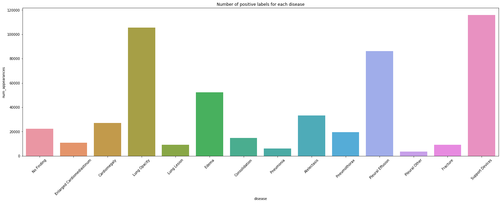

```python
import pandas as pd
%matplotlib inline
import matplotlib.pyplot as plt
import seaborn as sns
from PIL import Image

from IPython.display import display, HTML

```


```python
PATH = '/storage/CheXpert-v1.0-small/'
```


```python
train_df = pd.read_csv(f'{PATH}train.csv')
valid_df = pd.read_csv(f'{PATH}valid.csv')
train_df.isna().sum()
```


    Path                               0
    Sex                                0
    Age                                0
    Frontal/Lateral                    0
    AP/PA                          32387
    No Finding                    201033
    Enlarged Cardiomediastinum    178575
    Cardiomegaly                  177211
    Lung Opacity                  105636
    Lung Lesion                   211470
    Edema                         137458
    Consolidation                 152792
    Pneumonia                     195806
    Atelectasis                   154971
    Pneumothorax                  144480
    Pleural Effusion               90203
    Pleural Other                 216922
    Fracture                      211220
    Support Devices               100197
    dtype: int64


```python
len(train_df), len(valid_df)

```


    (223414, 234)


```python
label_cols = ['No Finding', 'Enlarged Cardiomediastinum', 'Cardiomegaly', 'Lung Opacity',
       'Lung Lesion', 'Edema', 'Consolidation', 'Pneumonia', 'Atelectasis',
       'Pneumothorax', 'Pleural Effusion', 'Pleural Other', 'Fracture',
       'Support Devices']
print(train_df['Atelectasis'].value_counts(dropna=False))
# print(train_df['Pneumothorax'].value_counts(dropna=False))
# print(train_df['Pneumonia'].value_counts(dropna=False))
print(train_df['Frontal/Lateral'].value_counts(dropna=False))
print(train_df['AP/PA'].value_counts(dropna=False))
print(train_df['Sex'].value_counts(dropna=False))
train_df.columns
```

     NaN    154971
    -1.0     33739
     1.0     33376
     0.0      1328
    Name: Atelectasis, dtype: int64
    Frontal    191027
    Lateral     32387
    Name: Frontal/Lateral, dtype: int64
    AP     161590
    NaN     32387
    PA      29420
    LL         16
    RL          1
    Name: AP/PA, dtype: int64
    Male       132636
    Female      90777
    Unknown         1
    Name: Sex, dtype: int64


    Index(['Path', 'Sex', 'Age', 'Frontal/Lateral', 'AP/PA', 'No Finding',
           'Enlarged Cardiomediastinum', 'Cardiomegaly', 'Lung Opacity',
           'Lung Lesion', 'Edema', 'Consolidation', 'Pneumonia', 'Atelectasis',
           'Pneumothorax', 'Pleural Effusion', 'Pleural Other', 'Fracture',
           'Support Devices'],
          dtype='object')


### Number of diseases (confirmed positive)
To get number of diseases in an Xray, I first replace the -1.0 with 0, so that when I sum across columns, I am only summing the 1.0 values. Then this column result is put ito the original train and valid dataframes.

#### Support Devices is not considered a finding according to the data. See more in cells below


```python
# number of diseases (sum the 1.0, except the no finding column)
# make a temp df where -1.0 is changed to 0, NAN is filled with 0, do the sum, then put that column into original df
temp_train = train_df[label_cols].replace([-1.0],0.0)
temp_train = temp_train.fillna(0.0)
temp_valid = valid_df[label_cols].replace([-1.0],0.0)
temp_valid = temp_valid.fillna(0.0)
## Support Devices is not considered a finding according to the data. see more in cells below
train_df['Number of Diseases'] = temp_train[['Enlarged Cardiomediastinum', 'Cardiomegaly', 'Lung Opacity',
       'Lung Lesion', 'Edema', 'Consolidation', 'Pneumonia', 'Atelectasis',
       'Pneumothorax', 'Pleural Effusion', 'Pleural Other', 'Fracture']].astype(int).sum(axis=1)
print(train_df.head(2))
valid_df['Number of Diseases'] = temp_valid[['Enlarged Cardiomediastinum', 'Cardiomegaly', 'Lung Opacity',
       'Lung Lesion', 'Edema', 'Consolidation', 'Pneumonia', 'Atelectasis',
       'Pneumothorax', 'Pleural Effusion', 'Pleural Other', 'Fracture']].astype(int).sum(axis=1)
valid_df.head(3)
```

                                                    Path     Sex  Age  \
    0  CheXpert-v1.0-small/train/patient00001/study1/...  Female   68   
    1  CheXpert-v1.0-small/train/patient00002/study2/...  Female   87   
    
      Frontal/Lateral AP/PA  No Finding  Enlarged Cardiomediastinum  Cardiomegaly  \
    0         Frontal    AP         1.0                         NaN           NaN   
    1         Frontal    AP         NaN                         NaN          -1.0   
    
       Lung Opacity  Lung Lesion  Edema  Consolidation  Pneumonia  Atelectasis  \
    0           NaN          NaN    NaN            NaN        NaN          NaN   
    1           1.0          NaN   -1.0           -1.0        NaN         -1.0   
    
       Pneumothorax  Pleural Effusion  Pleural Other  Fracture  Support Devices  \
    0           0.0               NaN            NaN       NaN              1.0   
    1           NaN              -1.0            NaN       1.0              NaN   
    
       Number of Diseases  
    0                   0  
    1                   2  


<div>
<style scoped>
    .dataframe tbody tr th:only-of-type {
        vertical-align: middle;
    }

    .dataframe tbody tr th {
        vertical-align: top;
    }

    .dataframe thead th {
        text-align: right;
    }
</style>
<table border="1" class="dataframe">
  <thead>
    <tr style="text-align: right;">
      <th></th>
      <th>Path</th>
      <th>Sex</th>
      <th>Age</th>
      <th>Frontal/Lateral</th>
      <th>AP/PA</th>
      <th>No Finding</th>
      <th>Enlarged Cardiomediastinum</th>
      <th>Cardiomegaly</th>
      <th>Lung Opacity</th>
      <th>Lung Lesion</th>
      <th>Edema</th>
      <th>Consolidation</th>
      <th>Pneumonia</th>
      <th>Atelectasis</th>
      <th>Pneumothorax</th>
      <th>Pleural Effusion</th>
      <th>Pleural Other</th>
      <th>Fracture</th>
      <th>Support Devices</th>
      <th>Number of Diseases</th>
    </tr>
  </thead>
  <tbody>
    <tr>
      <th>0</th>
      <td>CheXpert-v1.0-small/valid/patient64541/study1/...</td>
      <td>Male</td>
      <td>73</td>
      <td>Frontal</td>
      <td>AP</td>
      <td>0.0</td>
      <td>1.0</td>
      <td>1.0</td>
      <td>1.0</td>
      <td>0.0</td>
      <td>0.0</td>
      <td>0.0</td>
      <td>0.0</td>
      <td>0.0</td>
      <td>0.0</td>
      <td>0.0</td>
      <td>0.0</td>
      <td>0.0</td>
      <td>0.0</td>
      <td>3</td>
    </tr>
    <tr>
      <th>1</th>
      <td>CheXpert-v1.0-small/valid/patient64542/study1/...</td>
      <td>Male</td>
      <td>70</td>
      <td>Frontal</td>
      <td>PA</td>
      <td>0.0</td>
      <td>0.0</td>
      <td>0.0</td>
      <td>0.0</td>
      <td>0.0</td>
      <td>0.0</td>
      <td>0.0</td>
      <td>0.0</td>
      <td>0.0</td>
      <td>0.0</td>
      <td>0.0</td>
      <td>0.0</td>
      <td>0.0</td>
      <td>1.0</td>
      <td>0</td>
    </tr>
    <tr>
      <th>2</th>
      <td>CheXpert-v1.0-small/valid/patient64542/study1/...</td>
      <td>Male</td>
      <td>70</td>
      <td>Lateral</td>
      <td>NaN</td>
      <td>0.0</td>
      <td>0.0</td>
      <td>0.0</td>
      <td>0.0</td>
      <td>0.0</td>
      <td>0.0</td>
      <td>0.0</td>
      <td>0.0</td>
      <td>0.0</td>
      <td>0.0</td>
      <td>0.0</td>
      <td>0.0</td>
      <td>0.0</td>
      <td>1.0</td>
      <td>0</td>
    </tr>
  </tbody>
</table>
</div>


```python
#not getting in place to work so ... using the loop to replace NAN with 0.0, but first, summing the column to get total for each
disease_count = {}
for col in label_cols:
    disease_count[col]=sum(temp_train[col])
    train_df[col] = train_df[col].fillna(0.0) #now can replace NAN with 0.0
    valid_df[col] = valid_df[col].fillna(0.0) #now can replace NAN with 0.0
print(disease_count)
train_df.head()
```

    {'No Finding': 22381.0, 'Enlarged Cardiomediastinum': 10798.0, 'Cardiomegaly': 27000.0, 'Lung Opacity': 105581.0, 'Lung Lesion': 9186.0, 'Edema': 52246.0, 'Consolidation': 14783.0, 'Pneumonia': 6039.0, 'Atelectasis': 33376.0, 'Pneumothorax': 19448.0, 'Pleural Effusion': 86187.0, 'Pleural Other': 3523.0, 'Fracture': 9040.0, 'Support Devices': 116001.0}


<div>
<style scoped>
    .dataframe tbody tr th:only-of-type {
        vertical-align: middle;
    }

    .dataframe tbody tr th {
        vertical-align: top;
    }

    .dataframe thead th {
        text-align: right;
    }
</style>
<table border="1" class="dataframe">
  <thead>
    <tr style="text-align: right;">
      <th></th>
      <th>Path</th>
      <th>Sex</th>
      <th>Age</th>
      <th>Frontal/Lateral</th>
      <th>AP/PA</th>
      <th>No Finding</th>
      <th>Enlarged Cardiomediastinum</th>
      <th>Cardiomegaly</th>
      <th>Lung Opacity</th>
      <th>Lung Lesion</th>
      <th>Edema</th>
      <th>Consolidation</th>
      <th>Pneumonia</th>
      <th>Atelectasis</th>
      <th>Pneumothorax</th>
      <th>Pleural Effusion</th>
      <th>Pleural Other</th>
      <th>Fracture</th>
      <th>Support Devices</th>
      <th>Number of Diseases</th>
    </tr>
  </thead>
  <tbody>
    <tr>
      <th>0</th>
      <td>CheXpert-v1.0-small/train/patient00001/study1/...</td>
      <td>Female</td>
      <td>68</td>
      <td>Frontal</td>
      <td>AP</td>
      <td>1.0</td>
      <td>0.0</td>
      <td>0.0</td>
      <td>0.0</td>
      <td>0.0</td>
      <td>0.0</td>
      <td>0.0</td>
      <td>0.0</td>
      <td>0.0</td>
      <td>0.0</td>
      <td>0.0</td>
      <td>0.0</td>
      <td>0.0</td>
      <td>1.0</td>
      <td>0</td>
    </tr>
    <tr>
      <th>1</th>
      <td>CheXpert-v1.0-small/train/patient00002/study2/...</td>
      <td>Female</td>
      <td>87</td>
      <td>Frontal</td>
      <td>AP</td>
      <td>0.0</td>
      <td>0.0</td>
      <td>-1.0</td>
      <td>1.0</td>
      <td>0.0</td>
      <td>-1.0</td>
      <td>-1.0</td>
      <td>0.0</td>
      <td>-1.0</td>
      <td>0.0</td>
      <td>-1.0</td>
      <td>0.0</td>
      <td>1.0</td>
      <td>0.0</td>
      <td>2</td>
    </tr>
    <tr>
      <th>2</th>
      <td>CheXpert-v1.0-small/train/patient00002/study1/...</td>
      <td>Female</td>
      <td>83</td>
      <td>Frontal</td>
      <td>AP</td>
      <td>0.0</td>
      <td>0.0</td>
      <td>0.0</td>
      <td>1.0</td>
      <td>0.0</td>
      <td>0.0</td>
      <td>-1.0</td>
      <td>0.0</td>
      <td>0.0</td>
      <td>0.0</td>
      <td>0.0</td>
      <td>0.0</td>
      <td>1.0</td>
      <td>0.0</td>
      <td>2</td>
    </tr>
    <tr>
      <th>3</th>
      <td>CheXpert-v1.0-small/train/patient00002/study1/...</td>
      <td>Female</td>
      <td>83</td>
      <td>Lateral</td>
      <td>NaN</td>
      <td>0.0</td>
      <td>0.0</td>
      <td>0.0</td>
      <td>1.0</td>
      <td>0.0</td>
      <td>0.0</td>
      <td>-1.0</td>
      <td>0.0</td>
      <td>0.0</td>
      <td>0.0</td>
      <td>0.0</td>
      <td>0.0</td>
      <td>1.0</td>
      <td>0.0</td>
      <td>2</td>
    </tr>
    <tr>
      <th>4</th>
      <td>CheXpert-v1.0-small/train/patient00003/study1/...</td>
      <td>Male</td>
      <td>41</td>
      <td>Frontal</td>
      <td>AP</td>
      <td>0.0</td>
      <td>0.0</td>
      <td>0.0</td>
      <td>0.0</td>
      <td>0.0</td>
      <td>1.0</td>
      <td>0.0</td>
      <td>0.0</td>
      <td>0.0</td>
      <td>0.0</td>
      <td>0.0</td>
      <td>0.0</td>
      <td>0.0</td>
      <td>0.0</td>
      <td>1</td>
    </tr>
  </tbody>
</table>
</div>


```python
#check where support devices is 1, what are the cases that no finding is 1?
display(HTML(train_df[(train_df['Support Devices'] == 1.0) & (train_df['No Finding'] == 1.0)].sample(5).to_html()))
display(HTML(train_df[(train_df['Support Devices'] == 1.0) & (train_df['No Finding'] == 0.0)].sample(5).to_html()))
# print(train_df[(train_df['Support Devices'] == 1.0) & (train_df['No Finding'] == 0.0)].sample(5))
```


<table border="1" class="dataframe">
  <thead>
    <tr style="text-align: right;">
      <th></th>
      <th>Path</th>
      <th>Sex</th>
      <th>Age</th>
      <th>Frontal/Lateral</th>
      <th>AP/PA</th>
      <th>No Finding</th>
      <th>Enlarged Cardiomediastinum</th>
      <th>Cardiomegaly</th>
      <th>Lung Opacity</th>
      <th>Lung Lesion</th>
      <th>Edema</th>
      <th>Consolidation</th>
      <th>Pneumonia</th>
      <th>Atelectasis</th>
      <th>Pneumothorax</th>
      <th>Pleural Effusion</th>
      <th>Pleural Other</th>
      <th>Fracture</th>
      <th>Support Devices</th>
      <th>Number of Diseases</th>
    </tr>
  </thead>
  <tbody>
    <tr>
      <th>792</th>
      <td>CheXpert-v1.0-small/train/patient00194/study1/view1_frontal.jpg</td>
      <td>Male</td>
      <td>27</td>
      <td>Frontal</td>
      <td>AP</td>
      <td>1.0</td>
      <td>0.0</td>
      <td>0.0</td>
      <td>0.0</td>
      <td>0.0</td>
      <td>0.0</td>
      <td>0.0</td>
      <td>0.0</td>
      <td>0.0</td>
      <td>0.0</td>
      <td>0.0</td>
      <td>0.0</td>
      <td>0.0</td>
      <td>1.0</td>
      <td>0</td>
    </tr>
    <tr>
      <th>222145</th>
      <td>CheXpert-v1.0-small/train/patient63386/study1/view1_frontal.jpg</td>
      <td>Male</td>
      <td>51</td>
      <td>Frontal</td>
      <td>AP</td>
      <td>1.0</td>
      <td>0.0</td>
      <td>0.0</td>
      <td>0.0</td>
      <td>0.0</td>
      <td>0.0</td>
      <td>0.0</td>
      <td>0.0</td>
      <td>0.0</td>
      <td>0.0</td>
      <td>0.0</td>
      <td>0.0</td>
      <td>0.0</td>
      <td>1.0</td>
      <td>0</td>
    </tr>
    <tr>
      <th>122996</th>
      <td>CheXpert-v1.0-small/train/patient29466/study2/view1_frontal.jpg</td>
      <td>Female</td>
      <td>82</td>
      <td>Frontal</td>
      <td>AP</td>
      <td>1.0</td>
      <td>0.0</td>
      <td>0.0</td>
      <td>0.0</td>
      <td>0.0</td>
      <td>0.0</td>
      <td>0.0</td>
      <td>0.0</td>
      <td>0.0</td>
      <td>0.0</td>
      <td>0.0</td>
      <td>0.0</td>
      <td>0.0</td>
      <td>1.0</td>
      <td>0</td>
    </tr>
    <tr>
      <th>57746</th>
      <td>CheXpert-v1.0-small/train/patient13965/study1/view1_frontal.jpg</td>
      <td>Male</td>
      <td>21</td>
      <td>Frontal</td>
      <td>PA</td>
      <td>1.0</td>
      <td>0.0</td>
      <td>0.0</td>
      <td>0.0</td>
      <td>0.0</td>
      <td>0.0</td>
      <td>0.0</td>
      <td>0.0</td>
      <td>0.0</td>
      <td>0.0</td>
      <td>0.0</td>
      <td>0.0</td>
      <td>0.0</td>
      <td>1.0</td>
      <td>0</td>
    </tr>
    <tr>
      <th>213973</th>
      <td>CheXpert-v1.0-small/train/patient57583/study1/view1_frontal.jpg</td>
      <td>Female</td>
      <td>52</td>
      <td>Frontal</td>
      <td>AP</td>
      <td>1.0</td>
      <td>0.0</td>
      <td>0.0</td>
      <td>0.0</td>
      <td>0.0</td>
      <td>0.0</td>
      <td>0.0</td>
      <td>0.0</td>
      <td>0.0</td>
      <td>0.0</td>
      <td>0.0</td>
      <td>0.0</td>
      <td>0.0</td>
      <td>1.0</td>
      <td>0</td>
    </tr>
  </tbody>
</table>


<table border="1" class="dataframe">
  <thead>
    <tr style="text-align: right;">
      <th></th>
      <th>Path</th>
      <th>Sex</th>
      <th>Age</th>
      <th>Frontal/Lateral</th>
      <th>AP/PA</th>
      <th>No Finding</th>
      <th>Enlarged Cardiomediastinum</th>
      <th>Cardiomegaly</th>
      <th>Lung Opacity</th>
      <th>Lung Lesion</th>
      <th>Edema</th>
      <th>Consolidation</th>
      <th>Pneumonia</th>
      <th>Atelectasis</th>
      <th>Pneumothorax</th>
      <th>Pleural Effusion</th>
      <th>Pleural Other</th>
      <th>Fracture</th>
      <th>Support Devices</th>
      <th>Number of Diseases</th>
    </tr>
  </thead>
  <tbody>
    <tr>
      <th>88716</th>
      <td>CheXpert-v1.0-small/train/patient21302/study8/view1_frontal.jpg</td>
      <td>Female</td>
      <td>71</td>
      <td>Frontal</td>
      <td>AP</td>
      <td>0.0</td>
      <td>0.0</td>
      <td>0.0</td>
      <td>1.0</td>
      <td>0.0</td>
      <td>1.0</td>
      <td>0.0</td>
      <td>0.0</td>
      <td>0.0</td>
      <td>0.0</td>
      <td>1.0</td>
      <td>0.0</td>
      <td>0.0</td>
      <td>1.0</td>
      <td>3</td>
    </tr>
    <tr>
      <th>9520</th>
      <td>CheXpert-v1.0-small/train/patient02364/study1/view2_lateral.jpg</td>
      <td>Male</td>
      <td>64</td>
      <td>Lateral</td>
      <td>NaN</td>
      <td>0.0</td>
      <td>0.0</td>
      <td>1.0</td>
      <td>0.0</td>
      <td>0.0</td>
      <td>0.0</td>
      <td>0.0</td>
      <td>0.0</td>
      <td>0.0</td>
      <td>0.0</td>
      <td>0.0</td>
      <td>0.0</td>
      <td>0.0</td>
      <td>1.0</td>
      <td>1</td>
    </tr>
    <tr>
      <th>195809</th>
      <td>CheXpert-v1.0-small/train/patient47774/study3/view1_frontal.jpg</td>
      <td>Male</td>
      <td>83</td>
      <td>Frontal</td>
      <td>AP</td>
      <td>0.0</td>
      <td>0.0</td>
      <td>0.0</td>
      <td>0.0</td>
      <td>1.0</td>
      <td>0.0</td>
      <td>0.0</td>
      <td>0.0</td>
      <td>0.0</td>
      <td>0.0</td>
      <td>0.0</td>
      <td>0.0</td>
      <td>0.0</td>
      <td>1.0</td>
      <td>1</td>
    </tr>
    <tr>
      <th>197013</th>
      <td>CheXpert-v1.0-small/train/patient48292/study4/view1_frontal.jpg</td>
      <td>Male</td>
      <td>63</td>
      <td>Frontal</td>
      <td>AP</td>
      <td>0.0</td>
      <td>0.0</td>
      <td>0.0</td>
      <td>1.0</td>
      <td>0.0</td>
      <td>0.0</td>
      <td>0.0</td>
      <td>0.0</td>
      <td>1.0</td>
      <td>0.0</td>
      <td>0.0</td>
      <td>0.0</td>
      <td>0.0</td>
      <td>1.0</td>
      <td>2</td>
    </tr>
    <tr>
      <th>132128</th>
      <td>CheXpert-v1.0-small/train/patient31667/study2/view1_frontal.jpg</td>
      <td>Female</td>
      <td>55</td>
      <td>Frontal</td>
      <td>AP</td>
      <td>0.0</td>
      <td>0.0</td>
      <td>0.0</td>
      <td>1.0</td>
      <td>0.0</td>
      <td>-1.0</td>
      <td>0.0</td>
      <td>0.0</td>
      <td>0.0</td>
      <td>0.0</td>
      <td>0.0</td>
      <td>0.0</td>
      <td>0.0</td>
      <td>1.0</td>
      <td>1</td>
    </tr>
  </tbody>
</table>


```python
train_df[train_df['Number of Diseases']>6]
```


<div>
<style scoped>
    .dataframe tbody tr th:only-of-type {
        vertical-align: middle;
    }

    .dataframe tbody tr th {
        vertical-align: top;
    }

    .dataframe thead th {
        text-align: right;
    }
</style>
<table border="1" class="dataframe">
  <thead>
    <tr style="text-align: right;">
      <th></th>
      <th>Path</th>
      <th>Sex</th>
      <th>Age</th>
      <th>Frontal/Lateral</th>
      <th>AP/PA</th>
      <th>No Finding</th>
      <th>Enlarged Cardiomediastinum</th>
      <th>Cardiomegaly</th>
      <th>Lung Opacity</th>
      <th>Lung Lesion</th>
      <th>Edema</th>
      <th>Consolidation</th>
      <th>Pneumonia</th>
      <th>Atelectasis</th>
      <th>Pneumothorax</th>
      <th>Pleural Effusion</th>
      <th>Pleural Other</th>
      <th>Fracture</th>
      <th>Support Devices</th>
      <th>Number of Diseases</th>
    </tr>
  </thead>
  <tbody>
    <tr>
      <th>18598</th>
      <td>CheXpert-v1.0-small/train/patient04641/study1/...</td>
      <td>Male</td>
      <td>73</td>
      <td>Frontal</td>
      <td>AP</td>
      <td>0.0</td>
      <td>0.0</td>
      <td>0.0</td>
      <td>1.0</td>
      <td>0.0</td>
      <td>1.0</td>
      <td>1.0</td>
      <td>1.0</td>
      <td>1.0</td>
      <td>0.0</td>
      <td>1.0</td>
      <td>1.0</td>
      <td>0.0</td>
      <td>0.0</td>
      <td>7</td>
    </tr>
    <tr>
      <th>21841</th>
      <td>CheXpert-v1.0-small/train/patient05319/study6/...</td>
      <td>Male</td>
      <td>61</td>
      <td>Frontal</td>
      <td>AP</td>
      <td>0.0</td>
      <td>0.0</td>
      <td>1.0</td>
      <td>1.0</td>
      <td>0.0</td>
      <td>1.0</td>
      <td>1.0</td>
      <td>0.0</td>
      <td>1.0</td>
      <td>1.0</td>
      <td>1.0</td>
      <td>0.0</td>
      <td>0.0</td>
      <td>1.0</td>
      <td>7</td>
    </tr>
    <tr>
      <th>70452</th>
      <td>CheXpert-v1.0-small/train/patient16888/study1/...</td>
      <td>Male</td>
      <td>55</td>
      <td>Frontal</td>
      <td>PA</td>
      <td>0.0</td>
      <td>1.0</td>
      <td>1.0</td>
      <td>1.0</td>
      <td>1.0</td>
      <td>1.0</td>
      <td>0.0</td>
      <td>1.0</td>
      <td>-1.0</td>
      <td>0.0</td>
      <td>1.0</td>
      <td>0.0</td>
      <td>0.0</td>
      <td>0.0</td>
      <td>7</td>
    </tr>
    <tr>
      <th>70453</th>
      <td>CheXpert-v1.0-small/train/patient16888/study1/...</td>
      <td>Male</td>
      <td>55</td>
      <td>Lateral</td>
      <td>NaN</td>
      <td>0.0</td>
      <td>1.0</td>
      <td>1.0</td>
      <td>1.0</td>
      <td>1.0</td>
      <td>1.0</td>
      <td>0.0</td>
      <td>1.0</td>
      <td>-1.0</td>
      <td>0.0</td>
      <td>1.0</td>
      <td>0.0</td>
      <td>0.0</td>
      <td>0.0</td>
      <td>7</td>
    </tr>
    <tr>
      <th>77854</th>
      <td>CheXpert-v1.0-small/train/patient18704/study1/...</td>
      <td>Male</td>
      <td>64</td>
      <td>Frontal</td>
      <td>AP</td>
      <td>0.0</td>
      <td>0.0</td>
      <td>1.0</td>
      <td>1.0</td>
      <td>1.0</td>
      <td>1.0</td>
      <td>1.0</td>
      <td>0.0</td>
      <td>1.0</td>
      <td>1.0</td>
      <td>0.0</td>
      <td>0.0</td>
      <td>0.0</td>
      <td>1.0</td>
      <td>7</td>
    </tr>
    <tr>
      <th>105321</th>
      <td>CheXpert-v1.0-small/train/patient25268/study3/...</td>
      <td>Female</td>
      <td>57</td>
      <td>Frontal</td>
      <td>AP</td>
      <td>0.0</td>
      <td>0.0</td>
      <td>1.0</td>
      <td>1.0</td>
      <td>1.0</td>
      <td>0.0</td>
      <td>1.0</td>
      <td>1.0</td>
      <td>1.0</td>
      <td>0.0</td>
      <td>1.0</td>
      <td>0.0</td>
      <td>0.0</td>
      <td>0.0</td>
      <td>7</td>
    </tr>
    <tr>
      <th>105322</th>
      <td>CheXpert-v1.0-small/train/patient25268/study3/...</td>
      <td>Female</td>
      <td>57</td>
      <td>Lateral</td>
      <td>NaN</td>
      <td>0.0</td>
      <td>0.0</td>
      <td>1.0</td>
      <td>1.0</td>
      <td>1.0</td>
      <td>0.0</td>
      <td>1.0</td>
      <td>1.0</td>
      <td>1.0</td>
      <td>0.0</td>
      <td>1.0</td>
      <td>0.0</td>
      <td>0.0</td>
      <td>0.0</td>
      <td>7</td>
    </tr>
    <tr>
      <th>126702</th>
      <td>CheXpert-v1.0-small/train/patient30351/study1/...</td>
      <td>Male</td>
      <td>65</td>
      <td>Frontal</td>
      <td>AP</td>
      <td>0.0</td>
      <td>1.0</td>
      <td>1.0</td>
      <td>1.0</td>
      <td>1.0</td>
      <td>0.0</td>
      <td>-1.0</td>
      <td>1.0</td>
      <td>1.0</td>
      <td>0.0</td>
      <td>1.0</td>
      <td>0.0</td>
      <td>0.0</td>
      <td>1.0</td>
      <td>7</td>
    </tr>
    <tr>
      <th>130832</th>
      <td>CheXpert-v1.0-small/train/patient31349/study19...</td>
      <td>Male</td>
      <td>68</td>
      <td>Frontal</td>
      <td>AP</td>
      <td>0.0</td>
      <td>0.0</td>
      <td>1.0</td>
      <td>1.0</td>
      <td>0.0</td>
      <td>1.0</td>
      <td>0.0</td>
      <td>0.0</td>
      <td>1.0</td>
      <td>1.0</td>
      <td>1.0</td>
      <td>0.0</td>
      <td>1.0</td>
      <td>1.0</td>
      <td>7</td>
    </tr>
    <tr>
      <th>130835</th>
      <td>CheXpert-v1.0-small/train/patient31349/study20...</td>
      <td>Male</td>
      <td>68</td>
      <td>Frontal</td>
      <td>AP</td>
      <td>0.0</td>
      <td>1.0</td>
      <td>1.0</td>
      <td>1.0</td>
      <td>0.0</td>
      <td>0.0</td>
      <td>0.0</td>
      <td>0.0</td>
      <td>1.0</td>
      <td>1.0</td>
      <td>1.0</td>
      <td>0.0</td>
      <td>1.0</td>
      <td>1.0</td>
      <td>7</td>
    </tr>
    <tr>
      <th>149694</th>
      <td>CheXpert-v1.0-small/train/patient35488/study23...</td>
      <td>Female</td>
      <td>56</td>
      <td>Frontal</td>
      <td>AP</td>
      <td>0.0</td>
      <td>1.0</td>
      <td>1.0</td>
      <td>1.0</td>
      <td>0.0</td>
      <td>1.0</td>
      <td>1.0</td>
      <td>1.0</td>
      <td>1.0</td>
      <td>0.0</td>
      <td>0.0</td>
      <td>0.0</td>
      <td>0.0</td>
      <td>0.0</td>
      <td>7</td>
    </tr>
    <tr>
      <th>199069</th>
      <td>CheXpert-v1.0-small/train/patient49165/study1/...</td>
      <td>Female</td>
      <td>35</td>
      <td>Frontal</td>
      <td>AP</td>
      <td>0.0</td>
      <td>1.0</td>
      <td>1.0</td>
      <td>1.0</td>
      <td>0.0</td>
      <td>1.0</td>
      <td>0.0</td>
      <td>0.0</td>
      <td>1.0</td>
      <td>1.0</td>
      <td>1.0</td>
      <td>0.0</td>
      <td>0.0</td>
      <td>1.0</td>
      <td>7</td>
    </tr>
    <tr>
      <th>199070</th>
      <td>CheXpert-v1.0-small/train/patient49165/study2/...</td>
      <td>Female</td>
      <td>35</td>
      <td>Frontal</td>
      <td>AP</td>
      <td>0.0</td>
      <td>1.0</td>
      <td>1.0</td>
      <td>1.0</td>
      <td>0.0</td>
      <td>1.0</td>
      <td>0.0</td>
      <td>0.0</td>
      <td>1.0</td>
      <td>1.0</td>
      <td>1.0</td>
      <td>0.0</td>
      <td>0.0</td>
      <td>1.0</td>
      <td>7</td>
    </tr>
    <tr>
      <th>209546</th>
      <td>CheXpert-v1.0-small/train/patient54808/study1/...</td>
      <td>Female</td>
      <td>82</td>
      <td>Frontal</td>
      <td>AP</td>
      <td>0.0</td>
      <td>0.0</td>
      <td>1.0</td>
      <td>1.0</td>
      <td>0.0</td>
      <td>1.0</td>
      <td>0.0</td>
      <td>1.0</td>
      <td>1.0</td>
      <td>0.0</td>
      <td>1.0</td>
      <td>0.0</td>
      <td>1.0</td>
      <td>1.0</td>
      <td>7</td>
    </tr>
    <tr>
      <th>221076</th>
      <td>CheXpert-v1.0-small/train/patient62420/study1/...</td>
      <td>Male</td>
      <td>65</td>
      <td>Frontal</td>
      <td>AP</td>
      <td>0.0</td>
      <td>1.0</td>
      <td>1.0</td>
      <td>1.0</td>
      <td>0.0</td>
      <td>1.0</td>
      <td>0.0</td>
      <td>0.0</td>
      <td>1.0</td>
      <td>1.0</td>
      <td>1.0</td>
      <td>0.0</td>
      <td>0.0</td>
      <td>1.0</td>
      <td>7</td>
    </tr>
    <tr>
      <th>223322</th>
      <td>CheXpert-v1.0-small/train/patient64462/study2/...</td>
      <td>Female</td>
      <td>49</td>
      <td>Frontal</td>
      <td>AP</td>
      <td>0.0</td>
      <td>1.0</td>
      <td>0.0</td>
      <td>1.0</td>
      <td>0.0</td>
      <td>1.0</td>
      <td>1.0</td>
      <td>1.0</td>
      <td>1.0</td>
      <td>0.0</td>
      <td>1.0</td>
      <td>0.0</td>
      <td>0.0</td>
      <td>1.0</td>
      <td>7</td>
    </tr>
  </tbody>
</table>
</div>


### Visualizations of features
Below are bar charts of cateogorical features and histograms for numerical features in the train and validation data.
Between train and validation, they appear similiarly distributed enough to assume it is fine. I also base this on the literature explaining that they did stratified splits.


```python
cat_cols = ['Frontal/Lateral','AP/PA','Sex']
fig,ax = plt.subplots(len(cat_cols)+2, 2, figsize=(15,35))
# fig.tight_layout(rect=[0, 0.03, 1, 0.95])
fig.suptitle('Train and Validation Variable Distributions', fontsize=12)
for i,c in enumerate(cat_cols):
    for col in range(2): #go through columns
        ax[i,col].set_xticklabels(ax[i,col].get_xticks(), rotation = 45)
    sns.countplot(x=c, data=train_df,ax=ax[i,0])
    ax[i,0].set_title(f'Train Set {c}')
    sns.countplot(x=c, data=valid_df,ax=ax[i,1])
    ax[i,1].set_title(f'Validation Set {c}')

sns.histplot(train_df['Age'], ax=ax[len(cat_cols),0])
sns.histplot(valid_df['Age'], ax=ax[len(cat_cols),1])
sns.histplot(train_df['Number of Diseases'], ax=ax[len(cat_cols)+1,0])
sns.histplot(valid_df['Number of Diseases'], ax=ax[len(cat_cols)+1,1])

plt.savefig('images/variable_distributions.png')

print(train_df['No Finding'].value_counts())
```

    0.0    201033
    1.0     22381
    Name: No Finding, dtype: int64


```python
# EDA on the file paths, do the the images in a study have the same disease label(s)?
# dict w/ patiennum as key, study as 2nd key with diseases 
import collections
p_studies = collections.defaultdict(dict)

for p,l in zip(train_df.Path, list(train_df[label_cols].values)):
    set_nm, group, patient, study, image_nm = p.split('/')
#     print(patient, study, l)
    if study in p_studies[patient]:
        p_studies[patient][study].append([image_nm, l])
    else: 
        p_studies[patient][study] = [[image_nm, l]]
```


```python
# histogram of how many studies a patient has
import numpy as np 
print(f'Count of patients: {len(p_studies)}')
study_hist = []
images_hist = [] #how many images per study
diff_cnt = 0
for p in p_studies:
    study_hist.append(len(p_studies[p]))
    for s in p_studies[p]:
        images_hist.append(len(p_studies[p][s]))
        #if more than 1 image in a study, check labels
        if len(p_studies[p][s]) > 1:  
            current = None
            for i in p_studies[p][s]:
                label = i[1:]
                if current is None:
                    current = label
                else:
                    if (np.array(current)==np.array(label)).all() == False:
#                     if current==label == False:
                    
                        diff_cnt += 1
                    current = label      
```

    Count of patients: 64540


```python


print(max(study_hist))
sns.histplot(study_hist)
plt.ylim(0, 15000)
# p_studies['patient00005']
diff_cnt
```

    91


    0


```python
# Histogram of study count
from collections import Counter
print(Counter(images_hist))


print(max(images_hist))
sns.histplot(images_hist, bins=3)
# plt.ylim(0, )
plt.xlim(0,3)

```

    Counter({1: 153647, 2: 32215, 3: 1779})
    3


    (0, 3)


```python
disease_count_df = pd.DataFrame(list(disease_count.items()),columns = ['disease','num_appearances']) 
plt.figure(figsize=(25,8))
ax=sns.barplot(x='disease', y='num_appearances', data=disease_count_df)
for tick in ax.get_xticklabels():
    tick.set_rotation(45)
ax.set_title('Number of positive labels for each disease')
plt.savefig('disease_count.png')
```





```python
disease_counts_df =  pd.read_pickle('disease_count.pkl')
list(disease_counts_df.ratio.values)


```


    [0.056010190496211094,
     0.02702283351852408,
     0.06756959668458512,
     0.26422465139093265,
     0.02298867833868885,
     0.1307496721623272,
     0.036995605473637845,
     0.015113066458452206,
     0.08352603181276715,
     0.048670130234141164,
     0.21568966035016066,
     0.008816581078510867,
     0.022623302001061094]


```python
# using code from https://github.com/kamenbliznashki/chexpert/blob/master/explore_data.ipynb

prevalence = train_df[train_df.columns[5:-1]].apply(pd.Series.value_counts, dropna=False).T
# prevalence['prevalence (-1, 0 $ 1)'] = (prevalence[[-1.0, 0.0, 1.0]].sum(1) / prevalence.sum(1)).round(3) * 100
prevalence/223414 * 100
```


<div>
<style scoped>
    .dataframe tbody tr th:only-of-type {
        vertical-align: middle;
    }

    .dataframe tbody tr th {
        vertical-align: top;
    }

    .dataframe thead th {
        text-align: right;
    }
</style>
<table border="1" class="dataframe">
  <thead>
    <tr style="text-align: right;">
      <th></th>
      <th>-1.0</th>
      <th>0.0</th>
      <th>1.0</th>
    </tr>
  </thead>
  <tbody>
    <tr>
      <th>No Finding</th>
      <td>NaN</td>
      <td>89.982275</td>
      <td>10.017725</td>
    </tr>
    <tr>
      <th>Enlarged Cardiomediastinum</th>
      <td>5.551577</td>
      <td>89.615243</td>
      <td>4.833180</td>
    </tr>
    <tr>
      <th>Cardiomegaly</th>
      <td>3.619737</td>
      <td>84.295076</td>
      <td>12.085187</td>
    </tr>
    <tr>
      <th>Lung Opacity</th>
      <td>2.505662</td>
      <td>50.236333</td>
      <td>47.258005</td>
    </tr>
    <tr>
      <th>Lung Lesion</th>
      <td>0.666028</td>
      <td>95.222323</td>
      <td>4.111649</td>
    </tr>
    <tr>
      <th>Edema</th>
      <td>5.811632</td>
      <td>70.803083</td>
      <td>23.385285</td>
    </tr>
    <tr>
      <th>Consolidation</th>
      <td>12.417306</td>
      <td>80.965830</td>
      <td>6.616864</td>
    </tr>
    <tr>
      <th>Pneumonia</th>
      <td>8.401443</td>
      <td>88.895503</td>
      <td>2.703054</td>
    </tr>
    <tr>
      <th>Atelectasis</th>
      <td>15.101560</td>
      <td>69.959358</td>
      <td>14.939082</td>
    </tr>
    <tr>
      <th>Pneumothorax</th>
      <td>1.407701</td>
      <td>89.887384</td>
      <td>8.704916</td>
    </tr>
    <tr>
      <th>Pleural Effusion</th>
      <td>5.204687</td>
      <td>56.218053</td>
      <td>38.577260</td>
    </tr>
    <tr>
      <th>Pleural Other</th>
      <td>1.187482</td>
      <td>97.235625</td>
      <td>1.576893</td>
    </tr>
    <tr>
      <th>Fracture</th>
      <td>0.287359</td>
      <td>95.666341</td>
      <td>4.046300</td>
    </tr>
    <tr>
      <th>Support Devices</th>
      <td>0.482960</td>
      <td>47.595048</td>
      <td>51.921992</td>
    </tr>
  </tbody>
</table>
</div>


```python
train_df.groupby('Frontal/Lateral').agg(lambda x: x[x>0].sum()).T
```


<div>
<style scoped>
    .dataframe tbody tr th:only-of-type {
        vertical-align: middle;
    }

    .dataframe tbody tr th {
        vertical-align: top;
    }

    .dataframe thead th {
        text-align: right;
    }
</style>
<table border="1" class="dataframe">
  <thead>
    <tr style="text-align: right;">
      <th>Frontal/Lateral</th>
      <th>Frontal</th>
      <th>Lateral</th>
    </tr>
  </thead>
  <tbody>
    <tr>
      <th>Age</th>
      <td>11590175.0</td>
      <td>1910879.0</td>
    </tr>
    <tr>
      <th>No Finding</th>
      <td>16974.0</td>
      <td>5407.0</td>
    </tr>
    <tr>
      <th>Enlarged Cardiomediastinum</th>
      <td>9187.0</td>
      <td>1611.0</td>
    </tr>
    <tr>
      <th>Cardiomegaly</th>
      <td>23385.0</td>
      <td>3615.0</td>
    </tr>
    <tr>
      <th>Lung Opacity</th>
      <td>94211.0</td>
      <td>11370.0</td>
    </tr>
    <tr>
      <th>Lung Lesion</th>
      <td>7040.0</td>
      <td>2146.0</td>
    </tr>
    <tr>
      <th>Edema</th>
      <td>49675.0</td>
      <td>2571.0</td>
    </tr>
    <tr>
      <th>Consolidation</th>
      <td>12983.0</td>
      <td>1800.0</td>
    </tr>
    <tr>
      <th>Pneumonia</th>
      <td>4675.0</td>
      <td>1364.0</td>
    </tr>
    <tr>
      <th>Atelectasis</th>
      <td>29720.0</td>
      <td>3656.0</td>
    </tr>
    <tr>
      <th>Pneumothorax</th>
      <td>17693.0</td>
      <td>1755.0</td>
    </tr>
    <tr>
      <th>Pleural Effusion</th>
      <td>76899.0</td>
      <td>9288.0</td>
    </tr>
    <tr>
      <th>Pleural Other</th>
      <td>2505.0</td>
      <td>1018.0</td>
    </tr>
    <tr>
      <th>Fracture</th>
      <td>7436.0</td>
      <td>1604.0</td>
    </tr>
    <tr>
      <th>Support Devices</th>
      <td>107170.0</td>
      <td>8831.0</td>
    </tr>
    <tr>
      <th>Number of Diseases</th>
      <td>335409.0</td>
      <td>41798.0</td>
    </tr>
  </tbody>
</table>
</div>


```python
train_df.groupby('AP/PA')[label_cols].agg(lambda x: x[x>0].sum()).T
```


<div>
<style scoped>
    .dataframe tbody tr th:only-of-type {
        vertical-align: middle;
    }

    .dataframe tbody tr th {
        vertical-align: top;
    }

    .dataframe thead th {
        text-align: right;
    }
</style>
<table border="1" class="dataframe">
  <thead>
    <tr style="text-align: right;">
      <th>AP/PA</th>
      <th>AP</th>
      <th>LL</th>
      <th>PA</th>
      <th>RL</th>
    </tr>
  </thead>
  <tbody>
    <tr>
      <th>No Finding</th>
      <td>11471.0</td>
      <td>4.0</td>
      <td>5499.0</td>
      <td>0.0</td>
    </tr>
    <tr>
      <th>Enlarged Cardiomediastinum</th>
      <td>7750.0</td>
      <td>1.0</td>
      <td>1436.0</td>
      <td>0.0</td>
    </tr>
    <tr>
      <th>Cardiomegaly</th>
      <td>20475.0</td>
      <td>1.0</td>
      <td>2909.0</td>
      <td>0.0</td>
    </tr>
    <tr>
      <th>Lung Opacity</th>
      <td>84471.0</td>
      <td>4.0</td>
      <td>9736.0</td>
      <td>0.0</td>
    </tr>
    <tr>
      <th>Lung Lesion</th>
      <td>4918.0</td>
      <td>0.0</td>
      <td>2122.0</td>
      <td>0.0</td>
    </tr>
    <tr>
      <th>Edema</th>
      <td>47965.0</td>
      <td>1.0</td>
      <td>1709.0</td>
      <td>0.0</td>
    </tr>
    <tr>
      <th>Consolidation</th>
      <td>11484.0</td>
      <td>1.0</td>
      <td>1498.0</td>
      <td>0.0</td>
    </tr>
    <tr>
      <th>Pneumonia</th>
      <td>3476.0</td>
      <td>1.0</td>
      <td>1198.0</td>
      <td>0.0</td>
    </tr>
    <tr>
      <th>Atelectasis</th>
      <td>26523.0</td>
      <td>2.0</td>
      <td>3195.0</td>
      <td>0.0</td>
    </tr>
    <tr>
      <th>Pneumothorax</th>
      <td>15891.0</td>
      <td>0.0</td>
      <td>1802.0</td>
      <td>0.0</td>
    </tr>
    <tr>
      <th>Pleural Effusion</th>
      <td>68816.0</td>
      <td>4.0</td>
      <td>8078.0</td>
      <td>1.0</td>
    </tr>
    <tr>
      <th>Pleural Other</th>
      <td>1491.0</td>
      <td>2.0</td>
      <td>1012.0</td>
      <td>0.0</td>
    </tr>
    <tr>
      <th>Fracture</th>
      <td>6023.0</td>
      <td>2.0</td>
      <td>1411.0</td>
      <td>0.0</td>
    </tr>
    <tr>
      <th>Support Devices</th>
      <td>99028.0</td>
      <td>3.0</td>
      <td>8139.0</td>
      <td>0.0</td>
    </tr>
  </tbody>
</table>
</div>


#### Co ocurrances
On the positive cases to other positive cases


```python
train_df[label_cols].T.dot(train_df[label_cols]).astype(int)
train_df[label_cols].T
```


<div>
<style scoped>
    .dataframe tbody tr th:only-of-type {
        vertical-align: middle;
    }

    .dataframe tbody tr th {
        vertical-align: top;
    }

    .dataframe thead th {
        text-align: right;
    }
</style>
<table border="1" class="dataframe">
  <thead>
    <tr style="text-align: right;">
      <th></th>
      <th>0</th>
      <th>1</th>
      <th>2</th>
      <th>3</th>
      <th>4</th>
      <th>5</th>
      <th>6</th>
      <th>7</th>
      <th>8</th>
      <th>9</th>
      <th>...</th>
      <th>223404</th>
      <th>223405</th>
      <th>223406</th>
      <th>223407</th>
      <th>223408</th>
      <th>223409</th>
      <th>223410</th>
      <th>223411</th>
      <th>223412</th>
      <th>223413</th>
    </tr>
  </thead>
  <tbody>
    <tr>
      <th>No Finding</th>
      <td>1.0</td>
      <td>0.0</td>
      <td>0.0</td>
      <td>0.0</td>
      <td>0.0</td>
      <td>1.0</td>
      <td>1.0</td>
      <td>1.0</td>
      <td>1.0</td>
      <td>0.0</td>
      <td>...</td>
      <td>0.0</td>
      <td>0.0</td>
      <td>0.0</td>
      <td>0.0</td>
      <td>0.0</td>
      <td>0.0</td>
      <td>0.0</td>
      <td>0.0</td>
      <td>0.0</td>
      <td>1.0</td>
    </tr>
    <tr>
      <th>Enlarged Cardiomediastinum</th>
      <td>0.0</td>
      <td>0.0</td>
      <td>0.0</td>
      <td>0.0</td>
      <td>0.0</td>
      <td>0.0</td>
      <td>0.0</td>
      <td>0.0</td>
      <td>0.0</td>
      <td>0.0</td>
      <td>...</td>
      <td>0.0</td>
      <td>0.0</td>
      <td>0.0</td>
      <td>0.0</td>
      <td>0.0</td>
      <td>0.0</td>
      <td>0.0</td>
      <td>0.0</td>
      <td>0.0</td>
      <td>0.0</td>
    </tr>
    <tr>
      <th>Cardiomegaly</th>
      <td>0.0</td>
      <td>-1.0</td>
      <td>0.0</td>
      <td>0.0</td>
      <td>0.0</td>
      <td>0.0</td>
      <td>0.0</td>
      <td>0.0</td>
      <td>0.0</td>
      <td>0.0</td>
      <td>...</td>
      <td>0.0</td>
      <td>0.0</td>
      <td>0.0</td>
      <td>0.0</td>
      <td>0.0</td>
      <td>0.0</td>
      <td>0.0</td>
      <td>0.0</td>
      <td>1.0</td>
      <td>0.0</td>
    </tr>
    <tr>
      <th>Lung Opacity</th>
      <td>0.0</td>
      <td>1.0</td>
      <td>1.0</td>
      <td>1.0</td>
      <td>0.0</td>
      <td>0.0</td>
      <td>0.0</td>
      <td>0.0</td>
      <td>0.0</td>
      <td>0.0</td>
      <td>...</td>
      <td>0.0</td>
      <td>1.0</td>
      <td>1.0</td>
      <td>0.0</td>
      <td>0.0</td>
      <td>-1.0</td>
      <td>-1.0</td>
      <td>0.0</td>
      <td>1.0</td>
      <td>0.0</td>
    </tr>
    <tr>
      <th>Lung Lesion</th>
      <td>0.0</td>
      <td>0.0</td>
      <td>0.0</td>
      <td>0.0</td>
      <td>0.0</td>
      <td>0.0</td>
      <td>0.0</td>
      <td>0.0</td>
      <td>0.0</td>
      <td>0.0</td>
      <td>...</td>
      <td>0.0</td>
      <td>0.0</td>
      <td>0.0</td>
      <td>0.0</td>
      <td>0.0</td>
      <td>0.0</td>
      <td>0.0</td>
      <td>0.0</td>
      <td>0.0</td>
      <td>0.0</td>
    </tr>
    <tr>
      <th>Edema</th>
      <td>0.0</td>
      <td>-1.0</td>
      <td>0.0</td>
      <td>0.0</td>
      <td>1.0</td>
      <td>0.0</td>
      <td>0.0</td>
      <td>0.0</td>
      <td>0.0</td>
      <td>0.0</td>
      <td>...</td>
      <td>0.0</td>
      <td>0.0</td>
      <td>0.0</td>
      <td>1.0</td>
      <td>1.0</td>
      <td>0.0</td>
      <td>0.0</td>
      <td>-1.0</td>
      <td>0.0</td>
      <td>0.0</td>
    </tr>
    <tr>
      <th>Consolidation</th>
      <td>0.0</td>
      <td>-1.0</td>
      <td>-1.0</td>
      <td>-1.0</td>
      <td>0.0</td>
      <td>0.0</td>
      <td>0.0</td>
      <td>0.0</td>
      <td>0.0</td>
      <td>0.0</td>
      <td>...</td>
      <td>-1.0</td>
      <td>0.0</td>
      <td>-1.0</td>
      <td>0.0</td>
      <td>0.0</td>
      <td>0.0</td>
      <td>0.0</td>
      <td>0.0</td>
      <td>0.0</td>
      <td>0.0</td>
    </tr>
    <tr>
      <th>Pneumonia</th>
      <td>0.0</td>
      <td>0.0</td>
      <td>0.0</td>
      <td>0.0</td>
      <td>0.0</td>
      <td>0.0</td>
      <td>0.0</td>
      <td>0.0</td>
      <td>0.0</td>
      <td>0.0</td>
      <td>...</td>
      <td>0.0</td>
      <td>0.0</td>
      <td>0.0</td>
      <td>0.0</td>
      <td>0.0</td>
      <td>0.0</td>
      <td>0.0</td>
      <td>0.0</td>
      <td>-1.0</td>
      <td>0.0</td>
    </tr>
    <tr>
      <th>Atelectasis</th>
      <td>0.0</td>
      <td>-1.0</td>
      <td>0.0</td>
      <td>0.0</td>
      <td>0.0</td>
      <td>0.0</td>
      <td>0.0</td>
      <td>0.0</td>
      <td>0.0</td>
      <td>0.0</td>
      <td>...</td>
      <td>-1.0</td>
      <td>-1.0</td>
      <td>-1.0</td>
      <td>0.0</td>
      <td>1.0</td>
      <td>-1.0</td>
      <td>-1.0</td>
      <td>0.0</td>
      <td>1.0</td>
      <td>0.0</td>
    </tr>
    <tr>
      <th>Pneumothorax</th>
      <td>0.0</td>
      <td>0.0</td>
      <td>0.0</td>
      <td>0.0</td>
      <td>0.0</td>
      <td>0.0</td>
      <td>0.0</td>
      <td>0.0</td>
      <td>0.0</td>
      <td>1.0</td>
      <td>...</td>
      <td>0.0</td>
      <td>0.0</td>
      <td>0.0</td>
      <td>0.0</td>
      <td>0.0</td>
      <td>0.0</td>
      <td>0.0</td>
      <td>0.0</td>
      <td>0.0</td>
      <td>0.0</td>
    </tr>
    <tr>
      <th>Pleural Effusion</th>
      <td>0.0</td>
      <td>-1.0</td>
      <td>0.0</td>
      <td>0.0</td>
      <td>0.0</td>
      <td>0.0</td>
      <td>0.0</td>
      <td>0.0</td>
      <td>0.0</td>
      <td>0.0</td>
      <td>...</td>
      <td>0.0</td>
      <td>0.0</td>
      <td>0.0</td>
      <td>1.0</td>
      <td>0.0</td>
      <td>1.0</td>
      <td>-1.0</td>
      <td>0.0</td>
      <td>0.0</td>
      <td>0.0</td>
    </tr>
    <tr>
      <th>Pleural Other</th>
      <td>0.0</td>
      <td>0.0</td>
      <td>0.0</td>
      <td>0.0</td>
      <td>0.0</td>
      <td>0.0</td>
      <td>0.0</td>
      <td>0.0</td>
      <td>0.0</td>
      <td>0.0</td>
      <td>...</td>
      <td>0.0</td>
      <td>0.0</td>
      <td>0.0</td>
      <td>0.0</td>
      <td>0.0</td>
      <td>0.0</td>
      <td>0.0</td>
      <td>0.0</td>
      <td>0.0</td>
      <td>0.0</td>
    </tr>
    <tr>
      <th>Fracture</th>
      <td>0.0</td>
      <td>1.0</td>
      <td>1.0</td>
      <td>1.0</td>
      <td>0.0</td>
      <td>0.0</td>
      <td>0.0</td>
      <td>0.0</td>
      <td>0.0</td>
      <td>0.0</td>
      <td>...</td>
      <td>0.0</td>
      <td>0.0</td>
      <td>0.0</td>
      <td>0.0</td>
      <td>0.0</td>
      <td>0.0</td>
      <td>0.0</td>
      <td>0.0</td>
      <td>0.0</td>
      <td>0.0</td>
    </tr>
    <tr>
      <th>Support Devices</th>
      <td>1.0</td>
      <td>0.0</td>
      <td>0.0</td>
      <td>0.0</td>
      <td>0.0</td>
      <td>0.0</td>
      <td>0.0</td>
      <td>1.0</td>
      <td>1.0</td>
      <td>0.0</td>
      <td>...</td>
      <td>0.0</td>
      <td>0.0</td>
      <td>0.0</td>
      <td>0.0</td>
      <td>1.0</td>
      <td>0.0</td>
      <td>0.0</td>
      <td>0.0</td>
      <td>0.0</td>
      <td>0.0</td>
    </tr>
  </tbody>
</table>
<p>14 rows × 223414 columns</p>
</div>


```python

```


```python

fig, axs = plt.subplots(len(label_cols), 3, figsize=(3*5, 5*len(label_cols)))

for i, a in enumerate(label_cols):
    filenames = train_df.loc[(train_df[a]==1) & (train_df[train_df[label_cols]>0.0][label_cols].sum(1)==1.0), 'Path'].head(3).values
    axs[i,0].set_title(a)
    for j, f in enumerate(filenames):
        img = Image.open('/storage/'+filenames[j])
        axs[i,j].imshow(img, cmap='gray', interpolation='bilinear')
        axs[i,j].set_xlabel(filenames[j], fontsize=8)
        
```


```python
# saving as pickle files for the modeling notebook
train_df.to_pickle('train_df.pkl')
valid_df.to_pickle('valid_df.pkl')

```


```python
import torch
import torch.nn as nn
import torch.nn.functional as F
import torchvision.transforms as T
from torch.utils.data import DataLoader

from tqdm import tqdm #progress bar
import pprint

#confirm the mean and std on the train set
def compute_mean_and_std(dataset):
    m = 0
    s = 0
    k = 1
    for img, _, _ in tqdm(dataset):
        x = img.mean().item()
        new_m = m + (x - m)/k
        s += (x - m)*(x - new_m)
        m = new_m
        k += 1
    print('Number of datapoints: ', k)
    return m, math.sqrt(s/(k-1))

transform=transforms.Compose([transforms.CenterCrop(320), transforms.ToTensor(), transforms.Normalize(mean=[0.5330], std=[0.0349])]))
m, s = compute_mean_and_std(ds)
print('Dataset mean: {}; dataset std {}'.format(m, s))
        
# load only 
```
