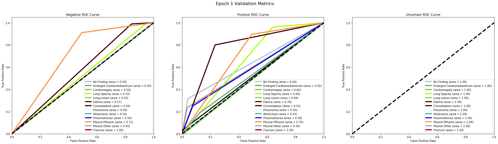
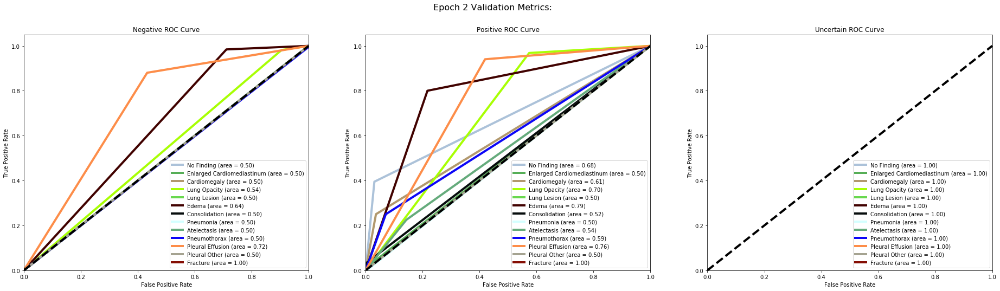
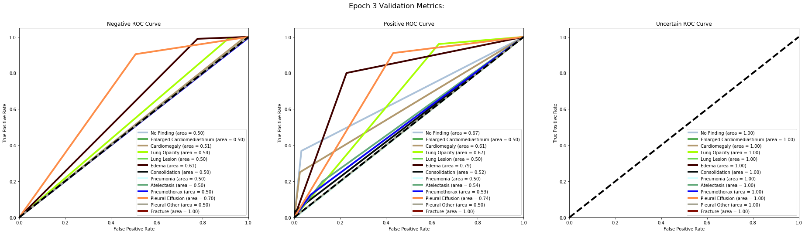
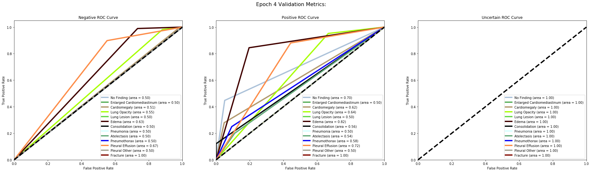
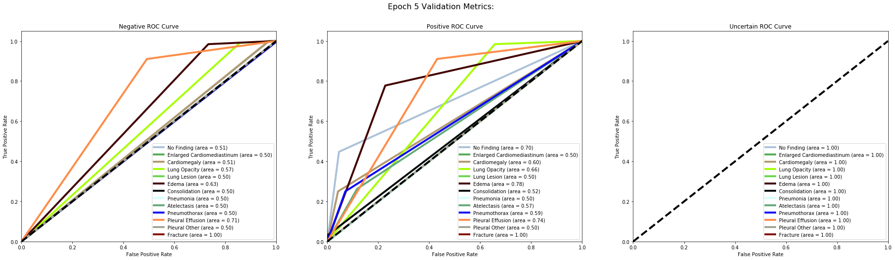
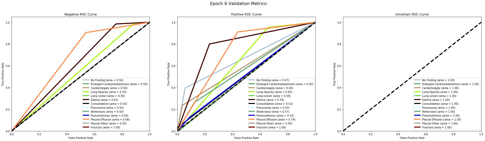
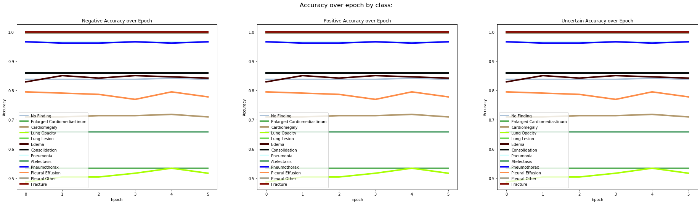

```python
import pickle

val_file = 'pickles/val_metrics_c1_13_Train3_metadata_all.pkl'


with open(val_file, 'rb') as f:
    conf_mat_dict_list= pickle.load(f)
    fpr_list=pickle.load(f)
    tpr_list=pickle.load(f)
    roc_auc_list=pickle.load(f)
    accuracy_list=pickle.load(f)
    precision_list=pickle.load(f)
    recall_list=pickle.load(f)
    f1_list=pickle.load(f)


disease_cols = ['No Finding', 'Enlarged Cardiomediastinum', 'Cardiomegaly', 'Lung Opacity',
       'Lung Lesion', 'Edema', 'Consolidation', 'Pneumonia', 'Atelectasis',
       'Pneumothorax', 'Pleural Effusion', 'Pleural Other', 'Fracture']

classes = ['Positive', 'Negative', 'Uncertain']

#df to hold values to show as a table
#index, epoch num, label, class metrics, class2 metrics, class 3 metrics, label 2...
# num rows are epochs, columns will be 2+ 12
```


```python
#precion rcall, f1 
# TP, FP
# FN, TN
# print(conf_mat_dict_list) I get 3 Matrices for each class, classes = {0: 'Negative', 1: 'Positive', 2: 'Uncertain'} 

def recall(tp, fn):
    return round(tp / (tp + fn + .000001),2)

def precision(tp, fp):
    return round(tp / (tp + fp + .000001),2)

def f1(tp, fp, fn):
    return round(tp / (tp + .5*(fp+fn + .00001)), 2)

for e in range(len(roc_auc_list)):
    for d in disease_cols:
        for i,c in enumerate(classes):
#             print(d,c)
            cf = conf_mat_dict_list[e][d][i] 
            TP, FP, FN, TN= cf[0][0], cf[0][1], cf[1][0], cf[1][1] 
            recall(TP,FN)
            precision(TP, FP)

x_coord = []
lol_accuracies = [[],[],[],[],[],[],[],[],[],[],[],[],[]]
# y1, y2, y3, y4, y5, y6, y7, y8, y9, y10, y11, y12, y13 = [],[],[],[],[],[],[],[],[],[],[],[],[]
for e in range(len(accuracy_list)):
    x_coord.append(e)
    for i,d in enumerate(disease_cols):
        lol_accuracies[i].append(accuracy_list[e][d])
```


```python
import matplotlib.pyplot as plt
%matplotlib inline

colors = ['#acc2d9','#56ae57','#b2996e','#a8ff04',	'#69d84f',	'#410200', '#070d0d', '#d4ffff', '#65ab7c',	'#0c06f7',	
          '#fd8d49', '#a5a391','#850e04']
for e in range(len(fpr_list)): #how many epochs are stored

    lw = 4
    figsize = (32, 8)
    cols = 3
    rows = 1 #changing to all diseases for a class in a plot
#     colors = ['aqua', 'darkorange', 'cornflowerblue']
    fig,ax = plt.subplots(rows, cols, figsize=figsize)
    fig.suptitle(f'Epoch {e+1} Validation Metrics:', fontsize=16, va='top')
    axes = ax.flatten()
    
    for i, classification in enumerate(['Negative', 'Positive', 'Uncertain']):
        for d_ix,disease in enumerate(disease_cols):
            

#             print(fpr_list[e][disease])
#             if classification in fpr_list[e][disease]:
        
            axes[i].plot(fpr_list[e][disease][classification], tpr_list[e][disease][classification], color=colors[d_ix], lw=lw,
         label=f'{disease} (area = {roc_auc_list[e][disease][classification]:0.2f})')
            
        axes[i].plot([0, 1], [0, 1], 'k--', lw=lw)
        axes[i].set_xlim([0.0, 1.0])
        axes[i].set_ylim([0.0, 1.05])
        axes[i].set_xlabel('False Positive Rate')
        axes[i].set_ylabel('True Positive Rate')
        axes[i].set_title(f'{classification} ROC Curve')
        axes[i].legend(loc="lower right")
    
    fig.savefig(f'images/epoch_t3_all_{e}_roc.png')

```




















```python
#make lists of coordinates
import matplotlib.pyplot as plt
%matplotlib inline
colors = ['#acc2d9','#56ae57','#b2996e','#a8ff04',	'#69d84f',	'#410200', '#070d0d', '#d4ffff', '#65ab7c',	'#0c06f7',	
          '#fd8d49', '#a5a391','#850e04']


lw = 4
figsize = (32, 8)
cols = 3
rows = 1 #changing to all diseases for a class in a plot
#     colors = ['aqua', 'darkorange', 'cornflowerblue']
fig,ax = plt.subplots(rows, cols, figsize=figsize)
fig.suptitle(f'Accuracy over epoch by class:', fontsize=16, va='top')
axes = ax.flatten()

for i, classification in enumerate(['Negative', 'Positive', 'Uncertain']):
    for d_ix,disease in enumerate(disease_cols):
            
        
        
        axes[i].plot(x_coord, lol_accuracies[d_ix], color=colors[d_ix], lw=lw,
     label=f'{disease}')
            
#         axes[i].plot([0, 1], [0, 1], 'k--', lw=lw)
#         axes[i].set_xlim([0.0, 1.0])
#         axes[i].set_ylim([0.0, 1.05])
        axes[i].set_xlabel('Epoch')
        axes[i].set_ylabel('Accuracy')
        axes[i].set_title(f'{classification} Accuracy over Epoch')
        axes[i].legend(loc="best")
    
    fig.savefig(f'images/accuracies_t4_all_meta.png')
    
```





```python
from pytablewriter import MarkdownTableWriter

lol = []

for d in disease_cols:
    for e in range(len(roc_auc_list)):

        row = [e,d]
        for i,c in enumerate(classes):
            cf = conf_mat_dict_list[e][d][i] 
            TP, FP, FN, TN= cf[0][0], cf[0][1], cf[1][0], cf[1][1] 
            row.extend([f1(TP, FP, FN),precision(TP, FP),recall(TP,FN),round(roc_auc_list[e][d][c], 2)])
        lol.append(row)


writer = MarkdownTableWriter(
    table_name="Train #4 results",
    headers=["Epoch", "Disease", "Positive:F1","Recall", "Precision","RoC Auc Score", 
             "Negative: F1", "Recall", "Precision","RoC Auc Score", "Uncertain: F1", "Recall", "Precision","RoC Auc Score"],
    value_matrix=lol,
)
writer.write_table()
```

    # Train #4 results
    |Epoch|         Disease          |Positive:F1|Recall|Precision|RoC Auc Score|Negative: F1|Recall|Precision|RoC Auc Score|Uncertain: F1|Recall|Precision|RoC Auc Score|
    |----:|--------------------------|----------:|-----:|--------:|------------:|-----------:|-----:|--------:|------------:|------------:|-----:|--------:|------------:|
    |    0|No Finding                |       0.00|  0.00|     0.00|         0.64|        0.91|  1.00|     0.84|         0.50|            1|     1|        1|            1|
    |    1|No Finding                |       0.00|  0.00|     0.00|         0.68|        0.91|  1.00|     0.84|         0.50|            1|     1|        1|            1|
    |    2|No Finding                |       0.00|  0.00|     0.00|         0.67|        0.91|  1.00|     0.84|         0.50|            1|     1|        1|            1|
    |    3|No Finding                |       0.00|  0.00|     0.00|         0.70|        0.91|  1.00|     0.84|         0.50|            1|     1|        1|            1|
    |    4|No Finding                |       0.05|  0.03|     1.00|         0.70|        0.91|  1.00|     0.84|         0.51|            1|     1|        1|            1|
    |    5|No Finding                |       0.00|  0.00|     0.00|         0.67|        0.91|  1.00|     0.84|         0.50|            1|     1|        1|            1|
    |    0|Enlarged Cardiomediastinum|       0.00|  0.00|     0.00|         0.50|        0.70|  1.00|     0.53|         0.50|            1|     1|        1|            1|
    |    1|Enlarged Cardiomediastinum|       0.00|  0.00|     0.00|         0.50|        0.70|  1.00|     0.53|         0.50|            1|     1|        1|            1|
    |    2|Enlarged Cardiomediastinum|       0.00|  0.00|     0.00|         0.50|        0.70|  1.00|     0.53|         0.50|            1|     1|        1|            1|
    |    3|Enlarged Cardiomediastinum|       0.00|  0.00|     0.00|         0.50|        0.70|  1.00|     0.53|         0.50|            1|     1|        1|            1|
    |    4|Enlarged Cardiomediastinum|       0.00|  0.00|     0.00|         0.50|        0.70|  1.00|     0.53|         0.50|            1|     1|        1|            1|
    |    5|Enlarged Cardiomediastinum|       0.00|  0.00|     0.00|         0.50|        0.70|  1.00|     0.53|         0.50|            1|     1|        1|            1|
    |    0|Cardiomegaly              |       0.00|  0.00|     0.00|         0.60|        0.83|  1.00|     0.71|         0.50|            1|     1|        1|            1|
    |    1|Cardiomegaly              |       0.00|  0.00|     0.00|         0.61|        0.83|  1.00|     0.71|         0.50|            1|     1|        1|            1|
    |    2|Cardiomegaly              |       0.03|  0.01|     1.00|         0.61|        0.83|  1.00|     0.71|         0.51|            1|     1|        1|            1|
    |    3|Cardiomegaly              |       0.03|  0.01|     1.00|         0.62|        0.83|  1.00|     0.71|         0.51|            1|     1|        1|            1|
    |    4|Cardiomegaly              |       0.06|  0.03|     1.00|         0.60|        0.83|  1.00|     0.72|         0.51|            1|     1|        1|            1|
    |    5|Cardiomegaly              |       0.00|  0.00|     0.00|         0.60|        0.83|  1.00|     0.71|         0.50|            1|     1|        1|            1|
    |    0|Lung Opacity              |       0.10|  0.06|     0.87|         0.66|        0.64|  0.99|     0.47|         0.52|            1|     1|        1|            1|
    |    1|Lung Opacity              |       0.17|  0.10|     0.86|         0.70|        0.65|  0.98|     0.48|         0.54|            1|     1|        1|            1|
    |    2|Lung Opacity              |       0.16|  0.09|     0.92|         0.67|        0.65|  0.99|     0.48|         0.54|            1|     1|        1|            1|
    |    3|Lung Opacity              |       0.21|  0.12|     0.88|         0.64|        0.65|  0.98|     0.49|         0.55|            1|     1|        1|            1|
    |    4|Lung Opacity              |       0.25|  0.14|     0.95|         0.66|        0.66|  0.99|     0.50|         0.57|            1|     1|        1|            1|
    |    5|Lung Opacity              |       0.21|  0.12|     0.88|         0.65|        0.65|  0.98|     0.49|         0.55|            1|     1|        1|            1|
    |    0|Lung Lesion               |       0.00|  0.00|     0.00|         0.49|        1.00|  1.00|     1.00|         0.50|            1|     1|        1|            1|
    |    1|Lung Lesion               |       0.00|  0.00|     0.00|         0.50|        1.00|  1.00|     1.00|         0.50|            1|     1|        1|            1|
    |    2|Lung Lesion               |       0.00|  0.00|     0.00|         0.50|        1.00|  1.00|     1.00|         0.50|            1|     1|        1|            1|
    |    3|Lung Lesion               |       0.00|  0.00|     0.00|         0.50|        1.00|  1.00|     1.00|         0.50|            1|     1|        1|            1|
    |    4|Lung Lesion               |       0.00|  0.00|     0.00|         0.50|        1.00|  1.00|     1.00|         0.50|            1|     1|        1|            1|
    |    5|Lung Lesion               |       0.00|  0.00|     0.00|         0.50|        1.00|  1.00|     1.00|         0.50|            1|     1|        1|            1|
    |    0|Edema                     |       0.26|  0.16|     0.78|         0.78|        0.90|  0.99|     0.83|         0.57|            1|     1|        1|            1|
    |    1|Edema                     |       0.43|  0.29|     0.81|         0.79|        0.91|  0.98|     0.85|         0.64|            1|     1|        1|            1|
    |    2|Edema                     |       0.35|  0.22|     0.83|         0.79|        0.91|  0.99|     0.84|         0.61|            1|     1|        1|            1|
    |    3|Edema                     |       0.41|  0.27|     0.86|         0.82|        0.91|  0.99|     0.85|         0.63|            1|     1|        1|            1|
    |    4|Edema                     |       0.40|  0.27|     0.80|         0.78|        0.91|  0.98|     0.85|         0.63|            1|     1|        1|            1|
    |    5|Edema                     |       0.37|  0.24|     0.79|         0.78|        0.91|  0.98|     0.85|         0.61|            1|     1|        1|            1|
    |    0|Consolidation             |       0.00|  0.00|     0.00|         0.52|        0.92|  1.00|     0.86|         0.50|            1|     1|        1|            1|
    |    1|Consolidation             |       0.00|  0.00|     0.00|         0.52|        0.92|  1.00|     0.86|         0.50|            1|     1|        1|            1|
    |    2|Consolidation             |       0.00|  0.00|     0.00|         0.52|        0.92|  1.00|     0.86|         0.50|            1|     1|        1|            1|
    |    3|Consolidation             |       0.00|  0.00|     0.00|         0.56|        0.92|  1.00|     0.86|         0.50|            1|     1|        1|            1|
    |    4|Consolidation             |       0.00|  0.00|     0.00|         0.52|        0.92|  1.00|     0.86|         0.50|            1|     1|        1|            1|
    |    5|Consolidation             |       0.00|  0.00|     0.00|         0.52|        0.92|  1.00|     0.86|         0.50|            1|     1|        1|            1|
    |    0|Pneumonia                 |       0.00|  0.00|     0.00|         0.50|        0.98|  1.00|     0.97|         0.50|            1|     1|        1|            1|
    |    1|Pneumonia                 |       0.00|  0.00|     0.00|         0.50|        0.98|  1.00|     0.97|         0.50|            1|     1|        1|            1|
    |    2|Pneumonia                 |       0.00|  0.00|     0.00|         0.50|        0.98|  1.00|     0.97|         0.50|            1|     1|        1|            1|
    |    3|Pneumonia                 |       0.00|  0.00|     0.00|         0.50|        0.98|  1.00|     0.97|         0.50|            1|     1|        1|            1|
    |    4|Pneumonia                 |       0.00|  0.00|     0.00|         0.50|        0.98|  1.00|     0.97|         0.50|            1|     1|        1|            1|
    |    5|Pneumonia                 |       0.00|  0.00|     0.00|         0.50|        0.98|  1.00|     0.97|         0.50|            1|     1|        1|            1|
    |    0|Atelectasis               |       0.00|  0.00|     0.00|         0.53|        0.79|  1.00|     0.66|         0.50|            1|     1|        1|            1|
    |    1|Atelectasis               |       0.00|  0.00|     0.00|         0.54|        0.79|  1.00|     0.66|         0.50|            1|     1|        1|            1|
    |    2|Atelectasis               |       0.00|  0.00|     0.00|         0.54|        0.79|  1.00|     0.66|         0.50|            1|     1|        1|            1|
    |    3|Atelectasis               |       0.00|  0.00|     0.00|         0.54|        0.79|  1.00|     0.66|         0.50|            1|     1|        1|            1|
    |    4|Atelectasis               |       0.00|  0.00|     0.00|         0.57|        0.79|  1.00|     0.66|         0.50|            1|     1|        1|            1|
    |    5|Atelectasis               |       0.00|  0.00|     0.00|         0.57|        0.79|  1.00|     0.66|         0.50|            1|     1|        1|            1|
    |    0|Pneumothorax              |       0.00|  0.00|     0.00|         0.59|        0.98|  1.00|     0.97|         0.50|            1|     1|        1|            1|
    |    1|Pneumothorax              |       0.00|  0.00|     0.00|         0.59|        0.98|  1.00|     0.97|         0.50|            1|     1|        1|            1|
    |    2|Pneumothorax              |       0.00|  0.00|     0.00|         0.53|        0.98|  1.00|     0.97|         0.50|            1|     1|        1|            1|
    |    3|Pneumothorax              |       0.00|  0.00|     0.00|         0.58|        0.98|  1.00|     0.97|         0.50|            1|     1|        1|            1|
    |    4|Pneumothorax              |       0.00|  0.00|     0.00|         0.59|        0.98|  1.00|     0.97|         0.50|            1|     1|        1|            1|
    |    5|Pneumothorax              |       0.00|  0.00|     0.00|         0.52|        0.98|  1.00|     0.97|         0.50|            1|     1|        1|            1|
    |    0|Pleural Effusion          |       0.59|  0.51|     0.69|         0.70|        0.86|  0.91|     0.82|         0.71|            1|     1|        1|            1|
    |    1|Pleural Effusion          |       0.61|  0.57|     0.66|         0.76|        0.86|  0.88|     0.84|         0.72|            1|     1|        1|            1|
    |    2|Pleural Effusion          |       0.57|  0.49|     0.67|         0.74|        0.86|  0.90|     0.82|         0.70|            1|     1|        1|            1|
    |    3|Pleural Effusion          |       0.53|  0.45|     0.64|         0.72|        0.85|  0.90|     0.80|         0.67|            1|     1|        1|            1|
    |    4|Pleural Effusion          |       0.59|  0.51|     0.69|         0.74|        0.86|  0.91|     0.82|         0.71|            1|     1|        1|            1|
    |    5|Pleural Effusion          |       0.54|  0.46|     0.66|         0.74|        0.85|  0.90|     0.81|         0.68|            1|     1|        1|            1|
    |    0|Pleural Other             |       0.00|  0.00|     0.00|         0.50|        1.00|  1.00|     1.00|         0.50|            1|     1|        1|            1|
    |    1|Pleural Other             |       0.00|  0.00|     0.00|         0.50|        1.00|  1.00|     1.00|         0.50|            1|     1|        1|            1|
    |    2|Pleural Other             |       0.00|  0.00|     0.00|         0.50|        1.00|  1.00|     1.00|         0.50|            1|     1|        1|            1|
    |    3|Pleural Other             |       0.00|  0.00|     0.00|         0.50|        1.00|  1.00|     1.00|         0.50|            1|     1|        1|            1|
    |    4|Pleural Other             |       0.00|  0.00|     0.00|         0.50|        1.00|  1.00|     1.00|         0.50|            1|     1|        1|            1|
    |    5|Pleural Other             |       0.00|  0.00|     0.00|         0.50|        1.00|  1.00|     1.00|         0.50|            1|     1|        1|            1|
    |    0|Fracture                  |       0.00|  0.00|     0.00|         1.00|        1.00|  1.00|     1.00|         1.00|            1|     1|        1|            1|
    |    1|Fracture                  |       0.00|  0.00|     0.00|         1.00|        1.00|  1.00|     1.00|         1.00|            1|     1|        1|            1|
    |    2|Fracture                  |       0.00|  0.00|     0.00|         1.00|        1.00|  1.00|     1.00|         1.00|            1|     1|        1|            1|
    |    3|Fracture                  |       0.00|  0.00|     0.00|         1.00|        1.00|  1.00|     1.00|         1.00|            1|     1|        1|            1|
    |    4|Fracture                  |       0.00|  0.00|     0.00|         1.00|        1.00|  1.00|     1.00|         1.00|            1|     1|        1|            1|
    |    5|Fracture                  |       0.00|  0.00|     0.00|         1.00|        1.00|  1.00|     1.00|         1.00|            1|     1|        1|            1|

