- [Results](#results)
  * [Chexpert paper](#chexpert-paper)
  * [Experiment: Training on all images](#experiment--training-on-all-images)
    + [Training Run #1](#training-run--1)
      - [ROC AUC Graphs for last Epoch 3](#roc-auc-graphs-for-last-epoch-3)
      - [Accuracy Graph of the labels over Epochs](#accuracy-graph-of-the-labels-over-epochs)
      - [Table of results](#table-of-results)
    + [Training Run #2](#training-run--2)
      - [ROC AUC Graphs for last Epoch 16](#roc-auc-graphs-for-last-epoch-16)
      - [Accuracy Graph of the labels to epoch 16](#accuracy-graph-of-the-labels-to-epoch-16)
      - [Table of results](#table-of-results-1)
    + [Training Run #3](#training-run--3)
      - [ROC AUC Graphs for last Epoch 11](#roc-auc-graphs-for-last-epoch-11)
      - [Accuracy Graph of the labels](#accuracy-graph-of-the-labels)
      - [Table of results](#table-of-results-2)
  * [Experiment: Incorporating Metadata](#experiment--incorporating-metadata)
    + [Training Run #1](#training-run--1-1)
      - [ROC AUC Graphs for last Epoch 2](#roc-auc-graphs-for-last-epoch-2)
      - [Accuracy Graph of the labels over all Epochs](#accuracy-graph-of-the-labels-over-all-epochs)
      - [Table of Results](#table-of-results)
    + [Training Run #2](#training-run--2-1)
      - [ROC AUC Graphs for last Epoch at 3](#roc-auc-graphs-for-last-epoch-at-3)
      - [Accuracy Graph of the labels over all Epochs](#accuracy-graph-of-the-labels-over-all-epochs-1)
      - [Table of Results](#table-of-results-1)
    + [Training Run #3](#training-run--3-1)
      - [ROC AUC Graphs for last Epoch at 4th](#roc-auc-graphs-for-last-epoch-at-4th)
      - [Accuracy Graph of the labels over Epochs](#accuracy-graph-of-the-labels-over-epochs-1)
      - [Table of Results](#table-of-results-2)
    + [Training Run #4](#training-run--4)
      - [ROC AUC Graphs for last Epoch at 8th](#roc-auc-graphs-for-last-epoch-at-8th)
      - [Accuracy Graph of the labels over Epochs](#accuracy-graph-of-the-labels-over-epochs-2)
      - [Table of Results](#table-of-results-3)
- [Summary of results](#summary-of-results)
  * [ROC AUC, Precision, Recall, F1](#roc-auc--precision--recall--f1)
      - [Positive Class:](#positive-class-)
      - [Negative Class](#negative-class)
    + [Image Only](#image-only)
    + [Image+Metadata](#image-metadata)
  * [Accuracy](#accuracy)
    + [Image Only](#image-only-1)
    + [Image+Metadata](#image-metadata-1)

<small><i><a href='http://ecotrust-canada.github.io/markdown-toc/'>Table of contents generated with markdown-toc</a></i></small>

# Results

## Chexpert paper
In the [ChexPert paper](https://stanfordmlgroup.github.io/competitions/chexpert/), U-MultiClass had good results for for Cardiomegaly and Pleural Effusion (of the 5). The other class assumptions they made did better on others of the 5. I assume this did not have to do with an imbalance problem, but that binary class would be easier and pending what diseases co-occur with each other.

I initially trained and validated on a subset of data using frontal view and AP. This takes training from 223,414 to 161,590 images (72%). I trained, unfroze the last convolution block to reduce overfitting. This had good results though unfreezing another convolution block, train results worsened and next tried weight decay. I stopped and saved results at the point where I got the best validation and train results.  I did similiarly for all images, and since the results were a little better, I moved forward with using all images.  I got to the best train/val, and then incorporated metadata.  The results I got for the epochs and final summary are given for these last experiments. (all images, then metadata.)

These hyperparameters were the same for all experiments

- Batch size: 16
- Num workers = 4
- Betas: (0.9, 0.999)

## Experiment: Training on all images


### Training Run #1
- Densenet121 all layers frozen except last linear classifier
- Weight decay: 0


#### ROC AUC Graphs for last Epoch 3

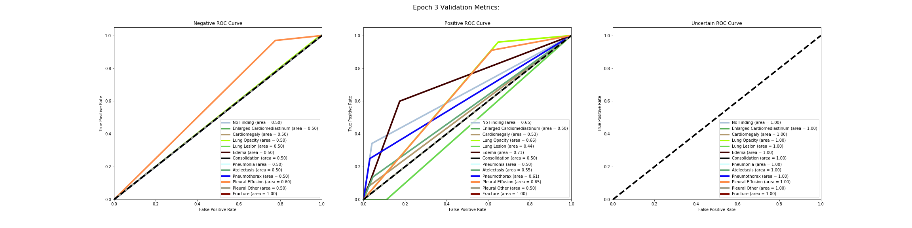

#### Accuracy Graph of the labels over Epochs

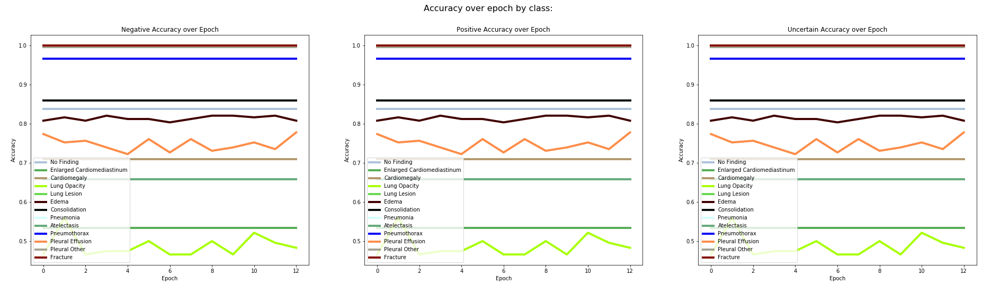

Train loss was steadily going down while validation loss fluctauted. I saved these early stopping weights on the 3rd epoch, as the other validation metrics were not improving, and use them for the next train.

#### Table of results

Table of Validation metrics for each disease by class, every epoch.

| Epoch | Disease                    | Positive:F1 | Recall | Precision | RoC Auc Score | Negative: F1 | Recall | Precision | RoC Auc Score | Uncertain: F1 | Recall | Precision | RoC Auc Score |
| ----: | -------------------------- | ----------: | -----: | --------: | ------------: | -----------: | -----: | --------: | ------------: | ------------: | -----: | --------: | ------------: |
|     0 | No Finding                 |        0.00 |   0.00 |      0.00 |          0.56 |         0.91 |   1.00 |      0.84 |          0.50 |             1 |      1 |         1 |             1 |
|     1 | No Finding                 |        0.00 |   0.00 |      0.00 |          0.67 |         0.91 |   1.00 |      0.84 |          0.50 |             1 |      1 |         1 |             1 |
|     2 | No Finding                 |        0.00 |   0.00 |      0.00 |          0.65 |         0.91 |   1.00 |      0.84 |          0.50 |             1 |      1 |         1 |             1 |
|     0 | Enlarged Cardiomediastinum |        0.00 |   0.00 |      0.00 |          0.50 |         0.70 |   1.00 |      0.53 |          0.50 |             1 |      1 |         1 |             1 |
|     1 | Enlarged Cardiomediastinum |        0.00 |   0.00 |      0.00 |          0.50 |         0.70 |   1.00 |      0.53 |          0.50 |             1 |      1 |         1 |             1 |
|     2 | Enlarged Cardiomediastinum |        0.00 |   0.00 |      0.00 |          0.50 |         0.70 |   1.00 |      0.53 |          0.50 |             1 |      1 |         1 |             1 |
|     0 | Cardiomegaly               |        0.00 |   0.00 |      0.00 |          0.53 |         0.83 |   1.00 |      0.71 |          0.50 |             1 |      1 |         1 |             1 |
|     1 | Cardiomegaly               |        0.00 |   0.00 |      0.00 |          0.55 |         0.83 |   1.00 |      0.71 |          0.50 |             1 |      1 |         1 |             1 |
|     2 | Cardiomegaly               |        0.00 |   0.00 |      0.00 |          0.53 |         0.83 |   1.00 |      0.71 |          0.50 |             1 |      1 |         1 |             1 |
|     0 | Lung Opacity               |        0.02 |   0.01 |      1.00 |          0.55 |         0.63 |   1.00 |      0.46 |          0.50 |             1 |      1 |         1 |             1 |
|     1 | Lung Opacity               |        0.34 |   0.21 |      0.87 |          0.50 |         0.67 |   0.96 |      0.51 |          0.59 |             1 |      1 |         1 |             1 |
|     2 | Lung Opacity               |        0.02 |   0.01 |      1.00 |          0.66 |         0.63 |   1.00 |      0.46 |          0.50 |             1 |      1 |         1 |             1 |
|     0 | Lung Lesion                |        0.00 |   0.00 |      0.00 |          0.50 |         1.00 |   1.00 |      1.00 |          0.50 |             1 |      1 |         1 |             1 |
|     1 | Lung Lesion                |        0.00 |   0.00 |      0.00 |          0.50 |         1.00 |   1.00 |      1.00 |          0.50 |             1 |      1 |         1 |             1 |
|     2 | Lung Lesion                |        0.00 |   0.00 |      0.00 |          0.44 |         1.00 |   1.00 |      1.00 |          0.50 |             1 |      1 |         1 |             1 |
|     0 | Edema                      |        0.15 |   0.09 |      0.50 |          0.72 |         0.89 |   0.98 |      0.82 |          0.53 |             1 |      1 |         1 |             1 |
|     1 | Edema                      |        0.09 |   0.04 |      1.00 |          0.77 |         0.90 |   1.00 |      0.81 |          0.52 |             1 |      1 |         1 |             1 |
|     2 | Edema                      |        0.00 |   0.00 |      0.00 |          0.71 |         0.89 |   1.00 |      0.81 |          0.50 |             1 |      1 |         1 |             1 |
|     0 | Consolidation              |        0.00 |   0.00 |      0.00 |          0.50 |         0.92 |   1.00 |      0.86 |          0.50 |             1 |      1 |         1 |             1 |
|     1 | Consolidation              |        0.00 |   0.00 |      0.00 |          0.50 |         0.92 |   1.00 |      0.86 |          0.50 |             1 |      1 |         1 |             1 |
|     2 | Consolidation              |        0.00 |   0.00 |      0.00 |          0.50 |         0.92 |   1.00 |      0.86 |          0.50 |             1 |      1 |         1 |             1 |
|     0 | Pneumonia                  |        0.00 |   0.00 |      0.00 |          0.50 |         0.98 |   1.00 |      0.97 |          0.50 |             1 |      1 |         1 |             1 |
|     1 | Pneumonia                  |        0.00 |   0.00 |      0.00 |          0.50 |         0.98 |   1.00 |      0.97 |          0.50 |             1 |      1 |         1 |             1 |
|     2 | Pneumonia                  |        0.00 |   0.00 |      0.00 |          0.50 |         0.98 |   1.00 |      0.97 |          0.50 |             1 |      1 |         1 |             1 |
|     0 | Atelectasis                |        0.00 |   0.00 |      0.00 |          0.60 |         0.79 |   1.00 |      0.66 |          0.50 |             1 |      1 |         1 |             1 |
|     1 | Atelectasis                |        0.00 |   0.00 |      0.00 |          0.60 |         0.79 |   1.00 |      0.66 |          0.50 |             1 |      1 |         1 |             1 |
|     2 | Atelectasis                |        0.00 |   0.00 |      0.00 |          0.55 |         0.79 |   1.00 |      0.66 |          0.50 |             1 |      1 |         1 |             1 |
|     0 | Pneumothorax               |        0.00 |   0.00 |      0.00 |          0.55 |         0.98 |   1.00 |      0.97 |          0.50 |             1 |      1 |         1 |             1 |
|     1 | Pneumothorax               |        0.00 |   0.00 |      0.00 |          0.56 |         0.98 |   1.00 |      0.97 |          0.50 |             1 |      1 |         1 |             1 |
|     2 | Pneumothorax               |        0.00 |   0.00 |      0.00 |          0.61 |         0.98 |   1.00 |      0.97 |          0.50 |             1 |      1 |         1 |             1 |
|     0 | Pleural Effusion           |        0.36 |   0.22 |      0.94 |          0.61 |         0.86 |   0.99 |      0.76 |          0.61 |             1 |      1 |         1 |             1 |
|     1 | Pleural Effusion           |        0.27 |   0.16 |      0.85 |          0.63 |         0.85 |   0.99 |      0.75 |          0.58 |             1 |      1 |         1 |             1 |
|     2 | Pleural Effusion           |        0.34 |   0.22 |      0.75 |          0.65 |         0.85 |   0.97 |      0.76 |          0.60 |             1 |      1 |         1 |             1 |
|     0 | Pleural Other              |        0.00 |   0.00 |      0.00 |          0.50 |         1.00 |   1.00 |      1.00 |          0.50 |             1 |      1 |         1 |             1 |
|     1 | Pleural Other              |        0.00 |   0.00 |      0.00 |          0.50 |         1.00 |   1.00 |      1.00 |          0.50 |             1 |      1 |         1 |             1 |
|     2 | Pleural Other              |        0.00 |   0.00 |      0.00 |          0.50 |         1.00 |   1.00 |      1.00 |          0.50 |             1 |      1 |         1 |             1 |
|     0 | Fracture                   |        0.00 |   0.00 |      0.00 |          1.00 |         1.00 |   1.00 |      1.00 |          1.00 |             1 |      1 |         1 |             1 |
|     1 | Fracture                   |        0.00 |   0.00 |      0.00 |          1.00 |         1.00 |   1.00 |      1.00 |          1.00 |             1 |      1 |         1 |             1 |
|     2 | Fracture                   |        0.00 |   0.00 |      0.00 |          1.00 |         1.00 |   1.00 |      1.00 |          1.00 |             1 |      1 |         1 |             1 |


### Training Run #2
I unfroze the last dense block, to now have the following layers unfrozen:

- features.denseblock4.denselayer16.conv1.weight
- features.denseblock4.denselayer16.conv2.weight
- classifier.weight
- classifier.bias

Training starts from checkpoint of train #1

This stopped at epoch 23/24, but should have at epoch 25. Train loss was going downwards and validation loss fluctuated but hit low points along the way. I took the small chance that the validation loss could go lower if I continue training as is. 

#### ROC AUC Graphs for last Epoch 16

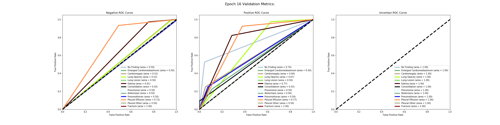

#### Accuracy Graph of the labels to epoch 16 

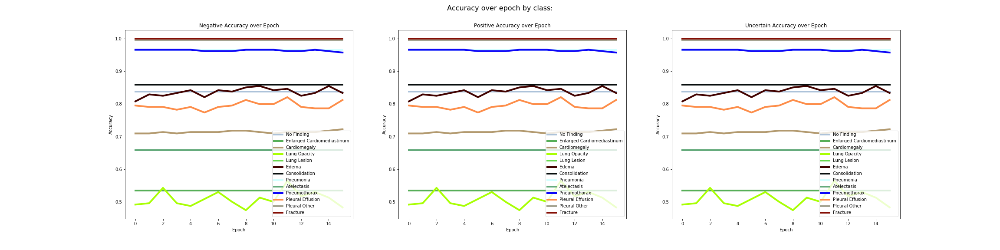


#### Table of results
| Epoch | Disease                    | Positive:F1 | Recall | Precision | RoC Auc Score | Negative: F1 | Recall | Precision | RoC Auc Score | Uncertain: F1 | Recall | Precision | RoC Auc Score |
| ----: | -------------------------- | ----------: | -----: | --------: | ------------: | -----------: | -----: | --------: | ------------: | ------------: | -----: | --------: | ------------: |
|     0 | No Finding                 |        0.00 |   0.00 |      0.00 |          0.69 |         0.91 |   1.00 |      0.84 |          0.50 |             1 |      1 |         1 |             1 |
|     1 | No Finding                 |        0.00 |   0.00 |      0.00 |          0.64 |         0.91 |   1.00 |      0.84 |          0.50 |             1 |      1 |         1 |             1 |
|     2 | No Finding                 |        0.00 |   0.00 |      0.00 |          0.69 |         0.91 |   1.00 |      0.84 |          0.50 |             1 |      1 |         1 |             1 |
|     3 | No Finding                 |        0.00 |   0.00 |      0.00 |          0.62 |         0.91 |   1.00 |      0.84 |          0.50 |             1 |      1 |         1 |             1 |
|     4 | No Finding                 |        0.00 |   0.00 |      0.00 |          0.66 |         0.91 |   1.00 |      0.84 |          0.50 |             1 |      1 |         1 |             1 |
|     5 | No Finding                 |        0.00 |   0.00 |      0.00 |          0.60 |         0.91 |   1.00 |      0.84 |          0.50 |             1 |      1 |         1 |             1 |
|     6 | No Finding                 |        0.00 |   0.00 |      0.00 |          0.63 |         0.91 |   1.00 |      0.84 |          0.50 |             1 |      1 |         1 |             1 |
|     7 | No Finding                 |        0.00 |   0.00 |      0.00 |          0.70 |         0.91 |   1.00 |      0.84 |          0.50 |             1 |      1 |         1 |             1 |
|     8 | No Finding                 |        0.00 |   0.00 |      0.00 |          0.71 |         0.91 |   1.00 |      0.84 |          0.50 |             1 |      1 |         1 |             1 |
|     9 | No Finding                 |        0.00 |   0.00 |      0.00 |          0.60 |         0.91 |   1.00 |      0.84 |          0.50 |             1 |      1 |         1 |             1 |
|    10 | No Finding                 |        0.00 |   0.00 |      0.00 |          0.68 |         0.91 |   1.00 |      0.84 |          0.50 |             1 |      1 |         1 |             1 |
|    11 | No Finding                 |        0.00 |   0.00 |      0.00 |          0.70 |         0.91 |   1.00 |      0.84 |          0.50 |             1 |      1 |         1 |             1 |
|    12 | No Finding                 |        0.00 |   0.00 |      0.00 |          0.66 |         0.91 |   1.00 |      0.84 |          0.50 |             1 |      1 |         1 |             1 |
|    13 | No Finding                 |        0.00 |   0.00 |      0.00 |          0.68 |         0.91 |   1.00 |      0.84 |          0.50 |             1 |      1 |         1 |             1 |
|    14 | No Finding                 |        0.00 |   0.00 |      0.00 |          0.66 |         0.91 |   1.00 |      0.84 |          0.50 |             1 |      1 |         1 |             1 |
|    15 | No Finding                 |        0.00 |   0.00 |      0.00 |          0.74 |         0.91 |   1.00 |      0.84 |          0.50 |             1 |      1 |         1 |             1 |
|     0 | Enlarged Cardiomediastinum |        0.00 |   0.00 |      0.00 |          0.50 |         0.70 |   1.00 |      0.53 |          0.50 |             1 |      1 |         1 |             1 |
|     1 | Enlarged Cardiomediastinum |        0.00 |   0.00 |      0.00 |          0.50 |         0.70 |   1.00 |      0.53 |          0.50 |             1 |      1 |         1 |             1 |
|     2 | Enlarged Cardiomediastinum |        0.00 |   0.00 |      0.00 |          0.50 |         0.70 |   1.00 |      0.53 |          0.50 |             1 |      1 |         1 |             1 |
|     3 | Enlarged Cardiomediastinum |        0.00 |   0.00 |      0.00 |          0.50 |         0.70 |   1.00 |      0.53 |          0.50 |             1 |      1 |         1 |             1 |
|     4 | Enlarged Cardiomediastinum |        0.00 |   0.00 |      0.00 |          0.50 |         0.70 |   1.00 |      0.53 |          0.50 |             1 |      1 |         1 |             1 |
|     5 | Enlarged Cardiomediastinum |        0.00 |   0.00 |      0.00 |          0.50 |         0.70 |   1.00 |      0.53 |          0.50 |             1 |      1 |         1 |             1 |
|     6 | Enlarged Cardiomediastinum |        0.00 |   0.00 |      0.00 |          0.50 |         0.70 |   1.00 |      0.53 |          0.50 |             1 |      1 |         1 |             1 |
|     7 | Enlarged Cardiomediastinum |        0.00 |   0.00 |      0.00 |          0.50 |         0.70 |   1.00 |      0.53 |          0.50 |             1 |      1 |         1 |             1 |
|     8 | Enlarged Cardiomediastinum |        0.00 |   0.00 |      0.00 |          0.50 |         0.70 |   1.00 |      0.53 |          0.50 |             1 |      1 |         1 |             1 |
|     9 | Enlarged Cardiomediastinum |        0.00 |   0.00 |      0.00 |          0.50 |         0.70 |   1.00 |      0.53 |          0.50 |             1 |      1 |         1 |             1 |
|    10 | Enlarged Cardiomediastinum |        0.00 |   0.00 |      0.00 |          0.50 |         0.70 |   1.00 |      0.53 |          0.50 |             1 |      1 |         1 |             1 |
|    11 | Enlarged Cardiomediastinum |        0.00 |   0.00 |      0.00 |          0.50 |         0.70 |   1.00 |      0.53 |          0.50 |             1 |      1 |         1 |             1 |
|    12 | Enlarged Cardiomediastinum |        0.00 |   0.00 |      0.00 |          0.50 |         0.70 |   1.00 |      0.53 |          0.50 |             1 |      1 |         1 |             1 |
|    13 | Enlarged Cardiomediastinum |        0.00 |   0.00 |      0.00 |          0.50 |         0.70 |   1.00 |      0.53 |          0.50 |             1 |      1 |         1 |             1 |
|    14 | Enlarged Cardiomediastinum |        0.00 |   0.00 |      0.00 |          0.50 |         0.70 |   1.00 |      0.53 |          0.50 |             1 |      1 |         1 |             1 |
|    15 | Enlarged Cardiomediastinum |        0.00 |   0.00 |      0.00 |          0.50 |         0.70 |   1.00 |      0.53 |          0.50 |             1 |      1 |         1 |             1 |
|     0 | Cardiomegaly               |        0.00 |   0.00 |      0.00 |          0.55 |         0.83 |   1.00 |      0.71 |          0.50 |             1 |      1 |         1 |             1 |
|     1 | Cardiomegaly               |        0.00 |   0.00 |      0.00 |          0.57 |         0.83 |   1.00 |      0.71 |          0.50 |             1 |      1 |         1 |             1 |
|     2 | Cardiomegaly               |        0.03 |   0.01 |      1.00 |          0.58 |         0.83 |   1.00 |      0.71 |          0.51 |             1 |      1 |         1 |             1 |
|     3 | Cardiomegaly               |        0.00 |   0.00 |      0.00 |          0.55 |         0.83 |   1.00 |      0.71 |          0.50 |             1 |      1 |         1 |             1 |
|     4 | Cardiomegaly               |        0.03 |   0.01 |      1.00 |          0.55 |         0.83 |   1.00 |      0.71 |          0.51 |             1 |      1 |         1 |             1 |
|     5 | Cardiomegaly               |        0.03 |   0.01 |      1.00 |          0.62 |         0.83 |   1.00 |      0.71 |          0.51 |             1 |      1 |         1 |             1 |
|     6 | Cardiomegaly               |        0.03 |   0.01 |      1.00 |          0.58 |         0.83 |   1.00 |      0.71 |          0.51 |             1 |      1 |         1 |             1 |
|     7 | Cardiomegaly               |        0.06 |   0.03 |      1.00 |          0.61 |         0.83 |   1.00 |      0.72 |          0.51 |             1 |      1 |         1 |             1 |
|     8 | Cardiomegaly               |        0.06 |   0.03 |      1.00 |          0.58 |         0.83 |   1.00 |      0.72 |          0.51 |             1 |      1 |         1 |             1 |
|     9 | Cardiomegaly               |        0.03 |   0.01 |      1.00 |          0.57 |         0.83 |   1.00 |      0.71 |          0.51 |             1 |      1 |         1 |             1 |
|    10 | Cardiomegaly               |        0.00 |   0.00 |      0.00 |          0.59 |         0.83 |   1.00 |      0.71 |          0.50 |             1 |      1 |         1 |             1 |
|    11 | Cardiomegaly               |        0.03 |   0.01 |      1.00 |          0.60 |         0.83 |   1.00 |      0.71 |          0.51 |             1 |      1 |         1 |             1 |
|    12 | Cardiomegaly               |        0.03 |   0.01 |      1.00 |          0.62 |         0.83 |   1.00 |      0.71 |          0.51 |             1 |      1 |         1 |             1 |
|    13 | Cardiomegaly               |        0.03 |   0.01 |      1.00 |          0.65 |         0.83 |   1.00 |      0.71 |          0.51 |             1 |      1 |         1 |             1 |
|    14 | Cardiomegaly               |        0.06 |   0.03 |      1.00 |          0.57 |         0.83 |   1.00 |      0.72 |          0.51 |             1 |      1 |         1 |             1 |
|    15 | Cardiomegaly               |        0.08 |   0.04 |      1.00 |          0.60 |         0.84 |   1.00 |      0.72 |          0.52 |             1 |      1 |         1 |             1 |
|     0 | Lung Opacity               |        0.11 |   0.06 |      1.00 |          0.58 |         0.64 |   1.00 |      0.48 |          0.53 |             1 |      1 |         1 |             1 |
|     1 | Lung Opacity               |        0.12 |   0.06 |      1.00 |          0.62 |         0.65 |   1.00 |      0.48 |          0.53 |             1 |      1 |         1 |             1 |
|     2 | Lung Opacity               |        0.28 |   0.17 |      0.91 |          0.57 |         0.66 |   0.98 |      0.50 |          0.57 |             1 |      1 |         1 |             1 |
|     3 | Lung Opacity               |        0.12 |   0.06 |      1.00 |          0.66 |         0.65 |   1.00 |      0.48 |          0.53 |             1 |      1 |         1 |             1 |
|     4 | Lung Opacity               |        0.09 |   0.05 |      1.00 |          0.65 |         0.64 |   1.00 |      0.47 |          0.52 |             1 |      1 |         1 |             1 |
|     5 | Lung Opacity               |        0.17 |   0.10 |      0.92 |          0.61 |         0.65 |   0.99 |      0.48 |          0.54 |             1 |      1 |         1 |             1 |
|     6 | Lung Opacity               |        0.24 |   0.13 |      0.94 |          0.61 |         0.66 |   0.99 |      0.50 |          0.56 |             1 |      1 |         1 |             1 |
|     7 | Lung Opacity               |        0.13 |   0.07 |      1.00 |          0.65 |         0.65 |   1.00 |      0.48 |          0.54 |             1 |      1 |         1 |             1 |
|     8 | Lung Opacity               |        0.05 |   0.02 |      1.00 |          0.67 |         0.64 |   1.00 |      0.47 |          0.51 |             1 |      1 |         1 |             1 |
|     9 | Lung Opacity               |        0.20 |   0.11 |      0.87 |          0.64 |         0.65 |   0.98 |      0.49 |          0.55 |             1 |      1 |         1 |             1 |
|    10 | Lung Opacity               |        0.15 |   0.08 |      0.91 |          0.65 |         0.65 |   0.99 |      0.48 |          0.54 |             1 |      1 |         1 |             1 |
|    11 | Lung Opacity               |        0.33 |   0.20 |      0.96 |          0.62 |         0.68 |   0.99 |      0.51 |          0.59 |             1 |      1 |         1 |             1 |
|    12 | Lung Opacity               |        0.19 |   0.10 |      1.00 |          0.63 |         0.66 |   1.00 |      0.49 |          0.55 |             1 |      1 |         1 |             1 |
|    13 | Lung Opacity               |        0.25 |   0.14 |      0.90 |          0.65 |         0.66 |   0.98 |      0.50 |          0.56 |             1 |      1 |         1 |             1 |
|    14 | Lung Opacity               |        0.20 |   0.11 |      0.87 |          0.64 |         0.65 |   0.98 |      0.49 |          0.55 |             1 |      1 |         1 |             1 |
|    15 | Lung Opacity               |        0.09 |   0.05 |      0.86 |          0.67 |         0.64 |   0.99 |      0.47 |          0.52 |             1 |      1 |         1 |             1 |
|     0 | Lung Lesion                |        0.00 |   0.00 |      0.00 |          0.50 |         1.00 |   1.00 |      1.00 |          0.50 |             1 |      1 |         1 |             1 |
|     1 | Lung Lesion                |        0.00 |   0.00 |      0.00 |          0.50 |         1.00 |   1.00 |      1.00 |          0.50 |             1 |      1 |         1 |             1 |
|     2 | Lung Lesion                |        0.00 |   0.00 |      0.00 |          0.50 |         1.00 |   1.00 |      1.00 |          0.50 |             1 |      1 |         1 |             1 |
|     3 | Lung Lesion                |        0.00 |   0.00 |      0.00 |          0.50 |         1.00 |   1.00 |      1.00 |          0.50 |             1 |      1 |         1 |             1 |
|     4 | Lung Lesion                |        0.00 |   0.00 |      0.00 |          0.50 |         1.00 |   1.00 |      1.00 |          0.50 |             1 |      1 |         1 |             1 |
|     5 | Lung Lesion                |        0.00 |   0.00 |      0.00 |          0.50 |         1.00 |   1.00 |      1.00 |          0.50 |             1 |      1 |         1 |             1 |
|     6 | Lung Lesion                |        0.00 |   0.00 |      0.00 |          0.50 |         1.00 |   1.00 |      1.00 |          0.50 |             1 |      1 |         1 |             1 |
|     7 | Lung Lesion                |        0.00 |   0.00 |      0.00 |          0.50 |         1.00 |   1.00 |      1.00 |          0.50 |             1 |      1 |         1 |             1 |
|     8 | Lung Lesion                |        0.00 |   0.00 |      0.00 |          0.50 |         1.00 |   1.00 |      1.00 |          0.50 |             1 |      1 |         1 |             1 |
|     9 | Lung Lesion                |        0.00 |   0.00 |      0.00 |          0.50 |         1.00 |   1.00 |      1.00 |          0.50 |             1 |      1 |         1 |             1 |
|    10 | Lung Lesion                |        0.00 |   0.00 |      0.00 |          0.50 |         1.00 |   1.00 |      1.00 |          0.50 |             1 |      1 |         1 |             1 |
|    11 | Lung Lesion                |        0.00 |   0.00 |      0.00 |          0.50 |         1.00 |   1.00 |      1.00 |          0.50 |             1 |      1 |         1 |             1 |
|    12 | Lung Lesion                |        0.00 |   0.00 |      0.00 |          0.50 |         1.00 |   1.00 |      1.00 |          0.50 |             1 |      1 |         1 |             1 |
|    13 | Lung Lesion                |        0.00 |   0.00 |      0.00 |          0.50 |         1.00 |   1.00 |      1.00 |          0.50 |             1 |      1 |         1 |             1 |
|    14 | Lung Lesion                |        0.00 |   0.00 |      0.00 |          0.50 |         1.00 |   1.00 |      1.00 |          0.50 |             1 |      1 |         1 |             1 |
|    15 | Lung Lesion                |        0.00 |   0.00 |      0.00 |          0.50 |         1.00 |   1.00 |      1.00 |          0.50 |             1 |      1 |         1 |             1 |
|     0 | Edema                      |        0.08 |   0.04 |      0.50 |          0.76 |         0.89 |   0.99 |      0.81 |          0.52 |             1 |      1 |         1 |             1 |
|     1 | Edema                      |        0.26 |   0.16 |      0.78 |          0.81 |         0.90 |   0.99 |      0.83 |          0.57 |             1 |      1 |         1 |             1 |
|     2 | Edema                      |        0.31 |   0.20 |      0.64 |          0.79 |         0.90 |   0.97 |      0.84 |          0.59 |             1 |      1 |         1 |             1 |
|     3 | Edema                      |        0.29 |   0.18 |      0.80 |          0.81 |         0.91 |   0.99 |      0.83 |          0.58 |             1 |      1 |         1 |             1 |
|     4 | Edema                      |        0.35 |   0.22 |      0.83 |          0.78 |         0.91 |   0.99 |      0.84 |          0.61 |             1 |      1 |         1 |             1 |
|     5 | Edema                      |        0.30 |   0.20 |      0.60 |          0.75 |         0.90 |   0.97 |      0.84 |          0.58 |             1 |      1 |         1 |             1 |
|     6 | Edema                      |        0.35 |   0.22 |      0.83 |          0.77 |         0.91 |   0.99 |      0.84 |          0.61 |             1 |      1 |         1 |             1 |
|     7 | Edema                      |        0.34 |   0.22 |      0.77 |          0.78 |         0.91 |   0.98 |      0.84 |          0.60 |             1 |      1 |         1 |             1 |
|     8 | Edema                      |        0.46 |   0.33 |      0.75 |          0.80 |         0.91 |   0.97 |      0.86 |          0.65 |             1 |      1 |         1 |             1 |
|     9 | Edema                      |        0.41 |   0.27 |      0.92 |          0.79 |         0.92 |   0.99 |      0.85 |          0.63 |             1 |      1 |         1 |             1 |
|    10 | Edema                      |        0.30 |   0.18 |      1.00 |          0.78 |         0.91 |   1.00 |      0.84 |          0.59 |             1 |      1 |         1 |             1 |
|    11 | Edema                      |        0.33 |   0.20 |      1.00 |          0.80 |         0.91 |   1.00 |      0.84 |          0.60 |             1 |      1 |         1 |             1 |
|    12 | Edema                      |        0.33 |   0.22 |      0.62 |          0.78 |         0.90 |   0.97 |      0.84 |          0.60 |             1 |      1 |         1 |             1 |
|    13 | Edema                      |        0.29 |   0.18 |      0.80 |          0.80 |         0.91 |   0.99 |      0.83 |          0.58 |             1 |      1 |         1 |             1 |
|    14 | Edema                      |        0.41 |   0.27 |      0.92 |          0.80 |         0.92 |   0.99 |      0.85 |          0.63 |             1 |      1 |         1 |             1 |
|    15 | Edema                      |        0.36 |   0.24 |      0.69 |          0.77 |         0.90 |   0.97 |      0.84 |          0.61 |             1 |      1 |         1 |             1 |
|     0 | Consolidation              |        0.00 |   0.00 |      0.00 |          0.52 |         0.92 |   1.00 |      0.86 |          0.50 |             1 |      1 |         1 |             1 |
|     1 | Consolidation              |        0.00 |   0.00 |      0.00 |          0.52 |         0.92 |   1.00 |      0.86 |          0.50 |             1 |      1 |         1 |             1 |
|     2 | Consolidation              |        0.00 |   0.00 |      0.00 |          0.52 |         0.92 |   1.00 |      0.86 |          0.50 |             1 |      1 |         1 |             1 |
|     3 | Consolidation              |        0.00 |   0.00 |      0.00 |          0.52 |         0.92 |   1.00 |      0.86 |          0.50 |             1 |      1 |         1 |             1 |
|     4 | Consolidation              |        0.00 |   0.00 |      0.00 |          0.53 |         0.92 |   1.00 |      0.86 |          0.50 |             1 |      1 |         1 |             1 |
|     5 | Consolidation              |        0.00 |   0.00 |      0.00 |          0.52 |         0.92 |   1.00 |      0.86 |          0.50 |             1 |      1 |         1 |             1 |
|     6 | Consolidation              |        0.00 |   0.00 |      0.00 |          0.53 |         0.92 |   1.00 |      0.86 |          0.50 |             1 |      1 |         1 |             1 |
|     7 | Consolidation              |        0.00 |   0.00 |      0.00 |          0.52 |         0.92 |   1.00 |      0.86 |          0.50 |             1 |      1 |         1 |             1 |
|     8 | Consolidation              |        0.00 |   0.00 |      0.00 |          0.50 |         0.92 |   1.00 |      0.86 |          0.50 |             1 |      1 |         1 |             1 |
|     9 | Consolidation              |        0.00 |   0.00 |      0.00 |          0.52 |         0.92 |   1.00 |      0.86 |          0.50 |             1 |      1 |         1 |             1 |
|    10 | Consolidation              |        0.00 |   0.00 |      0.00 |          0.50 |         0.92 |   1.00 |      0.86 |          0.50 |             1 |      1 |         1 |             1 |
|    11 | Consolidation              |        0.00 |   0.00 |      0.00 |          0.50 |         0.92 |   1.00 |      0.86 |          0.50 |             1 |      1 |         1 |             1 |
|    12 | Consolidation              |        0.00 |   0.00 |      0.00 |          0.52 |         0.92 |   1.00 |      0.86 |          0.50 |             1 |      1 |         1 |             1 |
|    13 | Consolidation              |        0.00 |   0.00 |      0.00 |          0.52 |         0.92 |   1.00 |      0.86 |          0.50 |             1 |      1 |         1 |             1 |
|    14 | Consolidation              |        0.00 |   0.00 |      0.00 |          0.53 |         0.92 |   1.00 |      0.86 |          0.50 |             1 |      1 |         1 |             1 |
|    15 | Consolidation              |        0.00 |   0.00 |      0.00 |          0.55 |         0.92 |   1.00 |      0.86 |          0.50 |             1 |      1 |         1 |             1 |
|     0 | Pneumonia                  |        0.00 |   0.00 |      0.00 |          0.50 |         0.98 |   1.00 |      0.97 |          0.50 |             1 |      1 |         1 |             1 |
|     1 | Pneumonia                  |        0.00 |   0.00 |      0.00 |          0.50 |         0.98 |   1.00 |      0.97 |          0.50 |             1 |      1 |         1 |             1 |
|     2 | Pneumonia                  |        0.00 |   0.00 |      0.00 |          0.50 |         0.98 |   1.00 |      0.97 |          0.50 |             1 |      1 |         1 |             1 |
|     3 | Pneumonia                  |        0.00 |   0.00 |      0.00 |          0.50 |         0.98 |   1.00 |      0.97 |          0.50 |             1 |      1 |         1 |             1 |
|     4 | Pneumonia                  |        0.00 |   0.00 |      0.00 |          0.50 |         0.98 |   1.00 |      0.97 |          0.50 |             1 |      1 |         1 |             1 |
|     5 | Pneumonia                  |        0.00 |   0.00 |      0.00 |          0.50 |         0.98 |   1.00 |      0.97 |          0.50 |             1 |      1 |         1 |             1 |
|     6 | Pneumonia                  |        0.00 |   0.00 |      0.00 |          0.50 |         0.98 |   1.00 |      0.97 |          0.50 |             1 |      1 |         1 |             1 |
|     7 | Pneumonia                  |        0.00 |   0.00 |      0.00 |          0.50 |         0.98 |   1.00 |      0.97 |          0.50 |             1 |      1 |         1 |             1 |
|     8 | Pneumonia                  |        0.00 |   0.00 |      0.00 |          0.50 |         0.98 |   1.00 |      0.97 |          0.50 |             1 |      1 |         1 |             1 |
|     9 | Pneumonia                  |        0.00 |   0.00 |      0.00 |          0.50 |         0.98 |   1.00 |      0.97 |          0.50 |             1 |      1 |         1 |             1 |
|    10 | Pneumonia                  |        0.00 |   0.00 |      0.00 |          0.50 |         0.98 |   1.00 |      0.97 |          0.50 |             1 |      1 |         1 |             1 |
|    11 | Pneumonia                  |        0.00 |   0.00 |      0.00 |          0.50 |         0.98 |   1.00 |      0.97 |          0.50 |             1 |      1 |         1 |             1 |
|    12 | Pneumonia                  |        0.00 |   0.00 |      0.00 |          0.50 |         0.98 |   1.00 |      0.97 |          0.50 |             1 |      1 |         1 |             1 |
|    13 | Pneumonia                  |        0.00 |   0.00 |      0.00 |          0.50 |         0.98 |   1.00 |      0.97 |          0.50 |             1 |      1 |         1 |             1 |
|    14 | Pneumonia                  |        0.00 |   0.00 |      0.00 |          0.50 |         0.98 |   1.00 |      0.97 |          0.50 |             1 |      1 |         1 |             1 |
|    15 | Pneumonia                  |        0.00 |   0.00 |      0.00 |          0.50 |         0.98 |   1.00 |      0.97 |          0.50 |             1 |      1 |         1 |             1 |
|     0 | Atelectasis                |        0.00 |   0.00 |      0.00 |          0.60 |         0.79 |   1.00 |      0.66 |          0.50 |             1 |      1 |         1 |             1 |
|     1 | Atelectasis                |        0.00 |   0.00 |      0.00 |          0.58 |         0.79 |   1.00 |      0.66 |          0.50 |             1 |      1 |         1 |             1 |
|     2 | Atelectasis                |        0.00 |   0.00 |      0.00 |          0.56 |         0.79 |   1.00 |      0.66 |          0.50 |             1 |      1 |         1 |             1 |
|     3 | Atelectasis                |        0.00 |   0.00 |      0.00 |          0.62 |         0.79 |   1.00 |      0.66 |          0.50 |             1 |      1 |         1 |             1 |
|     4 | Atelectasis                |        0.00 |   0.00 |      0.00 |          0.56 |         0.79 |   1.00 |      0.66 |          0.50 |             1 |      1 |         1 |             1 |
|     5 | Atelectasis                |        0.00 |   0.00 |      0.00 |          0.57 |         0.79 |   1.00 |      0.66 |          0.50 |             1 |      1 |         1 |             1 |
|     6 | Atelectasis                |        0.00 |   0.00 |      0.00 |          0.54 |         0.79 |   1.00 |      0.66 |          0.50 |             1 |      1 |         1 |             1 |
|     7 | Atelectasis                |        0.00 |   0.00 |      0.00 |          0.57 |         0.79 |   1.00 |      0.66 |          0.50 |             1 |      1 |         1 |             1 |
|     8 | Atelectasis                |        0.00 |   0.00 |      0.00 |          0.58 |         0.79 |   1.00 |      0.66 |          0.50 |             1 |      1 |         1 |             1 |
|     9 | Atelectasis                |        0.00 |   0.00 |      0.00 |          0.53 |         0.79 |   1.00 |      0.66 |          0.50 |             1 |      1 |         1 |             1 |
|    10 | Atelectasis                |        0.00 |   0.00 |      0.00 |          0.53 |         0.79 |   1.00 |      0.66 |          0.50 |             1 |      1 |         1 |             1 |
|    11 | Atelectasis                |        0.00 |   0.00 |      0.00 |          0.58 |         0.79 |   1.00 |      0.66 |          0.50 |             1 |      1 |         1 |             1 |
|    12 | Atelectasis                |        0.00 |   0.00 |      0.00 |          0.57 |         0.79 |   1.00 |      0.66 |          0.50 |             1 |      1 |         1 |             1 |
|    13 | Atelectasis                |        0.00 |   0.00 |      0.00 |          0.60 |         0.79 |   1.00 |      0.66 |          0.50 |             1 |      1 |         1 |             1 |
|    14 | Atelectasis                |        0.00 |   0.00 |      0.00 |          0.56 |         0.79 |   1.00 |      0.66 |          0.50 |             1 |      1 |         1 |             1 |
|    15 | Atelectasis                |        0.00 |   0.00 |      0.00 |          0.56 |         0.79 |   1.00 |      0.66 |          0.50 |             1 |      1 |         1 |             1 |
|     0 | Pneumothorax               |        0.00 |   0.00 |      0.00 |          0.59 |         0.98 |   1.00 |      0.97 |          0.50 |             1 |      1 |         1 |             1 |
|     1 | Pneumothorax               |        0.00 |   0.00 |      0.00 |          0.52 |         0.98 |   1.00 |      0.97 |          0.50 |             1 |      1 |         1 |             1 |
|     2 | Pneumothorax               |        0.00 |   0.00 |      0.00 |          0.53 |         0.98 |   1.00 |      0.97 |          0.50 |             1 |      1 |         1 |             1 |
|     3 | Pneumothorax               |        0.00 |   0.00 |      0.00 |          0.53 |         0.98 |   1.00 |      0.97 |          0.50 |             1 |      1 |         1 |             1 |
|     4 | Pneumothorax               |        0.00 |   0.00 |      0.00 |          0.53 |         0.98 |   1.00 |      0.97 |          0.50 |             1 |      1 |         1 |             1 |
|     5 | Pneumothorax               |        0.00 |   0.00 |      0.00 |          0.53 |         0.98 |   1.00 |      0.97 |          0.50 |             1 |      1 |         1 |             1 |
|     6 | Pneumothorax               |        0.00 |   0.00 |      0.00 |          0.53 |         0.98 |   1.00 |      0.97 |          0.50 |             1 |      1 |         1 |             1 |
|     7 | Pneumothorax               |        0.00 |   0.00 |      0.00 |          0.59 |         0.98 |   1.00 |      0.97 |          0.50 |             1 |      1 |         1 |             1 |
|     8 | Pneumothorax               |        0.00 |   0.00 |      0.00 |          0.65 |         0.98 |   1.00 |      0.97 |          0.50 |             1 |      1 |         1 |             1 |
|     9 | Pneumothorax               |        0.00 |   0.00 |      0.00 |          0.59 |         0.98 |   1.00 |      0.97 |          0.50 |             1 |      1 |         1 |             1 |
|    10 | Pneumothorax               |        0.00 |   0.00 |      0.00 |          0.65 |         0.98 |   1.00 |      0.97 |          0.50 |             1 |      1 |         1 |             1 |
|    11 | Pneumothorax               |        0.00 |   0.00 |      0.00 |          0.59 |         0.98 |   1.00 |      0.97 |          0.50 |             1 |      1 |         1 |             1 |
|    12 | Pneumothorax               |        0.00 |   0.00 |      0.00 |          0.59 |         0.98 |   1.00 |      0.97 |          0.50 |             1 |      1 |         1 |             1 |
|    13 | Pneumothorax               |        0.00 |   0.00 |      0.00 |          0.64 |         0.98 |   1.00 |      0.97 |          0.50 |             1 |      1 |         1 |             1 |
|    14 | Pneumothorax               |        0.00 |   0.00 |      0.00 |          0.59 |         0.98 |   1.00 |      0.97 |          0.50 |             1 |      1 |         1 |             1 |
|    15 | Pneumothorax               |        0.00 |   0.00 |      0.00 |          0.59 |         0.98 |   0.99 |      0.97 |          0.50 |             1 |      1 |         1 |             1 |
|     0 | Pleural Effusion           |        0.52 |   0.39 |      0.79 |          0.71 |         0.87 |   0.96 |      0.80 |          0.67 |             1 |      1 |         1 |             1 |
|     1 | Pleural Effusion           |        0.57 |   0.49 |      0.69 |          0.76 |         0.86 |   0.91 |      0.82 |          0.70 |             1 |      1 |         1 |             1 |
|     2 | Pleural Effusion           |        0.55 |   0.45 |      0.71 |          0.73 |         0.86 |   0.93 |      0.81 |          0.69 |             1 |      1 |         1 |             1 |
|     3 | Pleural Effusion           |        0.50 |   0.37 |      0.74 |          0.75 |         0.86 |   0.95 |      0.79 |          0.66 |             1 |      1 |         1 |             1 |
|     4 | Pleural Effusion           |        0.53 |   0.42 |      0.74 |          0.77 |         0.87 |   0.94 |      0.80 |          0.68 |             1 |      1 |         1 |             1 |
|     5 | Pleural Effusion           |        0.50 |   0.39 |      0.68 |          0.74 |         0.85 |   0.93 |      0.79 |          0.66 |             1 |      1 |         1 |             1 |
|     6 | Pleural Effusion           |        0.55 |   0.45 |      0.71 |          0.75 |         0.86 |   0.93 |      0.81 |          0.69 |             1 |      1 |         1 |             1 |
|     7 | Pleural Effusion           |        0.54 |   0.42 |      0.76 |          0.75 |         0.87 |   0.95 |      0.80 |          0.68 |             1 |      1 |         1 |             1 |
|     8 | Pleural Effusion           |        0.58 |   0.45 |      0.81 |          0.75 |         0.88 |   0.96 |      0.81 |          0.70 |             1 |      1 |         1 |             1 |
|     9 | Pleural Effusion           |        0.59 |   0.51 |      0.71 |          0.75 |         0.87 |   0.92 |      0.82 |          0.71 |             1 |      1 |         1 |             1 |
|    10 | Pleural Effusion           |        0.55 |   0.43 |      0.76 |          0.74 |         0.87 |   0.95 |      0.81 |          0.69 |             1 |      1 |         1 |             1 |
|    11 | Pleural Effusion           |        0.61 |   0.49 |      0.80 |          0.77 |         0.88 |   0.95 |      0.82 |          0.72 |             1 |      1 |         1 |             1 |
|    12 | Pleural Effusion           |        0.55 |   0.45 |      0.71 |          0.77 |         0.86 |   0.93 |      0.81 |          0.69 |             1 |      1 |         1 |             1 |
|    13 | Pleural Effusion           |        0.52 |   0.40 |      0.73 |          0.76 |         0.86 |   0.94 |      0.80 |          0.67 |             1 |      1 |         1 |             1 |
|    14 | Pleural Effusion           |        0.52 |   0.40 |      0.73 |          0.78 |         0.86 |   0.94 |      0.80 |          0.67 |             1 |      1 |         1 |             1 |
|    15 | Pleural Effusion           |        0.61 |   0.51 |      0.76 |          0.77 |         0.88 |   0.93 |      0.83 |          0.72 |             1 |      1 |         1 |             1 |
|     0 | Pleural Other              |        0.00 |   0.00 |      0.00 |          0.50 |         1.00 |   1.00 |      1.00 |          0.50 |             1 |      1 |         1 |             1 |
|     1 | Pleural Other              |        0.00 |   0.00 |      0.00 |          0.50 |         1.00 |   1.00 |      1.00 |          0.50 |             1 |      1 |         1 |             1 |
|     2 | Pleural Other              |        0.00 |   0.00 |      0.00 |          0.50 |         1.00 |   1.00 |      1.00 |          0.50 |             1 |      1 |         1 |             1 |
|     3 | Pleural Other              |        0.00 |   0.00 |      0.00 |          0.50 |         1.00 |   1.00 |      1.00 |          0.50 |             1 |      1 |         1 |             1 |
|     4 | Pleural Other              |        0.00 |   0.00 |      0.00 |          0.50 |         1.00 |   1.00 |      1.00 |          0.50 |             1 |      1 |         1 |             1 |
|     5 | Pleural Other              |        0.00 |   0.00 |      0.00 |          0.50 |         1.00 |   1.00 |      1.00 |          0.50 |             1 |      1 |         1 |             1 |
|     6 | Pleural Other              |        0.00 |   0.00 |      0.00 |          0.50 |         1.00 |   1.00 |      1.00 |          0.50 |             1 |      1 |         1 |             1 |
|     7 | Pleural Other              |        0.00 |   0.00 |      0.00 |          0.50 |         1.00 |   1.00 |      1.00 |          0.50 |             1 |      1 |         1 |             1 |
|     8 | Pleural Other              |        0.00 |   0.00 |      0.00 |          0.50 |         1.00 |   1.00 |      1.00 |          0.50 |             1 |      1 |         1 |             1 |
|     9 | Pleural Other              |        0.00 |   0.00 |      0.00 |          0.50 |         1.00 |   1.00 |      1.00 |          0.50 |             1 |      1 |         1 |             1 |
|    10 | Pleural Other              |        0.00 |   0.00 |      0.00 |          0.50 |         1.00 |   1.00 |      1.00 |          0.50 |             1 |      1 |         1 |             1 |
|    11 | Pleural Other              |        0.00 |   0.00 |      0.00 |          0.50 |         1.00 |   1.00 |      1.00 |          0.50 |             1 |      1 |         1 |             1 |
|    12 | Pleural Other              |        0.00 |   0.00 |      0.00 |          0.50 |         1.00 |   1.00 |      1.00 |          0.50 |             1 |      1 |         1 |             1 |
|    13 | Pleural Other              |        0.00 |   0.00 |      0.00 |          0.50 |         1.00 |   1.00 |      1.00 |          0.50 |             1 |      1 |         1 |             1 |
|    14 | Pleural Other              |        0.00 |   0.00 |      0.00 |          0.50 |         1.00 |   1.00 |      1.00 |          0.50 |             1 |      1 |         1 |             1 |
|    15 | Pleural Other              |        0.00 |   0.00 |      0.00 |          0.50 |         1.00 |   1.00 |      1.00 |          0.50 |             1 |      1 |         1 |             1 |
|     0 | Fracture                   |        0.00 |   0.00 |      0.00 |          1.00 |         1.00 |   1.00 |      1.00 |          1.00 |             1 |      1 |         1 |             1 |
|     1 | Fracture                   |        0.00 |   0.00 |      0.00 |          1.00 |         1.00 |   1.00 |      1.00 |          1.00 |             1 |      1 |         1 |             1 |
|     2 | Fracture                   |        0.00 |   0.00 |      0.00 |          1.00 |         1.00 |   1.00 |      1.00 |          1.00 |             1 |      1 |         1 |             1 |
|     3 | Fracture                   |        0.00 |   0.00 |      0.00 |          1.00 |         1.00 |   1.00 |      1.00 |          1.00 |             1 |      1 |         1 |             1 |
|     4 | Fracture                   |        0.00 |   0.00 |      0.00 |          1.00 |         1.00 |   1.00 |      1.00 |          1.00 |             1 |      1 |         1 |             1 |
|     5 | Fracture                   |        0.00 |   0.00 |      0.00 |          1.00 |         1.00 |   1.00 |      1.00 |          1.00 |             1 |      1 |         1 |             1 |
|     6 | Fracture                   |        0.00 |   0.00 |      0.00 |          1.00 |         1.00 |   1.00 |      1.00 |          1.00 |             1 |      1 |         1 |             1 |
|     7 | Fracture                   |        0.00 |   0.00 |      0.00 |          1.00 |         1.00 |   1.00 |      1.00 |          1.00 |             1 |      1 |         1 |             1 |
|     8 | Fracture                   |        0.00 |   0.00 |      0.00 |          1.00 |         1.00 |   1.00 |      1.00 |          1.00 |             1 |      1 |         1 |             1 |
|     9 | Fracture                   |        0.00 |   0.00 |      0.00 |          1.00 |         1.00 |   1.00 |      1.00 |          1.00 |             1 |      1 |         1 |             1 |
|    10 | Fracture                   |        0.00 |   0.00 |      0.00 |          1.00 |         1.00 |   1.00 |      1.00 |          1.00 |             1 |      1 |         1 |             1 |
|    11 | Fracture                   |        0.00 |   0.00 |      0.00 |          1.00 |         1.00 |   1.00 |      1.00 |          1.00 |             1 |      1 |         1 |             1 |
|    12 | Fracture                   |        0.00 |   0.00 |      0.00 |          1.00 |         1.00 |   1.00 |      1.00 |          1.00 |             1 |      1 |         1 |             1 |
|    13 | Fracture                   |        0.00 |   0.00 |      0.00 |          1.00 |         1.00 |   1.00 |      1.00 |          1.00 |             1 |      1 |         1 |             1 |
|    14 | Fracture                   |        0.00 |   0.00 |      0.00 |          1.00 |         1.00 |   1.00 |      1.00 |          1.00 |             1 |      1 |         1 |             1 |
|    15 | Fracture                   |        0.00 |   0.00 |      0.00 |          1.00 |         1.00 |   1.00 |      1.00 |          1.00 |             1 |      1 |         1 |             1 |

### Training Run #3

Parameters same as train #2

Interestingly, validation fluxed but the spikes down went low, and the checkpoint is the lowest so far. 
Train had a choppy down trend. Due to this, I gave a step of regularization by introducing a weight decay for the next run. The results for that were went down over all metrics.  This led me to stop here and move on to using Metadata and comapare results.

Accruacy graphs confirm to use checkpoint, not continue training.

#### ROC AUC Graphs for last Epoch 11

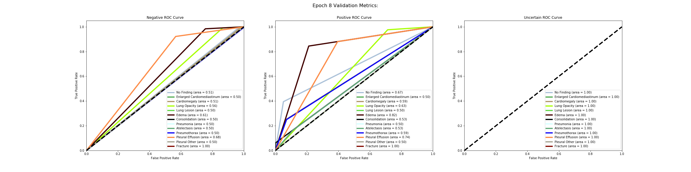

#### Accuracy Graph of the labels 

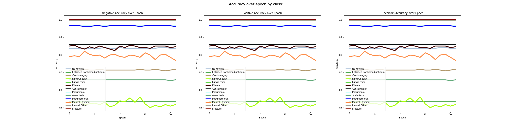


#### Table of results
| Epoch | Disease                    | Positive:F1 | Recall | Precision | RoC Auc Score | Negative: F1 | Recall | Precision | RoC Auc Score | Uncertain: F1 | Recall | Precision | RoC Auc Score |
| ----: | -------------------------- | ----------: | -----: | --------: | ------------: | -----------: | -----: | --------: | ------------: | ------------: | -----: | --------: | ------------: |
|     0 | No Finding                 |        0.00 |   0.00 |      0.00 |          0.70 |         0.91 |   1.00 |      0.84 |          0.50 |             1 |      1 |         1 |             1 |
|     1 | No Finding                 |        0.00 |   0.00 |      0.00 |          0.67 |         0.91 |   1.00 |      0.84 |          0.50 |             1 |      1 |         1 |             1 |
|     2 | No Finding                 |        0.00 |   0.00 |      0.00 |          0.67 |         0.91 |   1.00 |      0.84 |          0.50 |             1 |      1 |         1 |             1 |
|     3 | No Finding                 |        0.00 |   0.00 |      0.00 |          0.69 |         0.91 |   1.00 |      0.84 |          0.50 |             1 |      1 |         1 |             1 |
|     4 | No Finding                 |        0.00 |   0.00 |      0.00 |          0.67 |         0.91 |   1.00 |      0.84 |          0.50 |             1 |      1 |         1 |             1 |
|     5 | No Finding                 |        0.00 |   0.00 |      0.00 |          0.69 |         0.91 |   1.00 |      0.84 |          0.50 |             1 |      1 |         1 |             1 |
|     6 | No Finding                 |        0.00 |   0.00 |      0.00 |          0.71 |         0.91 |   1.00 |      0.84 |          0.50 |             1 |      1 |         1 |             1 |
|     7 | No Finding                 |        0.05 |   0.03 |      1.00 |          0.67 |         0.91 |   1.00 |      0.84 |          0.51 |             1 |      1 |         1 |             1 |
|     8 | No Finding                 |        0.00 |   0.00 |      0.00 |          0.67 |         0.91 |   1.00 |      0.84 |          0.50 |             1 |      1 |         1 |             1 |
|     9 | No Finding                 |        0.00 |   0.00 |      0.00 |          0.65 |         0.91 |   1.00 |      0.84 |          0.50 |             1 |      1 |         1 |             1 |
|    10 | No Finding                 |        0.05 |   0.03 |      1.00 |          0.68 |         0.91 |   1.00 |      0.84 |          0.51 |             1 |      1 |         1 |             1 |
|    11 | No Finding                 |        0.00 |   0.00 |      0.00 |          0.67 |         0.91 |   1.00 |      0.84 |          0.50 |             1 |      1 |         1 |             1 |
|     0 | Enlarged Cardiomediastinum |        0.00 |   0.00 |      0.00 |          0.50 |         0.70 |   1.00 |      0.53 |          0.50 |             1 |      1 |         1 |             1 |
|     1 | Enlarged Cardiomediastinum |        0.00 |   0.00 |      0.00 |          0.50 |         0.70 |   1.00 |      0.53 |          0.50 |             1 |      1 |         1 |             1 |
|     2 | Enlarged Cardiomediastinum |        0.00 |   0.00 |      0.00 |          0.50 |         0.70 |   1.00 |      0.53 |          0.50 |             1 |      1 |         1 |             1 |
|     3 | Enlarged Cardiomediastinum |        0.00 |   0.00 |      0.00 |          0.50 |         0.70 |   1.00 |      0.53 |          0.50 |             1 |      1 |         1 |             1 |
|     4 | Enlarged Cardiomediastinum |        0.00 |   0.00 |      0.00 |          0.50 |         0.70 |   1.00 |      0.53 |          0.50 |             1 |      1 |         1 |             1 |
|     5 | Enlarged Cardiomediastinum |        0.00 |   0.00 |      0.00 |          0.50 |         0.70 |   1.00 |      0.53 |          0.50 |             1 |      1 |         1 |             1 |
|     6 | Enlarged Cardiomediastinum |        0.00 |   0.00 |      0.00 |          0.50 |         0.70 |   1.00 |      0.53 |          0.50 |             1 |      1 |         1 |             1 |
|     7 | Enlarged Cardiomediastinum |        0.00 |   0.00 |      0.00 |          0.50 |         0.70 |   1.00 |      0.53 |          0.50 |             1 |      1 |         1 |             1 |
|     8 | Enlarged Cardiomediastinum |        0.00 |   0.00 |      0.00 |          0.50 |         0.70 |   1.00 |      0.53 |          0.50 |             1 |      1 |         1 |             1 |
|     9 | Enlarged Cardiomediastinum |        0.00 |   0.00 |      0.00 |          0.50 |         0.70 |   1.00 |      0.53 |          0.50 |             1 |      1 |         1 |             1 |
|    10 | Enlarged Cardiomediastinum |        0.00 |   0.00 |      0.00 |          0.50 |         0.70 |   1.00 |      0.53 |          0.50 |             1 |      1 |         1 |             1 |
|    11 | Enlarged Cardiomediastinum |        0.00 |   0.00 |      0.00 |          0.50 |         0.70 |   1.00 |      0.53 |          0.50 |             1 |      1 |         1 |             1 |
|     0 | Cardiomegaly               |        0.03 |   0.01 |      1.00 |          0.62 |         0.83 |   1.00 |      0.71 |          0.51 |             1 |      1 |         1 |             1 |
|     1 | Cardiomegaly               |        0.03 |   0.01 |      1.00 |          0.58 |         0.83 |   1.00 |      0.71 |          0.51 |             1 |      1 |         1 |             1 |
|     2 | Cardiomegaly               |        0.00 |   0.00 |      0.00 |          0.60 |         0.83 |   1.00 |      0.71 |          0.50 |             1 |      1 |         1 |             1 |
|     3 | Cardiomegaly               |        0.06 |   0.03 |      1.00 |          0.64 |         0.83 |   1.00 |      0.72 |          0.51 |             1 |      1 |         1 |             1 |
|     4 | Cardiomegaly               |        0.03 |   0.01 |      1.00 |          0.61 |         0.83 |   1.00 |      0.71 |          0.51 |             1 |      1 |         1 |             1 |
|     5 | Cardiomegaly               |        0.03 |   0.01 |      1.00 |          0.61 |         0.83 |   1.00 |      0.71 |          0.51 |             1 |      1 |         1 |             1 |
|     6 | Cardiomegaly               |        0.06 |   0.03 |      1.00 |          0.64 |         0.83 |   1.00 |      0.72 |          0.51 |             1 |      1 |         1 |             1 |
|     7 | Cardiomegaly               |        0.03 |   0.01 |      1.00 |          0.59 |         0.83 |   1.00 |      0.71 |          0.51 |             1 |      1 |         1 |             1 |
|     8 | Cardiomegaly               |        0.03 |   0.01 |      1.00 |          0.62 |         0.83 |   1.00 |      0.71 |          0.51 |             1 |      1 |         1 |             1 |
|     9 | Cardiomegaly               |        0.03 |   0.01 |      1.00 |          0.56 |         0.83 |   1.00 |      0.71 |          0.51 |             1 |      1 |         1 |             1 |
|    10 | Cardiomegaly               |        0.03 |   0.01 |      1.00 |          0.59 |         0.83 |   1.00 |      0.71 |          0.51 |             1 |      1 |         1 |             1 |
|    11 | Cardiomegaly               |        0.03 |   0.01 |      1.00 |          0.64 |         0.83 |   1.00 |      0.71 |          0.51 |             1 |      1 |         1 |             1 |
|     0 | Lung Opacity               |        0.24 |   0.13 |      0.94 |          0.64 |         0.66 |   0.99 |      0.50 |          0.56 |             1 |      1 |         1 |             1 |
|     1 | Lung Opacity               |        0.25 |   0.14 |      0.90 |          0.65 |         0.66 |   0.98 |      0.50 |          0.56 |             1 |      1 |         1 |             1 |
|     2 | Lung Opacity               |        0.24 |   0.13 |      1.00 |          0.63 |         0.66 |   1.00 |      0.50 |          0.57 |             1 |      1 |         1 |             1 |
|     3 | Lung Opacity               |        0.21 |   0.12 |      0.88 |          0.64 |         0.65 |   0.98 |      0.49 |          0.55 |             1 |      1 |         1 |             1 |
|     4 | Lung Opacity               |        0.21 |   0.12 |      0.94 |          0.64 |         0.66 |   0.99 |      0.49 |          0.55 |             1 |      1 |         1 |             1 |
|     5 | Lung Opacity               |        0.23 |   0.13 |      0.89 |          0.65 |         0.66 |   0.98 |      0.49 |          0.56 |             1 |      1 |         1 |             1 |
|     6 | Lung Opacity               |        0.21 |   0.12 |      0.88 |          0.68 |         0.65 |   0.98 |      0.49 |          0.55 |             1 |      1 |         1 |             1 |
|     7 | Lung Opacity               |        0.24 |   0.13 |      0.94 |          0.63 |         0.66 |   0.99 |      0.50 |          0.56 |             1 |      1 |         1 |             1 |
|     8 | Lung Opacity               |        0.17 |   0.10 |      0.86 |          0.60 |         0.65 |   0.98 |      0.48 |          0.54 |             1 |      1 |         1 |             1 |
|     9 | Lung Opacity               |        0.20 |   0.11 |      0.87 |          0.65 |         0.65 |   0.98 |      0.49 |          0.55 |             1 |      1 |         1 |             1 |
|    10 | Lung Opacity               |        0.27 |   0.16 |      0.91 |          0.67 |         0.66 |   0.98 |      0.50 |          0.57 |             1 |      1 |         1 |             1 |
|    11 | Lung Opacity               |        0.25 |   0.14 |      0.95 |          0.66 |         0.66 |   0.99 |      0.50 |          0.57 |             1 |      1 |         1 |             1 |
|     0 | Lung Lesion                |        0.00 |   0.00 |      0.00 |          0.50 |         1.00 |   1.00 |      1.00 |          0.50 |             1 |      1 |         1 |             1 |
|     1 | Lung Lesion                |        0.00 |   0.00 |      0.00 |          0.50 |         1.00 |   1.00 |      1.00 |          0.50 |             1 |      1 |         1 |             1 |
|     2 | Lung Lesion                |        0.00 |   0.00 |      0.00 |          0.50 |         1.00 |   1.00 |      1.00 |          0.50 |             1 |      1 |         1 |             1 |
|     3 | Lung Lesion                |        0.00 |   0.00 |      0.00 |          0.50 |         1.00 |   1.00 |      1.00 |          0.50 |             1 |      1 |         1 |             1 |
|     4 | Lung Lesion                |        0.00 |   0.00 |      0.00 |          0.50 |         1.00 |   1.00 |      1.00 |          0.50 |             1 |      1 |         1 |             1 |
|     5 | Lung Lesion                |        0.00 |   0.00 |      0.00 |          0.50 |         1.00 |   1.00 |      1.00 |          0.50 |             1 |      1 |         1 |             1 |
|     6 | Lung Lesion                |        0.00 |   0.00 |      0.00 |          0.50 |         1.00 |   1.00 |      1.00 |          0.50 |             1 |      1 |         1 |             1 |
|     7 | Lung Lesion                |        0.00 |   0.00 |      0.00 |          0.50 |         1.00 |   1.00 |      1.00 |          0.50 |             1 |      1 |         1 |             1 |
|     8 | Lung Lesion                |        0.00 |   0.00 |      0.00 |          0.50 |         1.00 |   1.00 |      1.00 |          0.50 |             1 |      1 |         1 |             1 |
|     9 | Lung Lesion                |        0.00 |   0.00 |      0.00 |          0.50 |         1.00 |   1.00 |      1.00 |          0.50 |             1 |      1 |         1 |             1 |
|    10 | Lung Lesion                |        0.00 |   0.00 |      0.00 |          0.50 |         1.00 |   1.00 |      1.00 |          0.50 |             1 |      1 |         1 |             1 |
|    11 | Lung Lesion                |        0.00 |   0.00 |      0.00 |          0.50 |         1.00 |   1.00 |      1.00 |          0.50 |             1 |      1 |         1 |             1 |
|     0 | Edema                      |        0.39 |   0.24 |      0.92 |          0.80 |         0.91 |   0.99 |      0.85 |          0.62 |             1 |      1 |         1 |             1 |
|     1 | Edema                      |        0.45 |   0.31 |      0.82 |          0.81 |         0.92 |   0.98 |      0.86 |          0.65 |             1 |      1 |         1 |             1 |
|     2 | Edema                      |        0.37 |   0.24 |      0.79 |          0.78 |         0.91 |   0.98 |      0.85 |          0.61 |             1 |      1 |         1 |             1 |
|     3 | Edema                      |        0.32 |   0.20 |      0.75 |          0.81 |         0.91 |   0.98 |      0.84 |          0.59 |             1 |      1 |         1 |             1 |
|     4 | Edema                      |        0.38 |   0.24 |      0.85 |          0.79 |         0.91 |   0.99 |      0.85 |          0.62 |             1 |      1 |         1 |             1 |
|     5 | Edema                      |        0.34 |   0.22 |      0.77 |          0.82 |         0.91 |   0.98 |      0.84 |          0.60 |             1 |      1 |         1 |             1 |
|     6 | Edema                      |        0.41 |   0.27 |      0.86 |          0.81 |         0.91 |   0.99 |      0.85 |          0.63 |             1 |      1 |         1 |             1 |
|     7 | Edema                      |        0.37 |   0.24 |      0.79 |          0.82 |         0.91 |   0.98 |      0.85 |          0.61 |             1 |      1 |         1 |             1 |
|     8 | Edema                      |        0.36 |   0.24 |      0.69 |          0.80 |         0.90 |   0.97 |      0.84 |          0.61 |             1 |      1 |         1 |             1 |
|     9 | Edema                      |        0.25 |   0.16 |      0.70 |          0.77 |         0.90 |   0.98 |      0.83 |          0.57 |             1 |      1 |         1 |             1 |
|    10 | Edema                      |        0.43 |   0.29 |      0.81 |          0.81 |         0.91 |   0.98 |      0.85 |          0.64 |             1 |      1 |         1 |             1 |
|    11 | Edema                      |        0.37 |   0.24 |      0.79 |          0.81 |         0.91 |   0.98 |      0.85 |          0.61 |             1 |      1 |         1 |             1 |
|     0 | Consolidation              |        0.00 |   0.00 |      0.00 |          0.53 |         0.92 |   1.00 |      0.86 |          0.50 |             1 |      1 |         1 |             1 |
|     1 | Consolidation              |        0.00 |   0.00 |      0.00 |          0.52 |         0.92 |   1.00 |      0.86 |          0.50 |             1 |      1 |         1 |             1 |
|     2 | Consolidation              |        0.00 |   0.00 |      0.00 |          0.52 |         0.92 |   1.00 |      0.86 |          0.50 |             1 |      1 |         1 |             1 |
|     3 | Consolidation              |        0.00 |   0.00 |      0.00 |          0.52 |         0.92 |   1.00 |      0.86 |          0.50 |             1 |      1 |         1 |             1 |
|     4 | Consolidation              |        0.00 |   0.00 |      0.00 |          0.53 |         0.92 |   1.00 |      0.86 |          0.50 |             1 |      1 |         1 |             1 |
|     5 | Consolidation              |        0.00 |   0.00 |      0.00 |          0.52 |         0.92 |   1.00 |      0.86 |          0.50 |             1 |      1 |         1 |             1 |
|     6 | Consolidation              |        0.00 |   0.00 |      0.00 |          0.51 |         0.92 |   1.00 |      0.86 |          0.50 |             1 |      1 |         1 |             1 |
|     7 | Consolidation              |        0.00 |   0.00 |      0.00 |          0.53 |         0.92 |   1.00 |      0.86 |          0.50 |             1 |      1 |         1 |             1 |
|     8 | Consolidation              |        0.00 |   0.00 |      0.00 |          0.50 |         0.92 |   1.00 |      0.86 |          0.50 |             1 |      1 |         1 |             1 |
|     9 | Consolidation              |        0.00 |   0.00 |      0.00 |          0.52 |         0.92 |   1.00 |      0.86 |          0.50 |             1 |      1 |         1 |             1 |
|    10 | Consolidation              |        0.00 |   0.00 |      0.00 |          0.53 |         0.92 |   1.00 |      0.86 |          0.50 |             1 |      1 |         1 |             1 |
|    11 | Consolidation              |        0.00 |   0.00 |      0.00 |          0.50 |         0.92 |   1.00 |      0.86 |          0.50 |             1 |      1 |         1 |             1 |
|     0 | Pneumonia                  |        0.00 |   0.00 |      0.00 |          0.50 |         0.98 |   1.00 |      0.97 |          0.50 |             1 |      1 |         1 |             1 |
|     1 | Pneumonia                  |        0.00 |   0.00 |      0.00 |          0.50 |         0.98 |   1.00 |      0.97 |          0.50 |             1 |      1 |         1 |             1 |
|     2 | Pneumonia                  |        0.00 |   0.00 |      0.00 |          0.50 |         0.98 |   1.00 |      0.97 |          0.50 |             1 |      1 |         1 |             1 |
|     3 | Pneumonia                  |        0.00 |   0.00 |      0.00 |          0.50 |         0.98 |   1.00 |      0.97 |          0.50 |             1 |      1 |         1 |             1 |
|     4 | Pneumonia                  |        0.00 |   0.00 |      0.00 |          0.50 |         0.98 |   1.00 |      0.97 |          0.50 |             1 |      1 |         1 |             1 |
|     5 | Pneumonia                  |        0.00 |   0.00 |      0.00 |          0.50 |         0.98 |   1.00 |      0.97 |          0.50 |             1 |      1 |         1 |             1 |
|     6 | Pneumonia                  |        0.00 |   0.00 |      0.00 |          0.50 |         0.98 |   1.00 |      0.97 |          0.50 |             1 |      1 |         1 |             1 |
|     7 | Pneumonia                  |        0.00 |   0.00 |      0.00 |          0.50 |         0.98 |   1.00 |      0.97 |          0.50 |             1 |      1 |         1 |             1 |
|     8 | Pneumonia                  |        0.00 |   0.00 |      0.00 |          0.50 |         0.98 |   1.00 |      0.97 |          0.50 |             1 |      1 |         1 |             1 |
|     9 | Pneumonia                  |        0.00 |   0.00 |      0.00 |          0.50 |         0.98 |   1.00 |      0.97 |          0.50 |             1 |      1 |         1 |             1 |
|    10 | Pneumonia                  |        0.00 |   0.00 |      0.00 |          0.50 |         0.98 |   1.00 |      0.97 |          0.50 |             1 |      1 |         1 |             1 |
|    11 | Pneumonia                  |        0.00 |   0.00 |      0.00 |          0.50 |         0.98 |   1.00 |      0.97 |          0.50 |             1 |      1 |         1 |             1 |
|     0 | Atelectasis                |        0.00 |   0.00 |      0.00 |          0.54 |         0.79 |   1.00 |      0.66 |          0.50 |             1 |      1 |         1 |             1 |
|     1 | Atelectasis                |        0.00 |   0.00 |      0.00 |          0.57 |         0.79 |   1.00 |      0.66 |          0.50 |             1 |      1 |         1 |             1 |
|     2 | Atelectasis                |        0.00 |   0.00 |      0.00 |          0.54 |         0.79 |   1.00 |      0.66 |          0.50 |             1 |      1 |         1 |             1 |
|     3 | Atelectasis                |        0.00 |   0.00 |      0.00 |          0.57 |         0.79 |   1.00 |      0.66 |          0.50 |             1 |      1 |         1 |             1 |
|     4 | Atelectasis                |        0.00 |   0.00 |      0.00 |          0.55 |         0.79 |   1.00 |      0.66 |          0.50 |             1 |      1 |         1 |             1 |
|     5 | Atelectasis                |        0.00 |   0.00 |      0.00 |          0.55 |         0.79 |   1.00 |      0.66 |          0.50 |             1 |      1 |         1 |             1 |
|     6 | Atelectasis                |        0.00 |   0.00 |      0.00 |          0.57 |         0.79 |   1.00 |      0.66 |          0.50 |             1 |      1 |         1 |             1 |
|     7 | Atelectasis                |        0.00 |   0.00 |      0.00 |          0.53 |         0.79 |   1.00 |      0.66 |          0.50 |             1 |      1 |         1 |             1 |
|     8 | Atelectasis                |        0.00 |   0.00 |      0.00 |          0.54 |         0.79 |   1.00 |      0.66 |          0.50 |             1 |      1 |         1 |             1 |
|     9 | Atelectasis                |        0.00 |   0.00 |      0.00 |          0.54 |         0.79 |   1.00 |      0.66 |          0.50 |             1 |      1 |         1 |             1 |
|    10 | Atelectasis                |        0.00 |   0.00 |      0.00 |          0.56 |         0.79 |   1.00 |      0.66 |          0.50 |             1 |      1 |         1 |             1 |
|    11 | Atelectasis                |        0.00 |   0.00 |      0.00 |          0.54 |         0.79 |   1.00 |      0.66 |          0.50 |             1 |      1 |         1 |             1 |
|     0 | Pneumothorax               |        0.20 |   0.12 |      0.50 |          0.59 |         0.98 |   1.00 |      0.97 |          0.56 |             1 |      1 |         1 |             1 |
|     1 | Pneumothorax               |        0.00 |   0.00 |      0.00 |          0.58 |         0.98 |   1.00 |      0.97 |          0.50 |             1 |      1 |         1 |             1 |
|     2 | Pneumothorax               |        0.00 |   0.00 |      0.00 |          0.59 |         0.98 |   1.00 |      0.97 |          0.50 |             1 |      1 |         1 |             1 |
|     3 | Pneumothorax               |        0.00 |   0.00 |      0.00 |          0.65 |         0.98 |   1.00 |      0.97 |          0.50 |             1 |      1 |         1 |             1 |
|     4 | Pneumothorax               |        0.00 |   0.00 |      0.00 |          0.65 |         0.98 |   1.00 |      0.97 |          0.50 |             1 |      1 |         1 |             1 |
|     5 | Pneumothorax               |        0.00 |   0.00 |      0.00 |          0.59 |         0.98 |   1.00 |      0.97 |          0.50 |             1 |      1 |         1 |             1 |
|     6 | Pneumothorax               |        0.00 |   0.00 |      0.00 |          0.53 |         0.98 |   1.00 |      0.97 |          0.50 |             1 |      1 |         1 |             1 |
|     7 | Pneumothorax               |        0.00 |   0.00 |      0.00 |          0.59 |         0.98 |   1.00 |      0.97 |          0.50 |             1 |      1 |         1 |             1 |
|     8 | Pneumothorax               |        0.00 |   0.00 |      0.00 |          0.59 |         0.98 |   1.00 |      0.97 |          0.50 |             1 |      1 |         1 |             1 |
|     9 | Pneumothorax               |        0.00 |   0.00 |      0.00 |          0.53 |         0.98 |   1.00 |      0.97 |          0.50 |             1 |      1 |         1 |             1 |
|    10 | Pneumothorax               |        0.00 |   0.00 |      0.00 |          0.52 |         0.98 |   1.00 |      0.97 |          0.50 |             1 |      1 |         1 |             1 |
|    11 | Pneumothorax               |        0.00 |   0.00 |      0.00 |          0.59 |         0.98 |   1.00 |      0.97 |          0.50 |             1 |      1 |         1 |             1 |
|     0 | Pleural Effusion           |        0.56 |   0.46 |      0.70 |          0.75 |         0.86 |   0.92 |      0.81 |          0.69 |             1 |      1 |         1 |             1 |
|     1 | Pleural Effusion           |        0.56 |   0.45 |      0.73 |          0.75 |         0.87 |   0.93 |      0.81 |          0.69 |             1 |      1 |         1 |             1 |
|     2 | Pleural Effusion           |        0.53 |   0.42 |      0.74 |          0.74 |         0.87 |   0.94 |      0.80 |          0.68 |             1 |      1 |         1 |             1 |
|     3 | Pleural Effusion           |        0.63 |   0.54 |      0.77 |          0.78 |         0.88 |   0.93 |      0.83 |          0.74 |             1 |      1 |         1 |             1 |
|     4 | Pleural Effusion           |        0.59 |   0.49 |      0.73 |          0.76 |         0.87 |   0.93 |      0.82 |          0.71 |             1 |      1 |         1 |             1 |
|     5 | Pleural Effusion           |        0.56 |   0.46 |      0.72 |          0.77 |         0.87 |   0.93 |      0.81 |          0.70 |             1 |      1 |         1 |             1 |
|     6 | Pleural Effusion           |        0.58 |   0.49 |      0.72 |          0.78 |         0.87 |   0.92 |      0.82 |          0.71 |             1 |      1 |         1 |             1 |
|     7 | Pleural Effusion           |        0.53 |   0.43 |      0.69 |          0.74 |         0.86 |   0.92 |      0.80 |          0.68 |             1 |      1 |         1 |             1 |
|     8 | Pleural Effusion           |        0.57 |   0.46 |      0.74 |          0.73 |         0.87 |   0.93 |      0.81 |          0.70 |             1 |      1 |         1 |             1 |
|     9 | Pleural Effusion           |        0.60 |   0.51 |      0.72 |          0.76 |         0.87 |   0.92 |      0.82 |          0.71 |             1 |      1 |         1 |             1 |
|    10 | Pleural Effusion           |        0.56 |   0.46 |      0.70 |          0.74 |         0.86 |   0.92 |      0.81 |          0.69 |             1 |      1 |         1 |             1 |
|    11 | Pleural Effusion           |        0.55 |   0.46 |      0.69 |          0.76 |         0.86 |   0.92 |      0.81 |          0.69 |             1 |      1 |         1 |             1 |
|     0 | Pleural Other              |        0.00 |   0.00 |      0.00 |          0.50 |         1.00 |   1.00 |      1.00 |          0.50 |             1 |      1 |         1 |             1 |
|     1 | Pleural Other              |        0.00 |   0.00 |      0.00 |          0.50 |         1.00 |   1.00 |      1.00 |          0.50 |             1 |      1 |         1 |             1 |
|     2 | Pleural Other              |        0.00 |   0.00 |      0.00 |          0.50 |         1.00 |   1.00 |      1.00 |          0.50 |             1 |      1 |         1 |             1 |
|     3 | Pleural Other              |        0.00 |   0.00 |      0.00 |          0.50 |         1.00 |   1.00 |      1.00 |          0.50 |             1 |      1 |         1 |             1 |
|     4 | Pleural Other              |        0.00 |   0.00 |      0.00 |          0.50 |         1.00 |   1.00 |      1.00 |          0.50 |             1 |      1 |         1 |             1 |
|     5 | Pleural Other              |        0.00 |   0.00 |      0.00 |          0.50 |         1.00 |   1.00 |      1.00 |          0.50 |             1 |      1 |         1 |             1 |
|     6 | Pleural Other              |        0.00 |   0.00 |      0.00 |          0.50 |         1.00 |   1.00 |      1.00 |          0.50 |             1 |      1 |         1 |             1 |
|     7 | Pleural Other              |        0.00 |   0.00 |      0.00 |          0.50 |         1.00 |   1.00 |      1.00 |          0.50 |             1 |      1 |         1 |             1 |
|     8 | Pleural Other              |        0.00 |   0.00 |      0.00 |          0.50 |         1.00 |   1.00 |      1.00 |          0.50 |             1 |      1 |         1 |             1 |
|     9 | Pleural Other              |        0.00 |   0.00 |      0.00 |          0.50 |         1.00 |   1.00 |      1.00 |          0.50 |             1 |      1 |         1 |             1 |
|    10 | Pleural Other              |        0.00 |   0.00 |      0.00 |          0.50 |         1.00 |   1.00 |      1.00 |          0.50 |             1 |      1 |         1 |             1 |
|    11 | Pleural Other              |        0.00 |   0.00 |      0.00 |          0.50 |         1.00 |   1.00 |      1.00 |          0.50 |             1 |      1 |         1 |             1 |
|     0 | Fracture                   |        0.00 |   0.00 |      0.00 |          1.00 |         1.00 |   1.00 |      1.00 |          1.00 |             1 |      1 |         1 |             1 |
|     1 | Fracture                   |        0.00 |   0.00 |      0.00 |          1.00 |         1.00 |   1.00 |      1.00 |          1.00 |             1 |      1 |         1 |             1 |
|     2 | Fracture                   |        0.00 |   0.00 |      0.00 |          1.00 |         1.00 |   1.00 |      1.00 |          1.00 |             1 |      1 |         1 |             1 |
|     3 | Fracture                   |        0.00 |   0.00 |      0.00 |          1.00 |         1.00 |   1.00 |      1.00 |          1.00 |             1 |      1 |         1 |             1 |
|     4 | Fracture                   |        0.00 |   0.00 |      0.00 |          1.00 |         1.00 |   1.00 |      1.00 |          1.00 |             1 |      1 |         1 |             1 |
|     5 | Fracture                   |        0.00 |   0.00 |      0.00 |          1.00 |         1.00 |   1.00 |      1.00 |          1.00 |             1 |      1 |         1 |             1 |
|     6 | Fracture                   |        0.00 |   0.00 |      0.00 |          1.00 |         1.00 |   1.00 |      1.00 |          1.00 |             1 |      1 |         1 |             1 |
|     7 | Fracture                   |        0.00 |   0.00 |      0.00 |          1.00 |         1.00 |   1.00 |      1.00 |          1.00 |             1 |      1 |         1 |             1 |
|     8 | Fracture                   |        0.00 |   0.00 |      0.00 |          1.00 |         1.00 |   1.00 |      1.00 |          1.00 |             1 |      1 |         1 |             1 |
|     9 | Fracture                   |        0.00 |   0.00 |      0.00 |          1.00 |         1.00 |   1.00 |      1.00 |          1.00 |             1 |      1 |         1 |             1 |
|    10 | Fracture                   |        0.00 |   0.00 |      0.00 |          1.00 |         1.00 |   1.00 |      1.00 |          1.00 |             1 |      1 |         1 |             1 |
|    11 | Fracture                   |        0.00 |   0.00 |      0.00 |          1.00 |         1.00 |   1.00 |      1.00 |          1.00 |             1 |      1 |         1 |             1 |


## Experiment: Incorporating Metadata

These are results using the Metadata age and gender.
A linear NN was added to the model:

```     
        self.l1 = nn.Linear(4, 32, bias = True)
        self.l2 = nn.Linear(32, 16, bias = True) #go into last linear 
        self.classifier = nn.Linear(1024+16, out_dim, bias=True)
```
Age was normalized, and gender was 1 hot encoded.


### Training Run #1
- Densenet121 + linear NN - all layers frozen except last linear classifier
- LR: 2.15E-04 
- Weight decay: 0

Epochs: 3 (early stopping at 12)

Training loss trended downward, Validation had some fluctuation

Note: I checked the val metrics (accuracy, ROC, prec, recall, f1) for epochs 0-12, and did not see an improvement after epoch 2. The accuracy plot below is for all the epochs 0-12.

#### ROC AUC Graphs for last Epoch 2

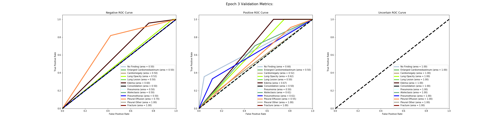

#### Accuracy Graph of the labels over all Epochs

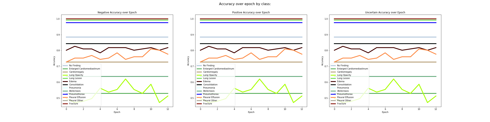

#### Table of Results


| Epoch | Disease                    | Positive:F1 | Recall | Precision | RoC Auc Score | Negative: F1 | Recall | Precision | RoC Auc Score | Uncertain: F1 | Recall | Precision | RoC Auc Score |
| ----: | -------------------------- | ----------: | -----: | --------: | ------------: | -----------: | -----: | --------: | ------------: | ------------: | -----: | --------: | ------------: |
|     0 | No Finding                 |        0.00 |   0.00 |      0.00 |          0.59 |         0.94 |   1.00 |      0.88 |          0.50 |             1 |      1 |         1 |             1 |
|     1 | No Finding                 |        0.00 |   0.00 |      0.00 |          0.66 |         0.94 |   1.00 |      0.88 |          0.50 |             1 |      1 |         1 |             1 |
|     2 | No Finding                 |        0.00 |   0.00 |      0.00 |          0.66 |         0.94 |   1.00 |      0.88 |          0.50 |             1 |      1 |         1 |             1 |
|     0 | Enlarged Cardiomediastinum |        0.00 |   0.00 |      0.00 |          0.50 |         0.69 |   1.00 |      0.53 |          0.50 |             1 |      1 |         1 |             1 |
|     1 | Enlarged Cardiomediastinum |        0.00 |   0.00 |      0.00 |          0.50 |         0.69 |   1.00 |      0.53 |          0.50 |             1 |      1 |         1 |             1 |
|     2 | Enlarged Cardiomediastinum |        0.00 |   0.00 |      0.00 |          0.50 |         0.69 |   1.00 |      0.53 |          0.50 |             1 |      1 |         1 |             1 |
|     0 | Cardiomegaly               |        0.00 |   0.00 |      0.00 |          0.50 |         0.84 |   1.00 |      0.73 |          0.50 |             1 |      1 |         1 |             1 |
|     1 | Cardiomegaly               |        0.00 |   0.00 |      0.00 |          0.56 |         0.84 |   1.00 |      0.73 |          0.50 |             1 |      1 |         1 |             1 |
|     2 | Cardiomegaly               |        0.00 |   0.00 |      0.00 |          0.52 |         0.84 |   1.00 |      0.73 |          0.50 |             1 |      1 |         1 |             1 |
|     0 | Lung Opacity               |        0.12 |   0.06 |      1.00 |          0.60 |         0.65 |   1.00 |      0.48 |          0.53 |             1 |      1 |         1 |             1 |
|     1 | Lung Opacity               |        0.03 |   0.02 |      1.00 |          0.64 |         0.64 |   1.00 |      0.47 |          0.51 |             1 |      1 |         1 |             1 |
|     2 | Lung Opacity               |        0.06 |   0.03 |      1.00 |          0.62 |         0.64 |   1.00 |      0.47 |          0.52 |             1 |      1 |         1 |             1 |
|     0 | Lung Lesion                |        0.00 |   0.00 |      0.00 |          0.50 |         1.00 |   1.00 |      0.99 |          0.50 |             1 |      1 |         1 |             1 |
|     1 | Lung Lesion                |        0.00 |   0.00 |      0.00 |          0.50 |         1.00 |   1.00 |      0.99 |          0.50 |             1 |      1 |         1 |             1 |
|     2 | Lung Lesion                |        0.00 |   0.00 |      0.00 |          0.50 |         1.00 |   1.00 |      0.99 |          0.50 |             1 |      1 |         1 |             1 |
|     0 | Edema                      |        0.08 |   0.04 |      1.00 |          0.74 |         0.89 |   1.00 |      0.80 |          0.52 |             1 |      1 |         1 |             1 |
|     1 | Edema                      |        0.28 |   0.16 |      1.00 |          0.76 |         0.90 |   1.00 |      0.82 |          0.58 |             1 |      1 |         1 |             1 |
|     2 | Edema                      |        0.34 |   0.24 |      0.60 |          0.67 |         0.89 |   0.96 |      0.83 |          0.60 |             1 |      1 |         1 |             1 |
|     0 | Consolidation              |        0.00 |   0.00 |      0.00 |          0.50 |         0.91 |   1.00 |      0.84 |          0.50 |             1 |      1 |         1 |             1 |
|     1 | Consolidation              |        0.00 |   0.00 |      0.00 |          0.50 |         0.91 |   1.00 |      0.84 |          0.50 |             1 |      1 |         1 |             1 |
|     2 | Consolidation              |        0.00 |   0.00 |      0.00 |          0.50 |         0.91 |   1.00 |      0.84 |          0.50 |             1 |      1 |         1 |             1 |
|     0 | Pneumonia                  |        0.00 |   0.00 |      0.00 |          0.50 |         0.99 |   1.00 |      0.98 |          0.50 |             1 |      1 |         1 |             1 |
|     1 | Pneumonia                  |        0.00 |   0.00 |      0.00 |          0.50 |         0.99 |   1.00 |      0.98 |          0.50 |             1 |      1 |         1 |             1 |
|     2 | Pneumonia                  |        0.00 |   0.00 |      0.00 |          0.50 |         0.99 |   1.00 |      0.98 |          0.50 |             1 |      1 |         1 |             1 |
|     0 | Atelectasis                |        0.00 |   0.00 |      0.00 |          0.57 |         0.78 |   1.00 |      0.64 |          0.50 |             1 |      1 |         1 |             1 |
|     1 | Atelectasis                |        0.00 |   0.00 |      0.00 |          0.61 |         0.78 |   1.00 |      0.64 |          0.50 |             1 |      1 |         1 |             1 |
|     2 | Atelectasis                |        0.00 |   0.00 |      0.00 |          0.61 |         0.78 |   1.00 |      0.64 |          0.50 |             1 |      1 |         1 |             1 |
|     0 | Pneumothorax               |        0.00 |   0.00 |      0.00 |          0.65 |         0.99 |   1.00 |      0.98 |          0.50 |             1 |      1 |         1 |             1 |
|     1 | Pneumothorax               |        0.00 |   0.00 |      0.00 |          0.62 |         0.99 |   1.00 |      0.98 |          0.50 |             1 |      1 |         1 |             1 |
|     2 | Pneumothorax               |        0.00 |   0.00 |      0.00 |          0.61 |         0.99 |   1.00 |      0.98 |          0.50 |             1 |      1 |         1 |             1 |
|     0 | Pleural Effusion           |        0.33 |   0.24 |      0.50 |          0.56 |         0.83 |   0.91 |      0.76 |          0.58 |             1 |      1 |         1 |             1 |
|     1 | Pleural Effusion           |        0.17 |   0.09 |      1.00 |          0.67 |         0.85 |   1.00 |      0.75 |          0.55 |             1 |      1 |         1 |             1 |
|     2 | Pleural Effusion           |        0.56 |   0.58 |      0.54 |          0.55 |         0.83 |   0.82 |      0.84 |          0.70 |             1 |      1 |         1 |             1 |
|     0 | Pleural Other              |        0.00 |   0.00 |      0.00 |          1.00 |         1.00 |   1.00 |      1.00 |          1.00 |             1 |      1 |         1 |             1 |
|     1 | Pleural Other              |        0.00 |   0.00 |      0.00 |          1.00 |         1.00 |   1.00 |      1.00 |          1.00 |             1 |      1 |         1 |             1 |
|     2 | Pleural Other              |        0.00 |   0.00 |      0.00 |          1.00 |         1.00 |   1.00 |      1.00 |          1.00 |             1 |      1 |         1 |             1 |
|     0 | Fracture                   |        0.00 |   0.00 |      0.00 |          1.00 |         1.00 |   1.00 |      1.00 |          1.00 |             1 |      1 |         1 |             1 |
|     1 | Fracture                   |        0.00 |   0.00 |      0.00 |          1.00 |         1.00 |   1.00 |      1.00 |          1.00 |             1 |      1 |         1 |             1 |
|     2 | Fracture                   |        0.00 |   0.00 |      0.00 |          1.00 |         1.00 |   1.00 |      1.00 |          1.00 |             1 |      1 |         1 |             1 |

### Training Run #2
Started off with the checkpoint of train #1 (3rd epoch)
- Densenet121 + linear NN - all layers frozen except last linear classifier and 
 denseblock4.denselayer16.conv2.weight

 denseblock4.denselayer16.conv1.weight

- LR: 3.70E-05 

- Weight decay: 0


Epoch 0-3, early stop 13

Val loss fluctuated and lowest it reached was higher than train #1.

I also checked the accuracy over time and ROC trends for epochs 0-13. I did not see improvement, mostly little flucutation. Since train loss is still trending down, for train #2, I use weight decay for the next train. 


#### ROC AUC Graphs for last Epoch at 3

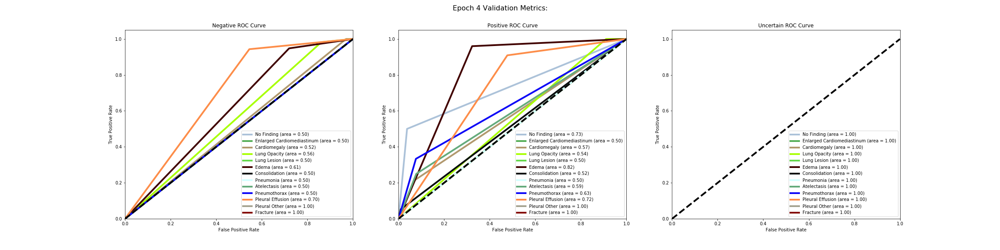

#### Accuracy Graph of the labels over all Epochs

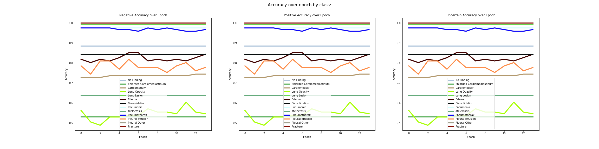

#### Table of Results
| Epoch | Disease                    | Positive:F1 | Recall | Precision | RoC Auc Score | Negative: F1 | Recall | Precision | RoC Auc Score | Uncertain: F1 | Recall | Precision | RoC Auc Score |
| ----: | -------------------------- | ----------: | -----: | --------: | ------------: | -----------: | -----: | --------: | ------------: | ------------: | -----: | --------: | ------------: |
|     0 | No Finding                 |        0.00 |   0.00 |      0.00 |          0.55 |         0.94 |   1.00 |      0.88 |          0.50 |             1 |      1 |         1 |             1 |
|     1 | No Finding                 |        0.00 |   0.00 |      0.00 |          0.66 |         0.94 |   1.00 |      0.88 |          0.50 |             1 |      1 |         1 |             1 |
|     2 | No Finding                 |        0.00 |   0.00 |      0.00 |          0.59 |         0.94 |   1.00 |      0.88 |          0.50 |             1 |      1 |         1 |             1 |
|     3 | No Finding                 |        0.00 |   0.00 |      0.00 |          0.73 |         0.94 |   1.00 |      0.88 |          0.50 |             1 |      1 |         1 |             1 |
|     0 | Enlarged Cardiomediastinum |        0.00 |   0.00 |      0.00 |          0.50 |         0.69 |   1.00 |      0.53 |          0.50 |             1 |      1 |         1 |             1 |
|     1 | Enlarged Cardiomediastinum |        0.00 |   0.00 |      0.00 |          0.50 |         0.69 |   1.00 |      0.53 |          0.50 |             1 |      1 |         1 |             1 |
|     2 | Enlarged Cardiomediastinum |        0.00 |   0.00 |      0.00 |          0.50 |         0.69 |   1.00 |      0.53 |          0.50 |             1 |      1 |         1 |             1 |
|     3 | Enlarged Cardiomediastinum |        0.00 |   0.00 |      0.00 |          0.50 |         0.69 |   1.00 |      0.53 |          0.50 |             1 |      1 |         1 |             1 |
|     0 | Cardiomegaly               |        0.00 |   0.00 |      0.00 |          0.63 |         0.84 |   1.00 |      0.73 |          0.50 |             1 |      1 |         1 |             1 |
|     1 | Cardiomegaly               |        0.00 |   0.00 |      0.00 |          0.60 |         0.84 |   1.00 |      0.73 |          0.50 |             1 |      1 |         1 |             1 |
|     2 | Cardiomegaly               |        0.00 |   0.00 |      0.00 |          0.55 |         0.84 |   1.00 |      0.73 |          0.50 |             1 |      1 |         1 |             1 |
|     3 | Cardiomegaly               |        0.06 |   0.03 |      1.00 |          0.57 |         0.85 |   1.00 |      0.73 |          0.52 |             1 |      1 |         1 |             1 |
|     0 | Lung Opacity               |        0.35 |   0.22 |      0.87 |          0.54 |         0.67 |   0.96 |      0.51 |          0.59 |             1 |      1 |         1 |             1 |
|     1 | Lung Opacity               |        0.14 |   0.08 |      1.00 |          0.57 |         0.65 |   1.00 |      0.48 |          0.54 |             1 |      1 |         1 |             1 |
|     2 | Lung Opacity               |        0.09 |   0.05 |      1.00 |          0.55 |         0.64 |   1.00 |      0.47 |          0.52 |             1 |      1 |         1 |             1 |
|     3 | Lung Opacity               |        0.24 |   0.14 |      0.90 |          0.54 |         0.66 |   0.98 |      0.50 |          0.56 |             1 |      1 |         1 |             1 |
|     0 | Lung Lesion                |        0.00 |   0.00 |      0.00 |          0.50 |         1.00 |   1.00 |      0.99 |          0.50 |             1 |      1 |         1 |             1 |
|     1 | Lung Lesion                |        0.00 |   0.00 |      0.00 |          0.50 |         1.00 |   1.00 |      0.99 |          0.50 |             1 |      1 |         1 |             1 |
|     2 | Lung Lesion                |        0.00 |   0.00 |      0.00 |          0.50 |         1.00 |   1.00 |      0.99 |          0.50 |             1 |      1 |         1 |             1 |
|     3 | Lung Lesion                |        0.00 |   0.00 |      0.00 |          0.50 |         1.00 |   1.00 |      0.99 |          0.50 |             1 |      1 |         1 |             1 |
|     0 | Edema                      |        0.35 |   0.24 |      0.67 |          0.75 |         0.89 |   0.97 |      0.83 |          0.60 |             1 |      1 |         1 |             1 |
|     1 | Edema                      |        0.25 |   0.16 |      0.57 |          0.79 |         0.89 |   0.97 |      0.82 |          0.56 |             1 |      1 |         1 |             1 |
|     2 | Edema                      |        0.27 |   0.16 |      0.80 |          0.79 |         0.90 |   0.99 |      0.82 |          0.57 |             1 |      1 |         1 |             1 |
|     3 | Edema                      |        0.38 |   0.28 |      0.58 |          0.82 |         0.89 |   0.95 |      0.83 |          0.61 |             1 |      1 |         1 |             1 |
|     0 | Consolidation              |        0.00 |   0.00 |      0.00 |          0.50 |         0.91 |   1.00 |      0.84 |          0.50 |             1 |      1 |         1 |             1 |
|     1 | Consolidation              |        0.00 |   0.00 |      0.00 |          0.50 |         0.91 |   1.00 |      0.84 |          0.50 |             1 |      1 |         1 |             1 |
|     2 | Consolidation              |        0.00 |   0.00 |      0.00 |          0.53 |         0.91 |   1.00 |      0.84 |          0.50 |             1 |      1 |         1 |             1 |
|     3 | Consolidation              |        0.00 |   0.00 |      0.00 |          0.52 |         0.91 |   1.00 |      0.84 |          0.50 |             1 |      1 |         1 |             1 |
|     0 | Pneumonia                  |        0.00 |   0.00 |      0.00 |          0.50 |         0.99 |   1.00 |      0.98 |          0.50 |             1 |      1 |         1 |             1 |
|     1 | Pneumonia                  |        0.00 |   0.00 |      0.00 |          0.50 |         0.99 |   1.00 |      0.98 |          0.50 |             1 |      1 |         1 |             1 |
|     2 | Pneumonia                  |        0.00 |   0.00 |      0.00 |          0.50 |         0.99 |   1.00 |      0.98 |          0.50 |             1 |      1 |         1 |             1 |
|     3 | Pneumonia                  |        0.00 |   0.00 |      0.00 |          0.50 |         0.99 |   1.00 |      0.98 |          0.50 |             1 |      1 |         1 |             1 |
|     0 | Atelectasis                |        0.00 |   0.00 |      0.00 |          0.58 |         0.78 |   1.00 |      0.64 |          0.50 |             1 |      1 |         1 |             1 |
|     1 | Atelectasis                |        0.00 |   0.00 |      0.00 |          0.60 |         0.78 |   1.00 |      0.64 |          0.50 |             1 |      1 |         1 |             1 |
|     2 | Atelectasis                |        0.00 |   0.00 |      0.00 |          0.62 |         0.78 |   1.00 |      0.64 |          0.50 |             1 |      1 |         1 |             1 |
|     3 | Atelectasis                |        0.00 |   0.00 |      0.00 |          0.59 |         0.78 |   1.00 |      0.64 |          0.50 |             1 |      1 |         1 |             1 |
|     0 | Pneumothorax               |        0.00 |   0.00 |      0.00 |          0.62 |         0.99 |   1.00 |      0.98 |          0.50 |             1 |      1 |         1 |             1 |
|     1 | Pneumothorax               |        0.00 |   0.00 |      0.00 |          0.63 |         0.99 |   1.00 |      0.98 |          0.50 |             1 |      1 |         1 |             1 |
|     2 | Pneumothorax               |        0.00 |   0.00 |      0.00 |          0.64 |         0.99 |   1.00 |      0.98 |          0.50 |             1 |      1 |         1 |             1 |
|     3 | Pneumothorax               |        0.00 |   0.00 |      0.00 |          0.63 |         0.99 |   1.00 |      0.98 |          0.50 |             1 |      1 |         1 |             1 |
|     0 | Pleural Effusion           |        0.50 |   0.39 |      0.68 |          0.64 |         0.86 |   0.93 |      0.80 |          0.66 |             1 |      1 |         1 |             1 |
|     1 | Pleural Effusion           |        0.42 |   0.33 |      0.55 |          0.62 |         0.84 |   0.90 |      0.78 |          0.62 |             1 |      1 |         1 |             1 |
|     2 | Pleural Effusion           |        0.61 |   0.55 |      0.69 |          0.64 |         0.87 |   0.91 |      0.84 |          0.73 |             1 |      1 |         1 |             1 |
|     3 | Pleural Effusion           |        0.57 |   0.45 |      0.75 |          0.72 |         0.88 |   0.94 |      0.82 |          0.70 |             1 |      1 |         1 |             1 |
|     0 | Pleural Other              |        0.00 |   0.00 |      0.00 |          1.00 |         1.00 |   1.00 |      1.00 |          1.00 |             1 |      1 |         1 |             1 |
|     1 | Pleural Other              |        0.00 |   0.00 |      0.00 |          1.00 |         1.00 |   1.00 |      1.00 |          1.00 |             1 |      1 |         1 |             1 |
|     2 | Pleural Other              |        0.00 |   0.00 |      0.00 |          1.00 |         1.00 |   1.00 |      1.00 |          1.00 |             1 |      1 |         1 |             1 |
|     3 | Pleural Other              |        0.00 |   0.00 |      0.00 |          1.00 |         1.00 |   1.00 |      1.00 |          1.00 |             1 |      1 |         1 |             1 |
|     0 | Fracture                   |        0.00 |   0.00 |      0.00 |          1.00 |         1.00 |   1.00 |      1.00 |          1.00 |             1 |      1 |         1 |             1 |
|     1 | Fracture                   |        0.00 |   0.00 |      0.00 |          1.00 |         1.00 |   1.00 |      1.00 |          1.00 |             1 |      1 |         1 |             1 |
|     2 | Fracture                   |        0.00 |   0.00 |      0.00 |          1.00 |         1.00 |   1.00 |      1.00 |          1.00 |             1 |      1 |         1 |             1 |
|     3 | Fracture                   |        0.00 |   0.00 |      0.00 |          1.00 |         1.00 |   1.00 |      1.00 |          1.00 |             1 |      1 |         1 |             1 |

### Training Run #3
Started off with the checkpoint of train #2 

Changes were

- LR: 1.78E-06 
- Weight decay: 0.001

Val loss went lower than first train #1 and less than what I got training with images only.
A train was still trending down, I tried another attempt at this with increase in weight decay = .01 for train #4. I chose to continue with weight decay, rather than unfreeze more layers, as I saw more regularzation with that choice in my work with images only. 


I noticed Edema accuracy spiked up at Epoch 13, right at the early stop. Though this could be a fluctuation, not upward trend.  All the other labels had a steady or constant accuracy over all epochs.


#### ROC AUC Graphs for last Epoch at 4th

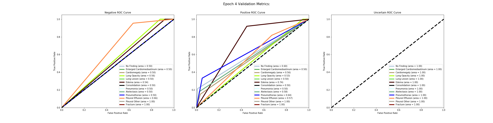

#### Accuracy Graph of the labels over Epochs

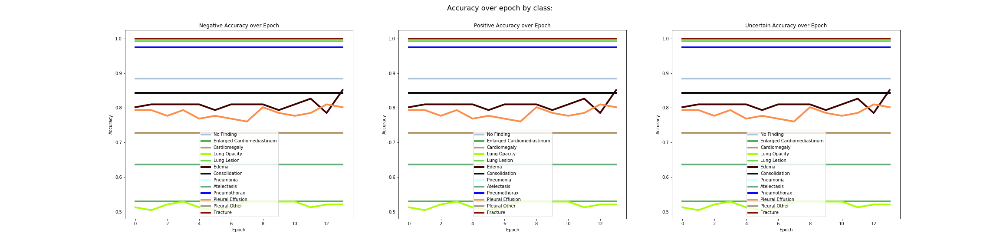


#### Table of Results
| Epoch | Disease                    | Positive:F1 | Recall | Precision | RoC Auc Score | Negative: F1 | Recall | Precision | RoC Auc Score | Uncertain: F1 | Recall | Precision | RoC Auc Score |
| ----: | -------------------------- | ----------: | -----: | --------: | ------------: | -----------: | -----: | --------: | ------------: | ------------: | -----: | --------: | ------------: |
|     0 | No Finding                 |        0.00 |   0.00 |      0.00 |          0.62 |         0.94 |   1.00 |      0.88 |          0.50 |             1 |      1 |         1 |             1 |
|     1 | No Finding                 |        0.00 |   0.00 |      0.00 |          0.59 |         0.94 |   1.00 |      0.88 |          0.50 |             1 |      1 |         1 |             1 |
|     2 | No Finding                 |        0.00 |   0.00 |      0.00 |          0.62 |         0.94 |   1.00 |      0.88 |          0.50 |             1 |      1 |         1 |             1 |
|     3 | No Finding                 |        0.00 |   0.00 |      0.00 |          0.60 |         0.94 |   1.00 |      0.88 |          0.50 |             1 |      1 |         1 |             1 |
|     0 | Enlarged Cardiomediastinum |        0.00 |   0.00 |      0.00 |          0.50 |         0.69 |   1.00 |      0.53 |          0.50 |             1 |      1 |         1 |             1 |
|     1 | Enlarged Cardiomediastinum |        0.00 |   0.00 |      0.00 |          0.50 |         0.69 |   1.00 |      0.53 |          0.50 |             1 |      1 |         1 |             1 |
|     2 | Enlarged Cardiomediastinum |        0.00 |   0.00 |      0.00 |          0.50 |         0.69 |   1.00 |      0.53 |          0.50 |             1 |      1 |         1 |             1 |
|     3 | Enlarged Cardiomediastinum |        0.00 |   0.00 |      0.00 |          0.50 |         0.69 |   1.00 |      0.53 |          0.50 |             1 |      1 |         1 |             1 |
|     0 | Cardiomegaly               |        0.00 |   0.00 |      0.00 |          0.55 |         0.84 |   1.00 |      0.73 |          0.50 |             1 |      1 |         1 |             1 |
|     1 | Cardiomegaly               |        0.00 |   0.00 |      0.00 |          0.57 |         0.84 |   1.00 |      0.73 |          0.50 |             1 |      1 |         1 |             1 |
|     2 | Cardiomegaly               |        0.00 |   0.00 |      0.00 |          0.53 |         0.84 |   1.00 |      0.73 |          0.50 |             1 |      1 |         1 |             1 |
|     3 | Cardiomegaly               |        0.00 |   0.00 |      0.00 |          0.56 |         0.84 |   1.00 |      0.73 |          0.50 |             1 |      1 |         1 |             1 |
|     0 | Lung Opacity               |        0.17 |   0.09 |      1.00 |          0.55 |         0.65 |   1.00 |      0.49 |          0.55 |             1 |      1 |         1 |             1 |
|     1 | Lung Opacity               |        0.14 |   0.08 |      1.00 |          0.54 |         0.65 |   1.00 |      0.48 |          0.54 |             1 |      1 |         1 |             1 |
|     2 | Lung Opacity               |        0.19 |   0.11 |      1.00 |          0.54 |         0.66 |   1.00 |      0.49 |          0.55 |             1 |      1 |         1 |             1 |
|     3 | Lung Opacity               |        0.22 |   0.12 |      1.00 |          0.53 |         0.66 |   1.00 |      0.50 |          0.56 |             1 |      1 |         1 |             1 |
|     0 | Lung Lesion                |        0.00 |   0.00 |      0.00 |          0.50 |         1.00 |   1.00 |      0.99 |          0.50 |             1 |      1 |         1 |             1 |
|     1 | Lung Lesion                |        0.00 |   0.00 |      0.00 |          0.50 |         1.00 |   1.00 |      0.99 |          0.50 |             1 |      1 |         1 |             1 |
|     2 | Lung Lesion                |        0.00 |   0.00 |      0.00 |          0.50 |         1.00 |   1.00 |      0.99 |          0.50 |             1 |      1 |         1 |             1 |
|     3 | Lung Lesion                |        0.00 |   0.00 |      0.00 |          0.50 |         1.00 |   1.00 |      0.99 |          0.50 |             1 |      1 |         1 |             1 |
|     0 | Edema                      |        0.14 |   0.08 |      0.67 |          0.75 |         0.89 |   0.99 |      0.81 |          0.53 |             1 |      1 |         1 |             1 |
|     1 | Edema                      |        0.15 |   0.08 |      1.00 |          0.75 |         0.89 |   1.00 |      0.81 |          0.54 |             1 |      1 |         1 |             1 |
|     2 | Edema                      |        0.15 |   0.08 |      1.00 |          0.72 |         0.89 |   1.00 |      0.81 |          0.54 |             1 |      1 |         1 |             1 |
|     3 | Edema                      |        0.15 |   0.08 |      1.00 |          0.74 |         0.89 |   1.00 |      0.81 |          0.54 |             1 |      1 |         1 |             1 |
|     0 | Consolidation              |        0.00 |   0.00 |      0.00 |          0.50 |         0.91 |   1.00 |      0.84 |          0.50 |             1 |      1 |         1 |             1 |
|     1 | Consolidation              |        0.00 |   0.00 |      0.00 |          0.50 |         0.91 |   1.00 |      0.84 |          0.50 |             1 |      1 |         1 |             1 |
|     2 | Consolidation              |        0.00 |   0.00 |      0.00 |          0.50 |         0.91 |   1.00 |      0.84 |          0.50 |             1 |      1 |         1 |             1 |
|     3 | Consolidation              |        0.00 |   0.00 |      0.00 |          0.50 |         0.91 |   1.00 |      0.84 |          0.50 |             1 |      1 |         1 |             1 |
|     0 | Pneumonia                  |        0.00 |   0.00 |      0.00 |          0.50 |         0.99 |   1.00 |      0.98 |          0.50 |             1 |      1 |         1 |             1 |
|     1 | Pneumonia                  |        0.00 |   0.00 |      0.00 |          0.50 |         0.99 |   1.00 |      0.98 |          0.50 |             1 |      1 |         1 |             1 |
|     2 | Pneumonia                  |        0.00 |   0.00 |      0.00 |          0.50 |         0.99 |   1.00 |      0.98 |          0.50 |             1 |      1 |         1 |             1 |
|     3 | Pneumonia                  |        0.00 |   0.00 |      0.00 |          0.50 |         0.99 |   1.00 |      0.98 |          0.50 |             1 |      1 |         1 |             1 |
|     0 | Atelectasis                |        0.00 |   0.00 |      0.00 |          0.56 |         0.78 |   1.00 |      0.64 |          0.50 |             1 |      1 |         1 |             1 |
|     1 | Atelectasis                |        0.00 |   0.00 |      0.00 |          0.56 |         0.78 |   1.00 |      0.64 |          0.50 |             1 |      1 |         1 |             1 |
|     2 | Atelectasis                |        0.00 |   0.00 |      0.00 |          0.54 |         0.78 |   1.00 |      0.64 |          0.50 |             1 |      1 |         1 |             1 |
|     3 | Atelectasis                |        0.00 |   0.00 |      0.00 |          0.58 |         0.78 |   1.00 |      0.64 |          0.50 |             1 |      1 |         1 |             1 |
|     0 | Pneumothorax               |        0.00 |   0.00 |      0.00 |          0.63 |         0.99 |   1.00 |      0.98 |          0.50 |             1 |      1 |         1 |             1 |
|     1 | Pneumothorax               |        0.00 |   0.00 |      0.00 |          0.64 |         0.99 |   1.00 |      0.98 |          0.50 |             1 |      1 |         1 |             1 |
|     2 | Pneumothorax               |        0.00 |   0.00 |      0.00 |          0.64 |         0.99 |   1.00 |      0.98 |          0.50 |             1 |      1 |         1 |             1 |
|     3 | Pneumothorax               |        0.00 |   0.00 |      0.00 |          0.64 |         0.99 |   1.00 |      0.98 |          0.50 |             1 |      1 |         1 |             1 |
|     0 | Pleural Effusion           |        0.49 |   0.36 |      0.75 |          0.60 |         0.87 |   0.95 |      0.80 |          0.66 |             1 |      1 |         1 |             1 |
|     1 | Pleural Effusion           |        0.47 |   0.33 |      0.79 |          0.56 |         0.87 |   0.97 |      0.79 |          0.65 |             1 |      1 |         1 |             1 |
|     2 | Pleural Effusion           |        0.40 |   0.27 |      0.75 |          0.62 |         0.86 |   0.97 |      0.78 |          0.62 |             1 |      1 |         1 |             1 |
|     3 | Pleural Effusion           |        0.49 |   0.36 |      0.75 |          0.57 |         0.87 |   0.95 |      0.80 |          0.66 |             1 |      1 |         1 |             1 |
|     0 | Pleural Other              |        0.00 |   0.00 |      0.00 |          1.00 |         1.00 |   1.00 |      1.00 |          1.00 |             1 |      1 |         1 |             1 |
|     1 | Pleural Other              |        0.00 |   0.00 |      0.00 |          1.00 |         1.00 |   1.00 |      1.00 |          1.00 |             1 |      1 |         1 |             1 |
|     2 | Pleural Other              |        0.00 |   0.00 |      0.00 |          1.00 |         1.00 |   1.00 |      1.00 |          1.00 |             1 |      1 |         1 |             1 |
|     3 | Pleural Other              |        0.00 |   0.00 |      0.00 |          1.00 |         1.00 |   1.00 |      1.00 |          1.00 |             1 |      1 |         1 |             1 |
|     0 | Fracture                   |        0.00 |   0.00 |      0.00 |          1.00 |         1.00 |   1.00 |      1.00 |          1.00 |             1 |      1 |         1 |             1 |
|     1 | Fracture                   |        0.00 |   0.00 |      0.00 |          1.00 |         1.00 |   1.00 |      1.00 |          1.00 |             1 |      1 |         1 |             1 |
|     2 | Fracture                   |        0.00 |   0.00 |      0.00 |          1.00 |         1.00 |   1.00 |      1.00 |          1.00 |             1 |      1 |         1 |             1 |
|     3 | Fracture                   |        0.00 |   0.00 |      0.00 |          1.00 |         1.00 |   1.00 |      1.00 |          1.00 |             1 |      1 |         1 |             1 |

### Training Run #4
Started off with the checkpoint of train #3

Changes

- LR: 1.35E-05 
- Weight decay: 0.01

   


This has an increased weight decay than train 3.

Prev Val loss. = .003526 

Validation loss did not go lower in this train. Train loss went up and slowly a bit down. Based on loss, it seems I have hit a point where regularization is not going to help any more.


Accuracy over all epochs 0-17, are constant, pleural effusion has little fluctuation.


#### ROC AUC Graphs for last Epoch at 8th

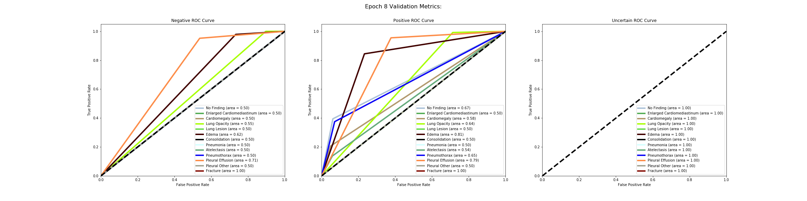

#### Accuracy Graph of the labels over Epochs

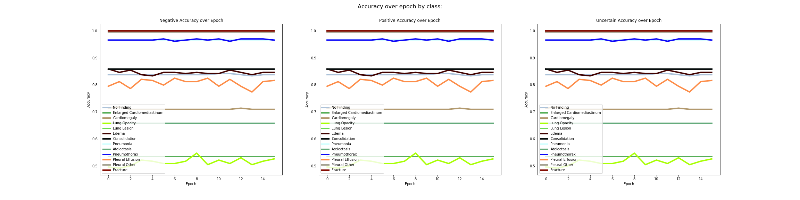


#### Table of Results
| Epoch | Disease                    | Positive:F1 | Recall | Precision | RoC Auc Score | Negative: F1 | Recall | Precision | RoC Auc Score | Uncertain: F1 | Recall | Precision | RoC Auc Score |
| ----: | -------------------------- | ----------: | -----: | --------: | ------------: | -----------: | -----: | --------: | ------------: | ------------: | -----: | --------: | ------------: |
|     0 | No Finding                 |        0.00 |   0.00 |      0.00 |          0.57 |         0.94 |   1.00 |      0.88 |          0.50 |             1 |      1 |         1 |             1 |
|     1 | No Finding                 |        0.00 |   0.00 |      0.00 |          0.57 |         0.94 |   1.00 |      0.88 |          0.50 |             1 |      1 |         1 |             1 |
|     2 | No Finding                 |        0.00 |   0.00 |      0.00 |          0.54 |         0.94 |   1.00 |      0.88 |          0.50 |             1 |      1 |         1 |             1 |
|     3 | No Finding                 |        0.00 |   0.00 |      0.00 |          0.53 |         0.94 |   1.00 |      0.88 |          0.50 |             1 |      1 |         1 |             1 |
|     4 | No Finding                 |        0.00 |   0.00 |      0.00 |          0.57 |         0.94 |   1.00 |      0.88 |          0.50 |             1 |      1 |         1 |             1 |
|     5 | No Finding                 |        0.00 |   0.00 |      0.00 |          0.60 |         0.94 |   1.00 |      0.88 |          0.50 |             1 |      1 |         1 |             1 |
|     6 | No Finding                 |        0.00 |   0.00 |      0.00 |          0.57 |         0.94 |   1.00 |      0.88 |          0.50 |             1 |      1 |         1 |             1 |
|     7 | No Finding                 |        0.00 |   0.00 |      0.00 |          0.60 |         0.94 |   1.00 |      0.88 |          0.50 |             1 |      1 |         1 |             1 |
|     0 | Enlarged Cardiomediastinum |        0.00 |   0.00 |      0.00 |          0.50 |         0.69 |   1.00 |      0.53 |          0.50 |             1 |      1 |         1 |             1 |
|     1 | Enlarged Cardiomediastinum |        0.00 |   0.00 |      0.00 |          0.50 |         0.69 |   1.00 |      0.53 |          0.50 |             1 |      1 |         1 |             1 |
|     2 | Enlarged Cardiomediastinum |        0.00 |   0.00 |      0.00 |          0.50 |         0.69 |   1.00 |      0.53 |          0.50 |             1 |      1 |         1 |             1 |
|     3 | Enlarged Cardiomediastinum |        0.00 |   0.00 |      0.00 |          0.50 |         0.69 |   1.00 |      0.53 |          0.50 |             1 |      1 |         1 |             1 |
|     4 | Enlarged Cardiomediastinum |        0.00 |   0.00 |      0.00 |          0.50 |         0.69 |   1.00 |      0.53 |          0.50 |             1 |      1 |         1 |             1 |
|     5 | Enlarged Cardiomediastinum |        0.00 |   0.00 |      0.00 |          0.50 |         0.69 |   1.00 |      0.53 |          0.50 |             1 |      1 |         1 |             1 |
|     6 | Enlarged Cardiomediastinum |        0.00 |   0.00 |      0.00 |          0.50 |         0.69 |   1.00 |      0.53 |          0.50 |             1 |      1 |         1 |             1 |
|     7 | Enlarged Cardiomediastinum |        0.00 |   0.00 |      0.00 |          0.50 |         0.69 |   1.00 |      0.53 |          0.50 |             1 |      1 |         1 |             1 |
|     0 | Cardiomegaly               |        0.00 |   0.00 |      0.00 |          0.50 |         0.84 |   1.00 |      0.73 |          0.50 |             1 |      1 |         1 |             1 |
|     1 | Cardiomegaly               |        0.00 |   0.00 |      0.00 |          0.50 |         0.84 |   1.00 |      0.73 |          0.50 |             1 |      1 |         1 |             1 |
|     2 | Cardiomegaly               |        0.00 |   0.00 |      0.00 |          0.50 |         0.84 |   1.00 |      0.73 |          0.50 |             1 |      1 |         1 |             1 |
|     3 | Cardiomegaly               |        0.00 |   0.00 |      0.00 |          0.50 |         0.84 |   1.00 |      0.73 |          0.50 |             1 |      1 |         1 |             1 |
|     4 | Cardiomegaly               |        0.00 |   0.00 |      0.00 |          0.50 |         0.84 |   1.00 |      0.73 |          0.50 |             1 |      1 |         1 |             1 |
|     5 | Cardiomegaly               |        0.00 |   0.00 |      0.00 |          0.50 |         0.84 |   1.00 |      0.73 |          0.50 |             1 |      1 |         1 |             1 |
|     6 | Cardiomegaly               |        0.00 |   0.00 |      0.00 |          0.50 |         0.84 |   1.00 |      0.73 |          0.50 |             1 |      1 |         1 |             1 |
|     7 | Cardiomegaly               |        0.00 |   0.00 |      0.00 |          0.50 |         0.84 |   1.00 |      0.73 |          0.50 |             1 |      1 |         1 |             1 |
|     0 | Lung Opacity               |        0.00 |   0.00 |      0.00 |          0.52 |         0.63 |   1.00 |      0.46 |          0.50 |             1 |      1 |         1 |             1 |
|     1 | Lung Opacity               |        0.06 |   0.03 |      1.00 |          0.51 |         0.64 |   1.00 |      0.47 |          0.52 |             1 |      1 |         1 |             1 |
|     2 | Lung Opacity               |        0.00 |   0.00 |      0.00 |          0.51 |         0.63 |   1.00 |      0.46 |          0.50 |             1 |      1 |         1 |             1 |
|     3 | Lung Opacity               |        0.03 |   0.02 |      1.00 |          0.53 |         0.64 |   1.00 |      0.47 |          0.51 |             1 |      1 |         1 |             1 |
|     4 | Lung Opacity               |        0.00 |   0.00 |      0.00 |          0.53 |         0.63 |   1.00 |      0.46 |          0.50 |             1 |      1 |         1 |             1 |
|     5 | Lung Opacity               |        0.00 |   0.00 |      0.00 |          0.53 |         0.63 |   1.00 |      0.46 |          0.50 |             1 |      1 |         1 |             1 |
|     6 | Lung Opacity               |        0.00 |   0.00 |      0.00 |          0.53 |         0.63 |   1.00 |      0.46 |          0.50 |             1 |      1 |         1 |             1 |
|     7 | Lung Opacity               |        0.03 |   0.02 |      1.00 |          0.53 |         0.64 |   1.00 |      0.47 |          0.51 |             1 |      1 |         1 |             1 |
|     0 | Lung Lesion                |        0.00 |   0.00 |      0.00 |          0.50 |         1.00 |   1.00 |      0.99 |          0.50 |             1 |      1 |         1 |             1 |
|     1 | Lung Lesion                |        0.00 |   0.00 |      0.00 |          0.50 |         1.00 |   1.00 |      0.99 |          0.50 |             1 |      1 |         1 |             1 |
|     2 | Lung Lesion                |        0.00 |   0.00 |      0.00 |          0.50 |         1.00 |   1.00 |      0.99 |          0.50 |             1 |      1 |         1 |             1 |
|     3 | Lung Lesion                |        0.00 |   0.00 |      0.00 |          0.50 |         1.00 |   1.00 |      0.99 |          0.50 |             1 |      1 |         1 |             1 |
|     4 | Lung Lesion                |        0.00 |   0.00 |      0.00 |          0.50 |         1.00 |   1.00 |      0.99 |          0.50 |             1 |      1 |         1 |             1 |
|     5 | Lung Lesion                |        0.00 |   0.00 |      0.00 |          0.50 |         1.00 |   1.00 |      0.99 |          0.50 |             1 |      1 |         1 |             1 |
|     6 | Lung Lesion                |        0.00 |   0.00 |      0.00 |          0.50 |         1.00 |   1.00 |      0.99 |          0.50 |             1 |      1 |         1 |             1 |
|     7 | Lung Lesion                |        0.00 |   0.00 |      0.00 |          0.50 |         1.00 |   1.00 |      0.99 |          0.50 |             1 |      1 |         1 |             1 |
|     0 | Edema                      |        0.00 |   0.00 |      0.00 |          0.74 |         0.88 |   1.00 |      0.79 |          0.50 |             1 |      1 |         1 |             1 |
|     1 | Edema                      |        0.00 |   0.00 |      0.00 |          0.73 |         0.88 |   1.00 |      0.79 |          0.50 |             1 |      1 |         1 |             1 |
|     2 | Edema                      |        0.00 |   0.00 |      0.00 |          0.75 |         0.88 |   1.00 |      0.79 |          0.50 |             1 |      1 |         1 |             1 |
|     3 | Edema                      |        0.00 |   0.00 |      0.00 |          0.70 |         0.88 |   1.00 |      0.79 |          0.50 |             1 |      1 |         1 |             1 |
|     4 | Edema                      |        0.00 |   0.00 |      0.00 |          0.75 |         0.88 |   1.00 |      0.79 |          0.50 |             1 |      1 |         1 |             1 |
|     5 | Edema                      |        0.00 |   0.00 |      0.00 |          0.75 |         0.88 |   1.00 |      0.79 |          0.50 |             1 |      1 |         1 |             1 |
|     6 | Edema                      |        0.00 |   0.00 |      0.00 |          0.71 |         0.88 |   1.00 |      0.79 |          0.50 |             1 |      1 |         1 |             1 |
|     7 | Edema                      |        0.00 |   0.00 |      0.00 |          0.74 |         0.88 |   1.00 |      0.79 |          0.50 |             1 |      1 |         1 |             1 |
|     0 | Consolidation              |        0.00 |   0.00 |      0.00 |          0.50 |         0.91 |   1.00 |      0.84 |          0.50 |             1 |      1 |         1 |             1 |
|     1 | Consolidation              |        0.00 |   0.00 |      0.00 |          0.50 |         0.91 |   1.00 |      0.84 |          0.50 |             1 |      1 |         1 |             1 |
|     2 | Consolidation              |        0.00 |   0.00 |      0.00 |          0.50 |         0.91 |   1.00 |      0.84 |          0.50 |             1 |      1 |         1 |             1 |
|     3 | Consolidation              |        0.00 |   0.00 |      0.00 |          0.50 |         0.91 |   1.00 |      0.84 |          0.50 |             1 |      1 |         1 |             1 |
|     4 | Consolidation              |        0.00 |   0.00 |      0.00 |          0.50 |         0.91 |   1.00 |      0.84 |          0.50 |             1 |      1 |         1 |             1 |
|     5 | Consolidation              |        0.00 |   0.00 |      0.00 |          0.50 |         0.91 |   1.00 |      0.84 |          0.50 |             1 |      1 |         1 |             1 |
|     6 | Consolidation              |        0.00 |   0.00 |      0.00 |          0.50 |         0.91 |   1.00 |      0.84 |          0.50 |             1 |      1 |         1 |             1 |
|     7 | Consolidation              |        0.00 |   0.00 |      0.00 |          0.50 |         0.91 |   1.00 |      0.84 |          0.50 |             1 |      1 |         1 |             1 |
|     0 | Pneumonia                  |        0.00 |   0.00 |      0.00 |          0.50 |         0.99 |   1.00 |      0.98 |          0.50 |             1 |      1 |         1 |             1 |
|     1 | Pneumonia                  |        0.00 |   0.00 |      0.00 |          0.50 |         0.99 |   1.00 |      0.98 |          0.50 |             1 |      1 |         1 |             1 |
|     2 | Pneumonia                  |        0.00 |   0.00 |      0.00 |          0.50 |         0.99 |   1.00 |      0.98 |          0.50 |             1 |      1 |         1 |             1 |
|     3 | Pneumonia                  |        0.00 |   0.00 |      0.00 |          0.50 |         0.99 |   1.00 |      0.98 |          0.50 |             1 |      1 |         1 |             1 |
|     4 | Pneumonia                  |        0.00 |   0.00 |      0.00 |          0.50 |         0.99 |   1.00 |      0.98 |          0.50 |             1 |      1 |         1 |             1 |
|     5 | Pneumonia                  |        0.00 |   0.00 |      0.00 |          0.50 |         0.99 |   1.00 |      0.98 |          0.50 |             1 |      1 |         1 |             1 |
|     6 | Pneumonia                  |        0.00 |   0.00 |      0.00 |          0.50 |         0.99 |   1.00 |      0.98 |          0.50 |             1 |      1 |         1 |             1 |
|     7 | Pneumonia                  |        0.00 |   0.00 |      0.00 |          0.50 |         0.99 |   1.00 |      0.98 |          0.50 |             1 |      1 |         1 |             1 |
|     0 | Atelectasis                |        0.00 |   0.00 |      0.00 |          0.50 |         0.78 |   1.00 |      0.64 |          0.50 |             1 |      1 |         1 |             1 |
|     1 | Atelectasis                |        0.00 |   0.00 |      0.00 |          0.50 |         0.78 |   1.00 |      0.64 |          0.50 |             1 |      1 |         1 |             1 |
|     2 | Atelectasis                |        0.00 |   0.00 |      0.00 |          0.50 |         0.78 |   1.00 |      0.64 |          0.50 |             1 |      1 |         1 |             1 |
|     3 | Atelectasis                |        0.00 |   0.00 |      0.00 |          0.50 |         0.78 |   1.00 |      0.64 |          0.50 |             1 |      1 |         1 |             1 |
|     4 | Atelectasis                |        0.00 |   0.00 |      0.00 |          0.50 |         0.78 |   1.00 |      0.64 |          0.50 |             1 |      1 |         1 |             1 |
|     5 | Atelectasis                |        0.00 |   0.00 |      0.00 |          0.50 |         0.78 |   1.00 |      0.64 |          0.50 |             1 |      1 |         1 |             1 |
|     6 | Atelectasis                |        0.00 |   0.00 |      0.00 |          0.50 |         0.78 |   1.00 |      0.64 |          0.50 |             1 |      1 |         1 |             1 |
|     7 | Atelectasis                |        0.00 |   0.00 |      0.00 |          0.50 |         0.78 |   1.00 |      0.64 |          0.50 |             1 |      1 |         1 |             1 |
|     0 | Pneumothorax               |        0.00 |   0.00 |      0.00 |          0.50 |         0.99 |   1.00 |      0.98 |          0.50 |             1 |      1 |         1 |             1 |
|     1 | Pneumothorax               |        0.00 |   0.00 |      0.00 |          0.50 |         0.99 |   1.00 |      0.98 |          0.50 |             1 |      1 |         1 |             1 |
|     2 | Pneumothorax               |        0.00 |   0.00 |      0.00 |          0.50 |         0.99 |   1.00 |      0.98 |          0.50 |             1 |      1 |         1 |             1 |
|     3 | Pneumothorax               |        0.00 |   0.00 |      0.00 |          0.50 |         0.99 |   1.00 |      0.98 |          0.50 |             1 |      1 |         1 |             1 |
|     4 | Pneumothorax               |        0.00 |   0.00 |      0.00 |          0.50 |         0.99 |   1.00 |      0.98 |          0.50 |             1 |      1 |         1 |             1 |
|     5 | Pneumothorax               |        0.00 |   0.00 |      0.00 |          0.50 |         0.99 |   1.00 |      0.98 |          0.50 |             1 |      1 |         1 |             1 |
|     6 | Pneumothorax               |        0.00 |   0.00 |      0.00 |          0.50 |         0.99 |   1.00 |      0.98 |          0.50 |             1 |      1 |         1 |             1 |
|     7 | Pneumothorax               |        0.00 |   0.00 |      0.00 |          0.50 |         0.99 |   1.00 |      0.98 |          0.50 |             1 |      1 |         1 |             1 |
|     0 | Pleural Effusion           |        0.33 |   0.21 |      0.78 |          0.60 |         0.86 |   0.98 |      0.77 |          0.59 |             1 |      1 |         1 |             1 |
|     1 | Pleural Effusion           |        0.41 |   0.27 |      0.82 |          0.65 |         0.87 |   0.98 |      0.78 |          0.62 |             1 |      1 |         1 |             1 |
|     2 | Pleural Effusion           |        0.33 |   0.21 |      0.70 |          0.63 |         0.85 |   0.97 |      0.77 |          0.59 |             1 |      1 |         1 |             1 |
|     3 | Pleural Effusion           |        0.36 |   0.24 |      0.73 |          0.61 |         0.86 |   0.97 |      0.77 |          0.60 |             1 |      1 |         1 |             1 |
|     4 | Pleural Effusion           |        0.52 |   0.39 |      0.76 |          0.68 |         0.87 |   0.95 |      0.81 |          0.67 |             1 |      1 |         1 |             1 |
|     5 | Pleural Effusion           |        0.15 |   0.09 |      0.37 |          0.67 |         0.83 |   0.94 |      0.73 |          0.52 |             1 |      1 |         1 |             1 |
|     6 | Pleural Effusion           |        0.38 |   0.27 |      0.64 |          0.63 |         0.85 |   0.94 |      0.78 |          0.61 |             1 |      1 |         1 |             1 |
|     7 | Pleural Effusion           |        0.56 |   0.42 |      0.82 |          0.64 |         0.89 |   0.97 |      0.82 |          0.70 |             1 |      1 |         1 |             1 |
|     0 | Pleural Other              |        0.00 |   0.00 |      0.00 |          1.00 |         1.00 |   1.00 |      1.00 |          1.00 |             1 |      1 |         1 |             1 |
|     1 | Pleural Other              |        0.00 |   0.00 |      0.00 |          1.00 |         1.00 |   1.00 |      1.00 |          1.00 |             1 |      1 |         1 |             1 |
|     2 | Pleural Other              |        0.00 |   0.00 |      0.00 |          1.00 |         1.00 |   1.00 |      1.00 |          1.00 |             1 |      1 |         1 |             1 |
|     3 | Pleural Other              |        0.00 |   0.00 |      0.00 |          1.00 |         1.00 |   1.00 |      1.00 |          1.00 |             1 |      1 |         1 |             1 |
|     4 | Pleural Other              |        0.00 |   0.00 |      0.00 |          1.00 |         1.00 |   1.00 |      1.00 |          1.00 |             1 |      1 |         1 |             1 |
|     5 | Pleural Other              |        0.00 |   0.00 |      0.00 |          1.00 |         1.00 |   1.00 |      1.00 |          1.00 |             1 |      1 |         1 |             1 |
|     6 | Pleural Other              |        0.00 |   0.00 |      0.00 |          1.00 |         1.00 |   1.00 |      1.00 |          1.00 |             1 |      1 |         1 |             1 |
|     7 | Pleural Other              |        0.00 |   0.00 |      0.00 |          1.00 |         1.00 |   1.00 |      1.00 |          1.00 |             1 |      1 |         1 |             1 |
|     0 | Fracture                   |        0.00 |   0.00 |      0.00 |          1.00 |         1.00 |   1.00 |      1.00 |          1.00 |             1 |      1 |         1 |             1 |
|     1 | Fracture                   |        0.00 |   0.00 |      0.00 |          1.00 |         1.00 |   1.00 |      1.00 |          1.00 |             1 |      1 |         1 |             1 |
|     2 | Fracture                   |        0.00 |   0.00 |      0.00 |          1.00 |         1.00 |   1.00 |      1.00 |          1.00 |             1 |      1 |         1 |             1 |
|     3 | Fracture                   |        0.00 |   0.00 |      0.00 |          1.00 |         1.00 |   1.00 |      1.00 |          1.00 |             1 |      1 |         1 |             1 |
|     4 | Fracture                   |        0.00 |   0.00 |      0.00 |          1.00 |         1.00 |   1.00 |      1.00 |          1.00 |             1 |      1 |         1 |             1 |
|     5 | Fracture                   |        0.00 |   0.00 |      0.00 |          1.00 |         1.00 |   1.00 |      1.00 |          1.00 |             1 |      1 |         1 |             1 |
|     6 | Fracture                   |        0.00 |   0.00 |      0.00 |          1.00 |         1.00 |   1.00 |      1.00 |          1.00 |             1 |      1 |         1 |             1 |
|     7 | Fracture                   |        0.00 |   0.00 |      0.00 |          1.00 |         1.00 |   1.00 |      1.00 |          1.00 |             1 |      1 |         1 |             1 |

# Summary of results

## ROC AUC, Precision, Recall, F1

- Uncertain class, across all diseases, do great (1.0 ROC AUC, Prec, Recall, F1) for Image only and Image+Metadata
- Fracture and Plueral Other, get (1.0 ROC AUC, Prec, Recall, F1) for the Positive and Negative class for Image only and Image+Metadata


#### Positive Class:
- For the other diseases, No Finding, Edema, Pleural Effusion did at least ROC AUC .5+ better in Metadata than Image only.
- Atelectasis, PneumoThorax did .5+ better for Image Only vs w/Metadata
- The rest are the same, being .5, except Pleural Effusion got .64 for Image + Meta

#### Negative Class
- Lung Opacity, Edema did .5+ better for Image Only
- The rest are the same, being .5, except Pleural Effusion got .7

### Image Only

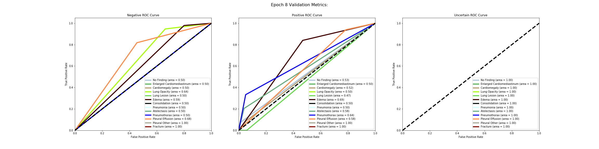

### Image+Metadata


## Accuracy
The accuracy is constant across epochs and the same for both Image only and Image+Metadata, with the except of these few:
- Plueral Effusion fluctuates in .7-.8
- Lung Opacity - fluctuates around .5 Image+Meta, and between.5-.6 for Image Only
- Edema - fluctuates in .8 range for Image Only, but is constant in Image+Meta (.8)

### Image Only


### Image+Metadata


